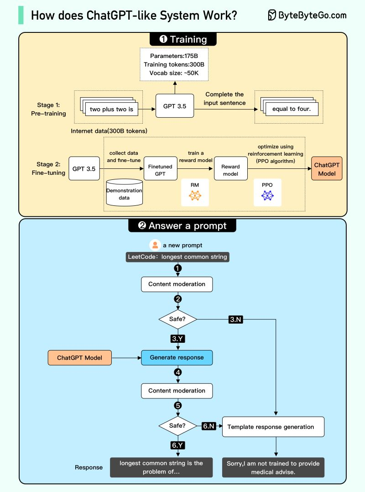
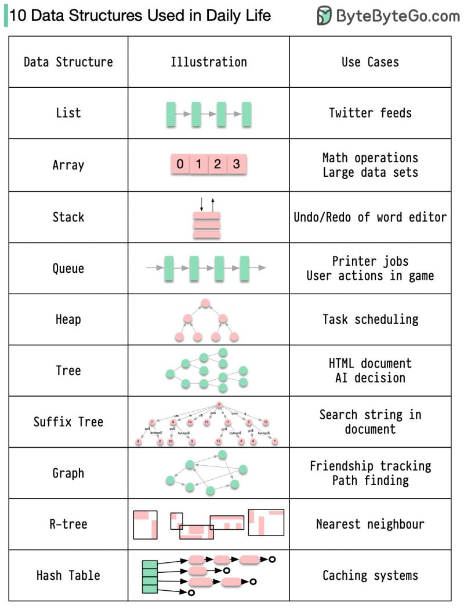
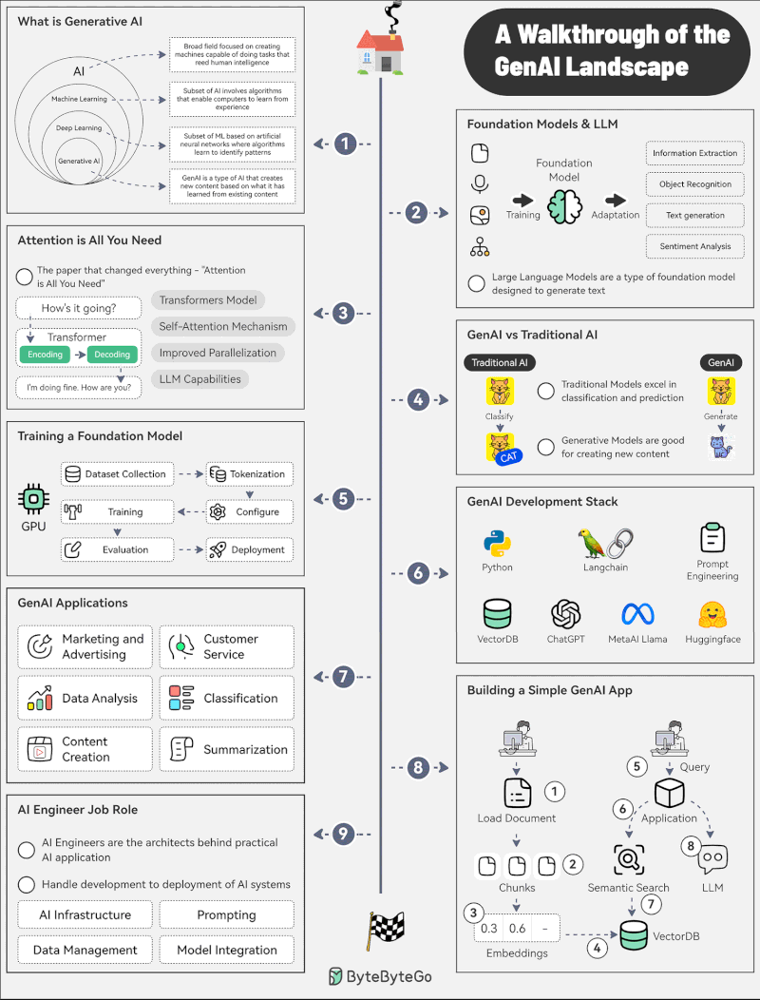

# AI

### ChatGPT System Architecture and Workflow

???+ info "How does ChatGPT-like System Work?"

    The two main phases of a ChatGPT-like system. The top section details the 'Training' phase, broken down into Stage 1 (Pre-training on internet data) and Stage 2 (Fine-tuning using demonstration data, a reward model, and PPO reinforcement learning). The bottom section details the 'Answer a prompt' phase, showing the flow from a user prompt through content moderation, safety checks, response generation by the ChatGPT model, and final output filtering.

[📊 Vergrößern](images/AI_Training_ChatGPTSystemArchitectureAndWorkflow.png){ .md-button .md-button--primary }

### Data Structures and Real-World Applications

???+ info "10 Data Structures Used in Daily Life"

    A table illustrating 10 fundamental data structures (List, Array, Stack, Queue, Heap, Tree, Suffix Tree, Graph, R-tree, Hash Table) with visual diagrams and their corresponding real-world use cases, such as Twitter feeds for Lists and Undo/Redo for Stacks.

[📊 Vergrößern](images/Programming_DataStructureComparison_DataStructuresAndRealWorldApplications.png){ .md-button .md-button--primary }

### GenAI Ecosystem and Workflow

???+ info "Generative AI"

    The Generative AI landscape, covering key concepts from basic definitions and foundation models to transformers, training, development stacks, applications, and the AI engineer job role.

[📊 Vergrößern](images/Programming_AWalkthroughOfTheGenAILandscap_GenAIEcosystemAndWorkflow.png){ .md-button .md-button--primary }

*3 Themen verfügbar*
