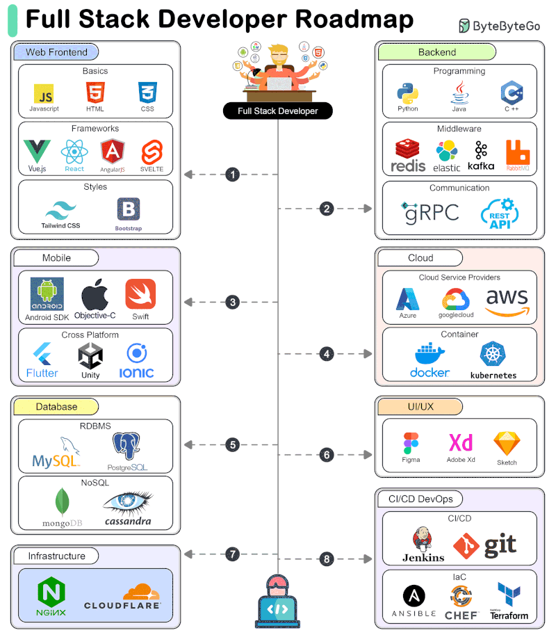
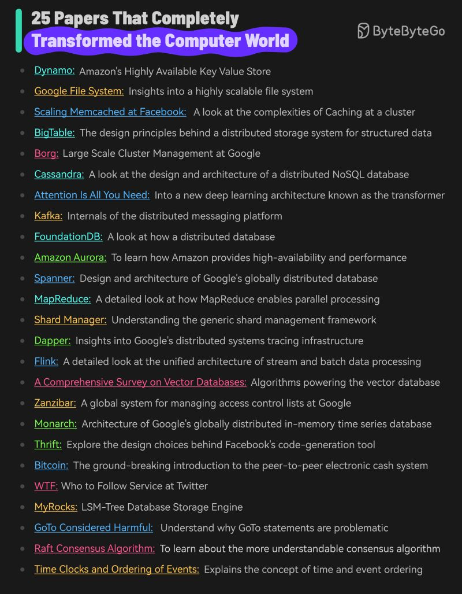
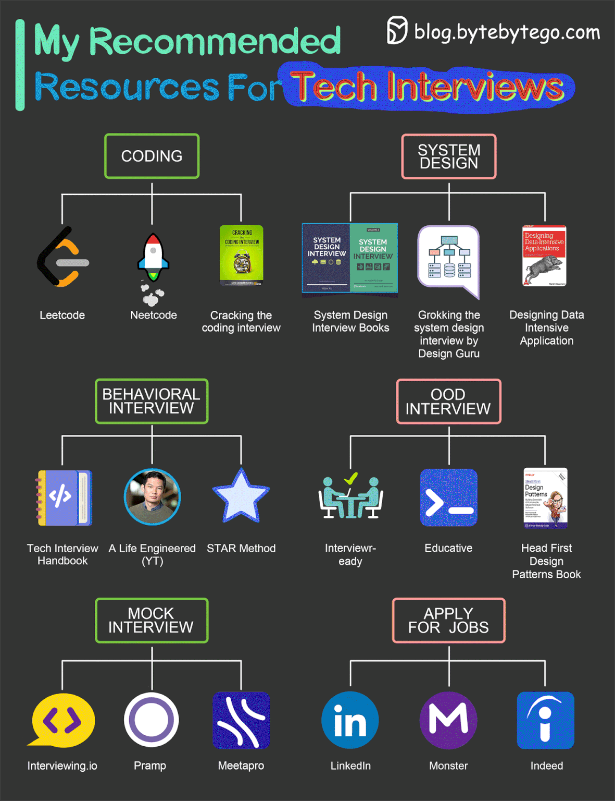
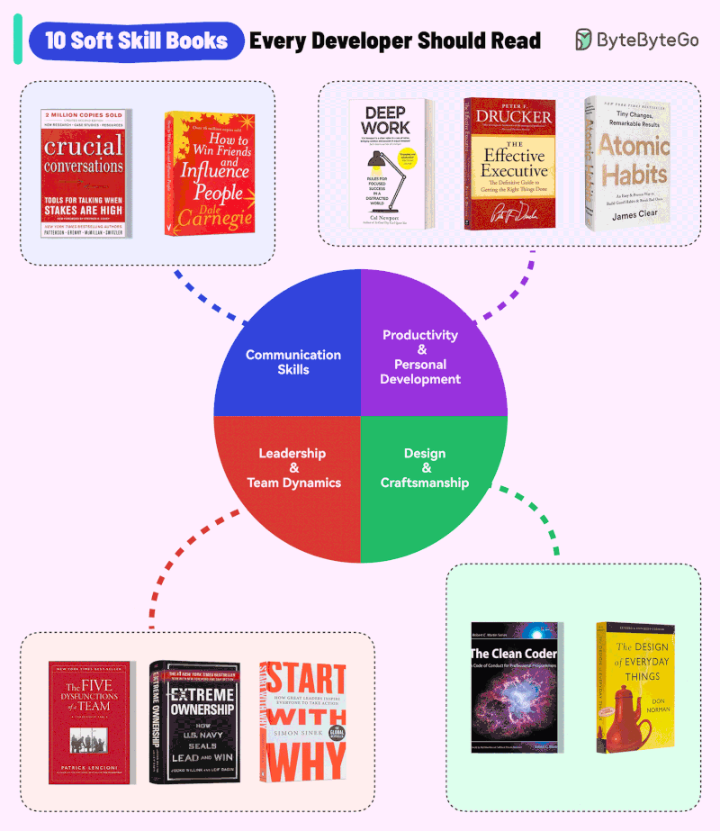
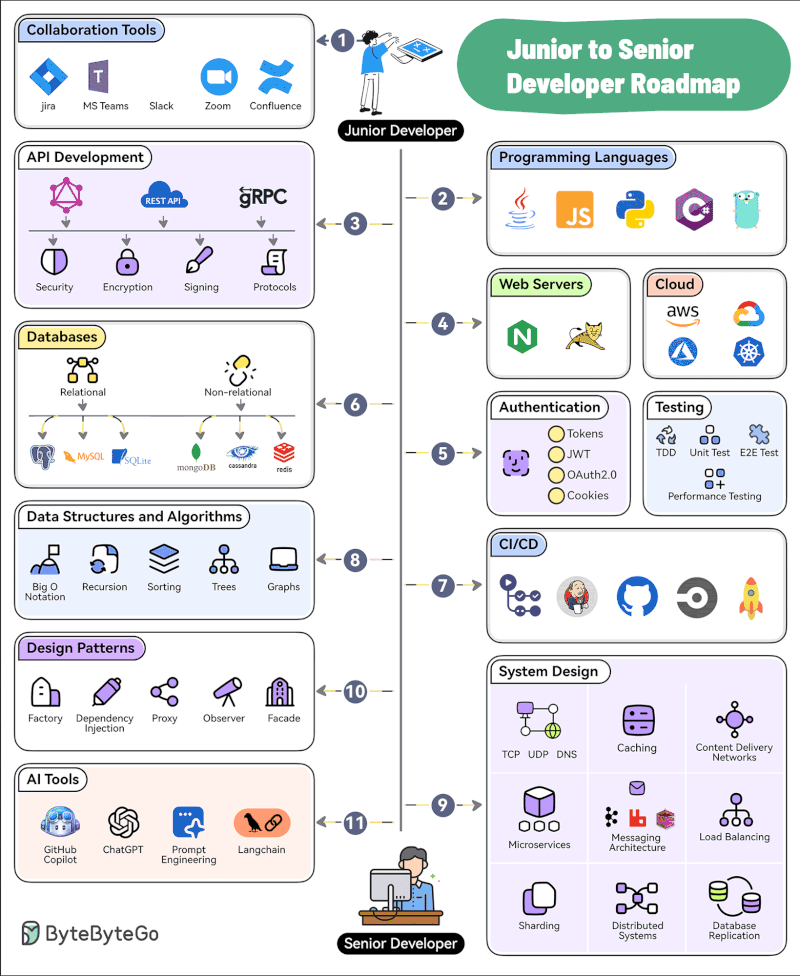

# Career

### Full Stack Development Ecosystem

???+ info "Full Stack Developer Roadmap"

    The comprehensive roadmap for a Full Stack Developer. It features a central developer figure connected to eight key domains: Web Frontend (Basics, Frameworks, Styles), Backend (Programming, Middleware, Communication), Mobile (Native & Cross Platform), Cloud (Providers, Containers), Database (RDBMS, NoSQL), UI/UX (Design Tools), Infrastructure (Nginx, Cloudflare), and CI/CD DevOps (Jenkins, Git, IaC).

[📊 Vergrößern](images/CareerLearning_TechnologyStackSkills_FullStackDevelopmentEcosystem.png){ .md-button .md-button--primary }

### Influential Computer Science and Engineering Papers

???+ info "25 Papers That Completely Transformed the Computer World"

    Listing 25 highly impactful computer science papers and systems, such as Dynamo, Google File System, Attention Is All You Need, and Bitcoin, along with brief descriptions of their contributions to the field.

[📊 Vergrößern](images/CareerLearning_ListOfSeminalPapers_InfluentialComputerScienceAndEngineeringPapers.png){ .md-button .md-button--primary }

### Interview Preparation Categories and Tools

???+ info "Tech Interviews"

    Titled 'My Recommended Resources For Tech Interviews' that categorizes study materials and platforms into six main areas: Coding (Leetcode, Neetcode, Cracking the Coding Interview), System Design (Books, Grokking, Designing Data-Intensive Applications), Behavioral Interview (Tech Interview Handbook, A Life Engineered, STAR Method), OOD Interview (Interviewready, Educative, Head First Design Patterns), Mock Interview (Interviewing.io, Pramp, Meetapro), and Apply for Jobs (LinkedIn, Monster, Indeed).

[📊 Vergrößern](images/CareerLearning_RecommendedResources_InterviewPreparationCategoriesAndTools.png){ .md-button .md-button--primary }

### Recommended reading list for software developers

???+ info "10 Soft Skill Books Every Developer Should Read"

    Displaying 10 book recommendations for developers, categorized into four quadrants: Communication Skills, Productivity & Personal Development, Leadership & Team Dynamics, and Design & Craftsmanship.

[📊 Vergrößern](images/CareerLearning_SkillCategoriesCommunicationPr_Recommendedreadinglistforsoftwaredevelopers.png){ .md-button .md-button--primary }

### Software Engineering Competency Map

???+ info "Junior to Senior Developer Roadmap"

    The step-by-step technical skills, tools, and concepts required for a developer to advance from a junior to a senior level. It covers 11 key areas including collaboration tools, programming languages, API development, web servers, cloud infrastructure, authentication, testing, databases, CI/CD, data structures & algorithms, system design, design patterns, and AI tools.

[📊 Vergrößern](images/CareerLearning_TechnicalSkillsProgression_SoftwareEngineeringCompetencyMap.png){ .md-button .md-button--primary }

*5 Themen verfügbar*
