# Cloud & DevOps

### AWS Service Portfolio and Classification

???+ info "AWS Cloud Services"

    A circular infographic titled 'AWS Cloud Services Cheat Sheet' by ByteByteGo. It organizes numerous Amazon Web Services (AWS) products into functional categories arranged in a wheel around a central AWS logo. Categories include Analytics, Application Integration, Financial Management, Compute, Database, Developer Tools, Network & Content Delivery, Storage, and Identity & Compliance/Security.

[📊 Vergrößern](images/CloudInfrastructure_ServiceCategoriesOverview_AWSServicePortfolioAndClassification.png){ .md-button .md-button--primary }

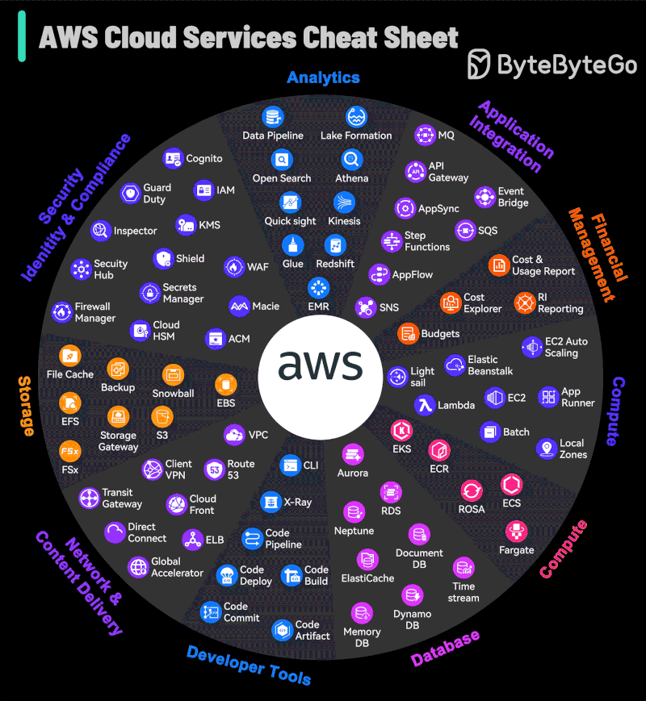

### Cloud Messaging Patterns

???+ info "Top 6 Cloud Messaging Patterns"

    Six common cloud messaging patterns: Async Request-Reply, Publisher-Subscriber, Claim Check, Priority Queue, Saga, and Competing Consumers. Each pattern includes a visual diagram of the workflow and a list of specific use cases.

[📊 Vergrößern](images/CloudInfrastructure_MessagingArchitectures_CloudMessagingPatterns.png){ .md-button .md-button--primary }

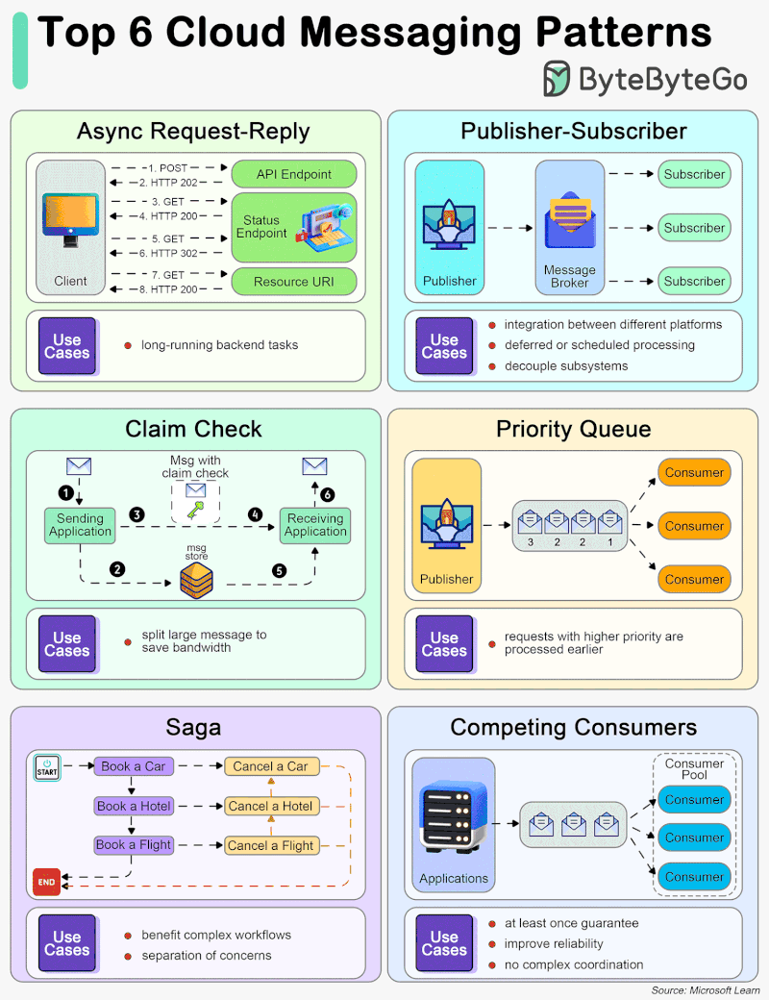

### Docker Client, Host, and Registry Interaction

???+ info "How does Docker Work?"

    The Docker workflow, showing how the Docker Client sends commands (build, pull, run) to the Daemon on the Docker Host, which manages Images and Containers, while interacting with the Docker Registry.

[📊 Vergrößern](images/CloudInfrastructure_DockerArchitecture_DockerClientHostAndRegistryInteraction.png){ .md-button .md-button--primary }

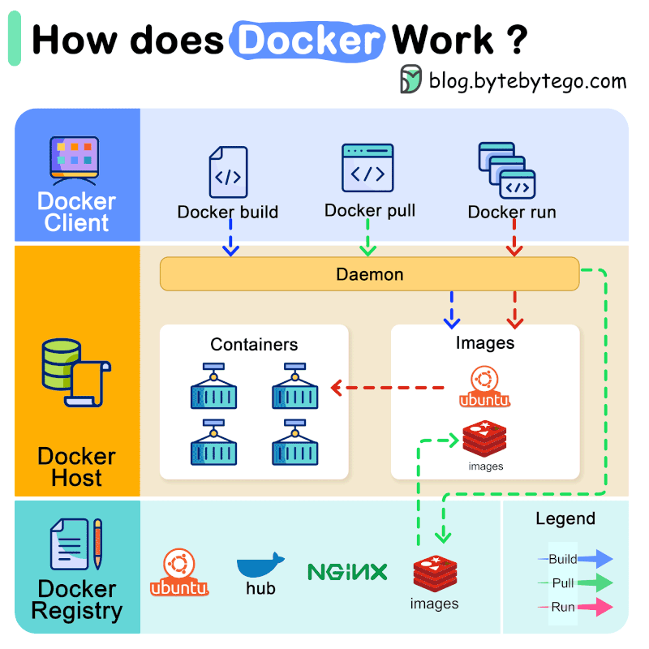

### Docker Ecosystem and Architecture

???+ info "8 Must-Know Docker Concepts"

    Eight fundamental Docker concepts. It covers the Dockerfile instructions, the composition of a Docker Image (code, dependencies, libraries), the creation of Containers from images, the role of a Docker Registry, the use of Volumes for file sharing, Docker Compose for multi-container management, Docker Networks for container communication, and the Docker CLI client-daemon interaction. A central panel humorously explains Docker's origin story regarding the 'works on my machine' problem.

[📊 Vergrößern](images/CloudInfrastructure_CoreConcepts_DockerEcosystemAndArchitecture.png){ .md-button .md-button--primary }

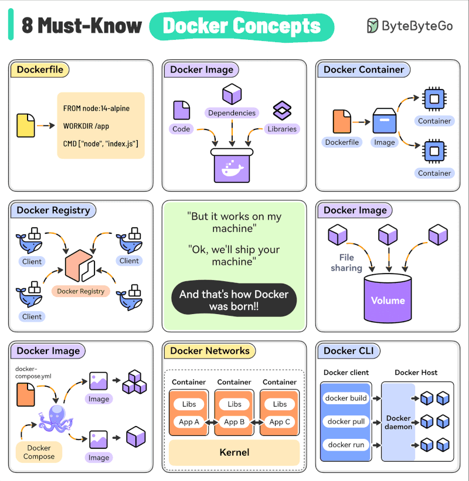

### Equivalent Cloud Services Mapping

???+ info "Cloud Comparison Cheat Sheet"

    A comprehensive comparison chart displaying equivalent cloud services across four major providers: AWS, Microsoft Azure, Google Cloud, and Oracle Cloud. The chart categorizes services into areas such as compute, storage, networking, databases, analytics, machine learning, and security management.

[📊 Vergrößern](images/CloudInfrastructure_CloudServiceProviders_EquivalentCloudServicesMapping.png){ .md-button .md-button--primary }

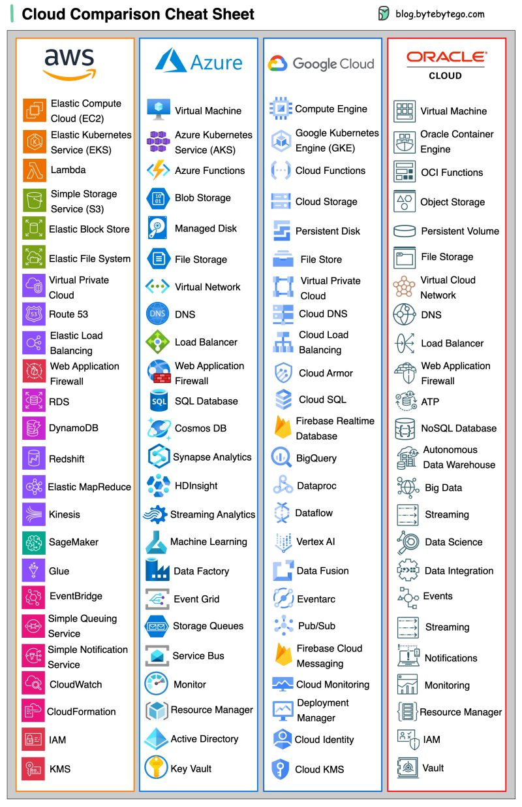

### Kubernetes Cluster Components

???+ info "What is k8s?"

    The high-level architecture of a Kubernetes (k8s) cluster. It depicts the user interface layer (Admin UI, CLI), the Control Plane (containing the API Server, Scheduler, etcd, and Control Manager), and the Worker Nodes (running Docker, kubelet, kube-proxy, and Pods with containers).

[📊 Vergrößern](images/CloudInfrastructure_Architecture_KubernetesClusterComponents.png){ .md-button .md-button--primary }

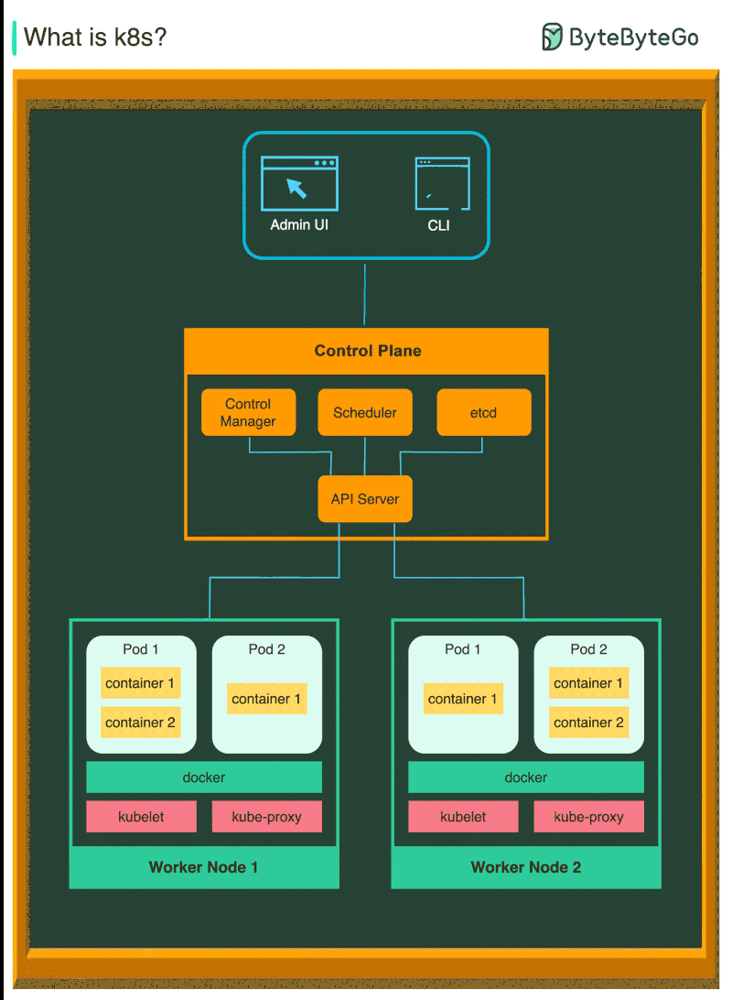

### Kubernetes Design Patterns Classification

???+ info "Top 10 k8s Design Patterns"

    Ten essential design patterns for Kubernetes (k8s). The patterns are grouped into four main categories: Structural (Init Container, Sidecar), Behavioural (Batch Job, Stateful Service, Stateful Discovery), Foundational (Health Probe, Automated Placement, Predictable Demands), and Higher-Level (Operator, Controller). Each section includes diagrams illustrating the architecture and data flow of the specific patterns.

[📊 Vergrößern](images/CloudInfrastructure_CategorizedOverviewStructuralB_KubernetesDesignPatternsClassification.png){ .md-button .md-button--primary }

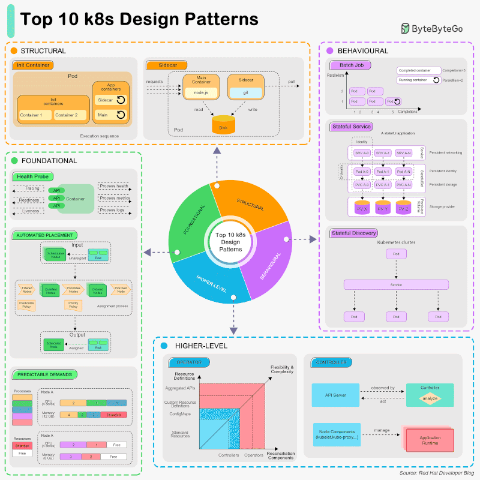

### Kubernetes Tools Stack Wheel

???+ info "Kubernetes Tools Stack"

    A circular diagram (wheel) centered around the Kubernetes logo, categorizing various tools and technologies into six main sectors: Monitoring and Observability, Infrastructure/Cloud Orchestration, Networking, Cluster Management, Security, and Container Runtime. Each sector contains logos and names of specific tools like Prometheus, Terraform, Docker, Helm, and Istio.

[📊 Vergrößern](images/CloudInfrastructure_EcosystemOverview_KubernetesToolsStackWheel.png){ .md-button .md-button--primary }

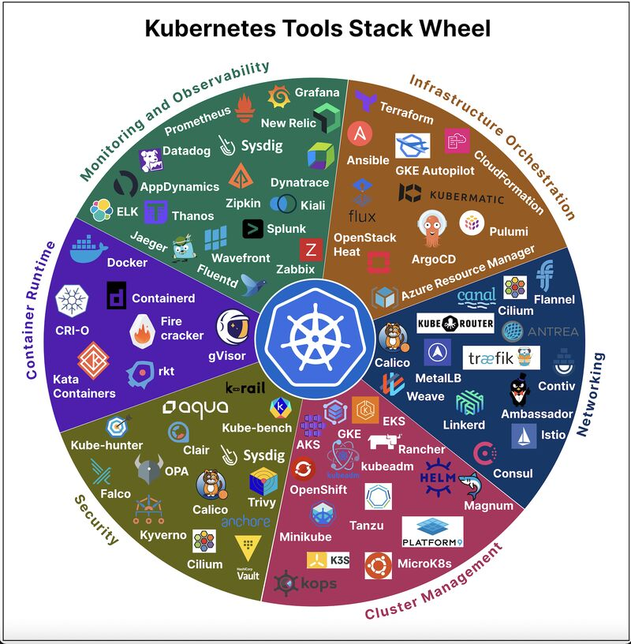

### Load Balancer Selection and Mapping

???+ info "Cloud Load Balancer"

    A comprehensive cheat sheet featuring a decision tree flowchart for selecting the appropriate cloud load balancer based on requirements (Internet Facing, Global/Regional, SSL Offload, Hosting Type) and a side-by-side comparison table of equivalent services for AWS, Azure, and Google Cloud.

[📊 Vergrößern](images/CloudInfrastructure_MultiCloudServiceComparison_LoadBalancerSelectionAndMapping.png){ .md-button .md-button--primary }

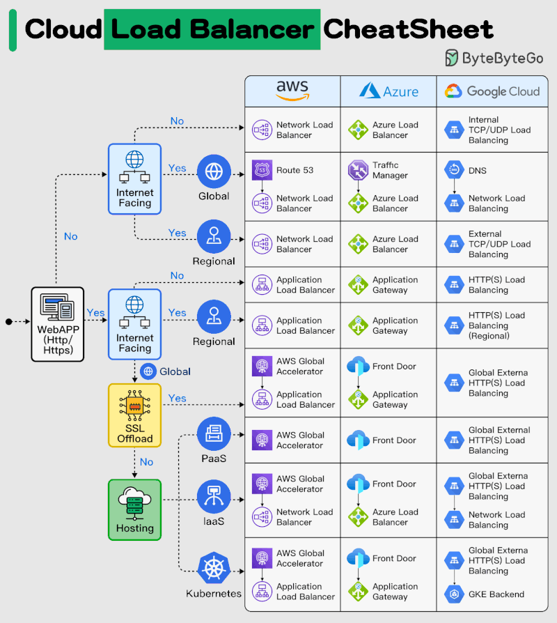

### Microsoft Azure Service Portfolio

???+ info "Azure Cloud Services"

    A circular cheat sheet diagram illustrating the ecosystem of Microsoft Azure cloud services. The services are grouped into ten color-coded sectors: Networking, Compute, Containers, Storage, Database, Analytics, Blockchain, IoT, Security, and Multimedia & ML. Each sector lists specific services with their corresponding icons, such as Virtual Machines, Blob Storage, SQL DB, and Cognitive Services.

[📊 Vergrößern](images/CloudInfrastructure_ServiceCategories_MicrosoftAzureServicePortfolio.png){ .md-button .md-button--primary }

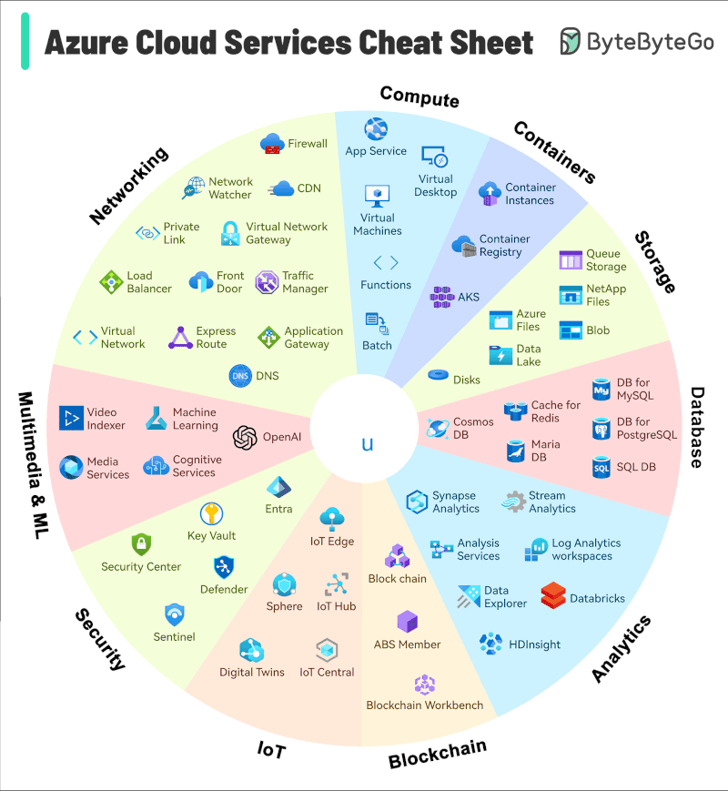

### Monitoring Elements Comparison

???+ info "Monitoring"

    A comprehensive cheat sheet table comparing monitoring tools and services across AWS, Google Cloud, Azure, and Open Source/3rd Party solutions. The comparison is categorized by monitoring elements including Data Collection, Data Storage, Data Analysis, Alerting, Visualization, Reporting and Compliance, Automation, Integration, and Feedback Loop.

[📊 Vergrößern](images/CloudInfrastructure_CloudProvidersAndOpenSourceToo_MonitoringElementsComparison.png){ .md-button .md-button--primary }

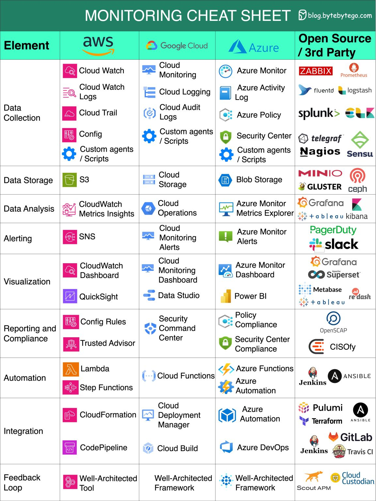

### Multi-Cloud Service Mapping

???+ info "Cloud Comparison"

    A comprehensive cheat sheet comparing cloud services across four major providers: AWS, Microsoft Azure, Google Cloud, and Oracle Cloud. The chart aligns equivalent services side-by-side, covering categories such as compute (VMs, Kubernetes), storage (object, block, file), networking (VPC, DNS, Load Balancing), databases (SQL, NoSQL), analytics, machine learning, and management/security tools.

[📊 Vergrößern](images/CloudInfrastructure_ServiceEquivalents_MultiCloudServiceMapping.png){ .md-button .md-button--primary }

### Nginx Architecture, High-Performance Web Server, Reverse Proxy, Content Cache, SSL Termination

???+ info "Why is Nginx so popular?"

    Titled 'Why is Nginx so popular?' centered around a 'Nginx Cheat Sheet' wheel. It details five key aspects of Nginx: its Master-Worker architecture, its function as a High-Performance Web Server handling concurrent connections, its role as a Reverse Proxy and Load Balancer distributing traffic, its Content Cache mechanism for fast rendering, and its SSL Termination capabilities for offloading decryption.

[📊 Vergrößern](images/CloudInfrastructure_NginxCheatSheet_NginxArchitectureHigh.png){ .md-button .md-button--primary }

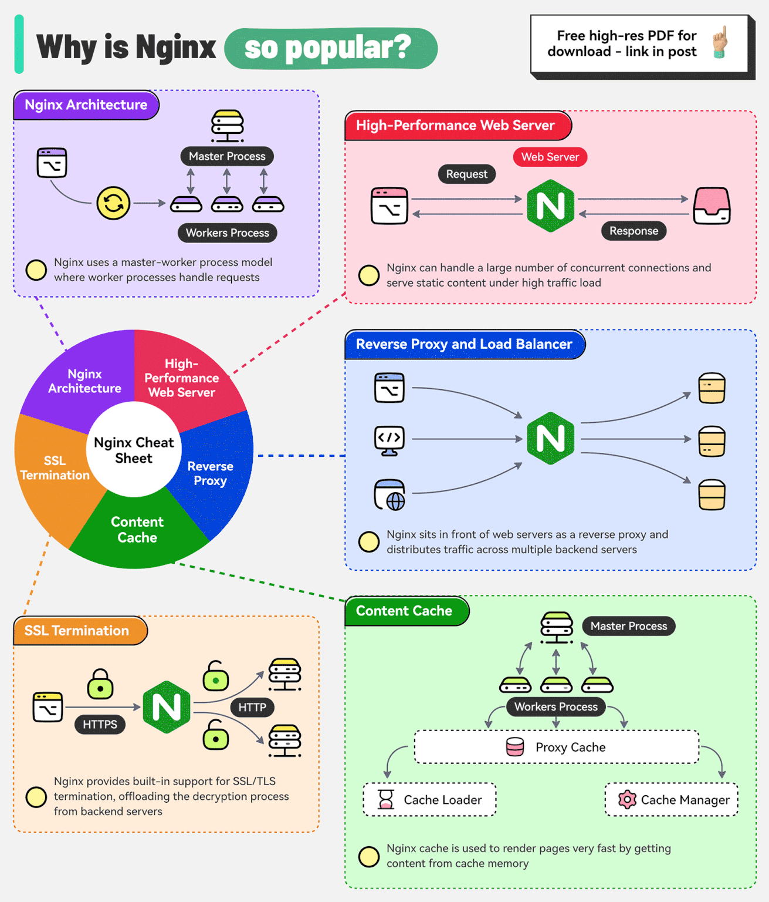

### RTO, RPO, and Disaster Recovery Architectures

???+ info "Cloud Disaster Recovery Strategies"

    Cloud Disaster Recovery. The top section defines Recovery Point Objective (RPO) and Recovery Time Objective (RTO) on a timeline relative to a disaster. The main body details four specific strategies: 1. Backup and Restore, 2. Pilot Light, 3. Warm Standby, and 4. Multi Site, illustrating the architecture, data sync, and scaling for each approach.

[📊 Vergrößern](images/CloudInfrastructure_StrategyTypes_RTORPOAndDisasterRecoveryArchitectures.png){ .md-button .md-button--primary }

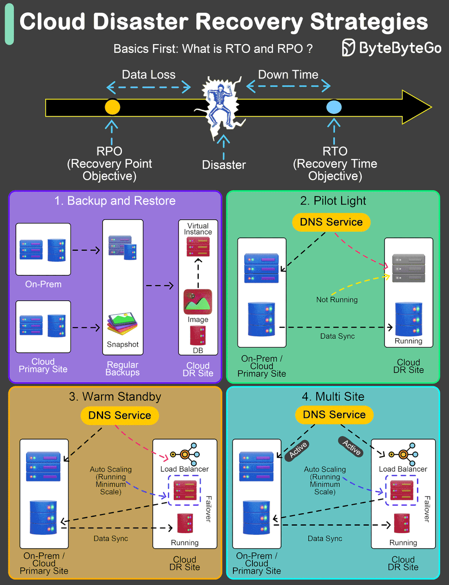

*14 Themen verfügbar*
