# Databases

### DB Scaling Strategies

???+ info "Database Scaling"

    Titled 'Database Scaling Cheatsheet' that illustrates seven core strategies for scaling databases: Indexing, Materialized Views, Denormalization, Vertical Scaling, Database Caching, Replication, and Sharding. Each strategy is accompanied by a diagram and a brief explanation of its function.

[📊 Vergrößern](images/SystemDesign_Overview_DBScalingStrategies.png){ .md-button .md-button--primary }

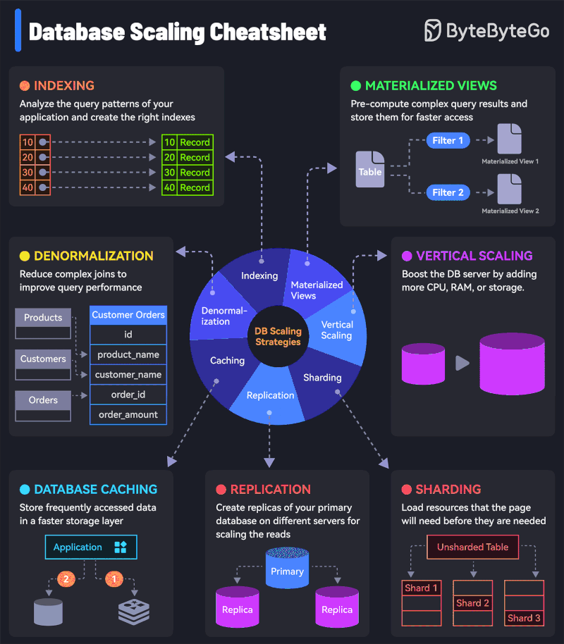

### Data Sharding Strategies

???+ info "Top 4 Data Sharding Algorithms"

    Four common algorithms for data sharding: Range-Based (partitioning by value ranges), Hash-Based (using a hash function modulo), Consistent Hashing (using a ring structure to minimize redistribution), and Virtual Bucket Hashing (mapping logical to physical buckets). Each section includes a visual diagram of the mechanism and a warning about potential downsides like uneven distribution or overhead.

[📊 Vergrößern](images/SystemDesign_RangeBasedHash_DataShardingStrategies.png){ .md-button .md-button--primary }

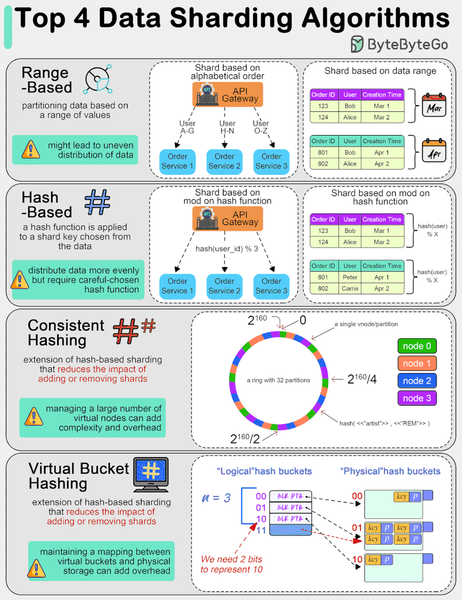

### Database Concurrency Control

???+ info "9 Types of Database Locks"

    Nine distinct types of database locks: Shared (S), Exclusive (X), Update (U), Schema, Bulk Update (BU), Key Range, Row-Level, Page-Level, and Table-Level locks. Each section defines the lock's purpose and provides a diagram showing how multiple clients interact with a database table (Order ID, User ID, Price) under that specific lock type.

[📊 Vergrößern](images/Databases_LockingMechanisms_DatabaseConcurrencyControl.png){ .md-button .md-button--primary }

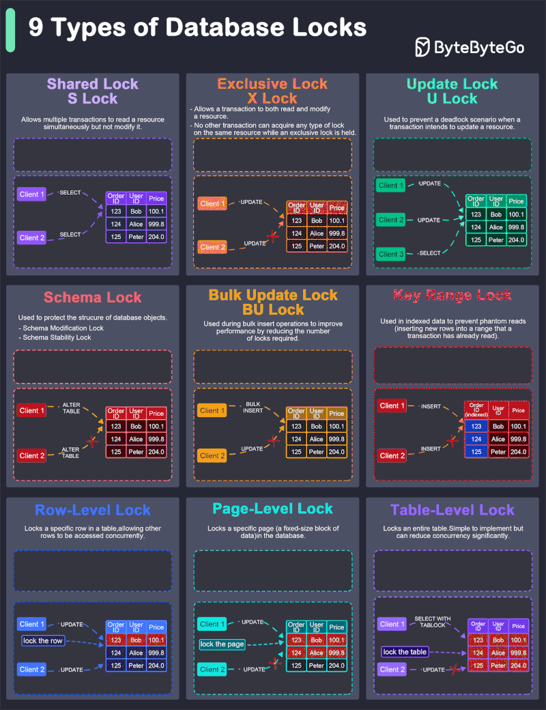

### Database Data Structures and Indexing

???+ info "8 Data Structures That Power Your Databases"

    A comprehensive table illustrating 8 key data structures used in databases: Skiplist, Hash index, SSTable, LSM tree, B-tree, Inverted index, Suffix tree, and R-tree. The table includes visual diagrams for each, their primary use cases (In-memory, Disk-based, Search), and notes on real-world applications like Redis and Lucene.

[📊 Vergrößern](images/Databases_ComparisonTable_DatabaseDataStructuresAndIndexing.png){ .md-button .md-button--primary }

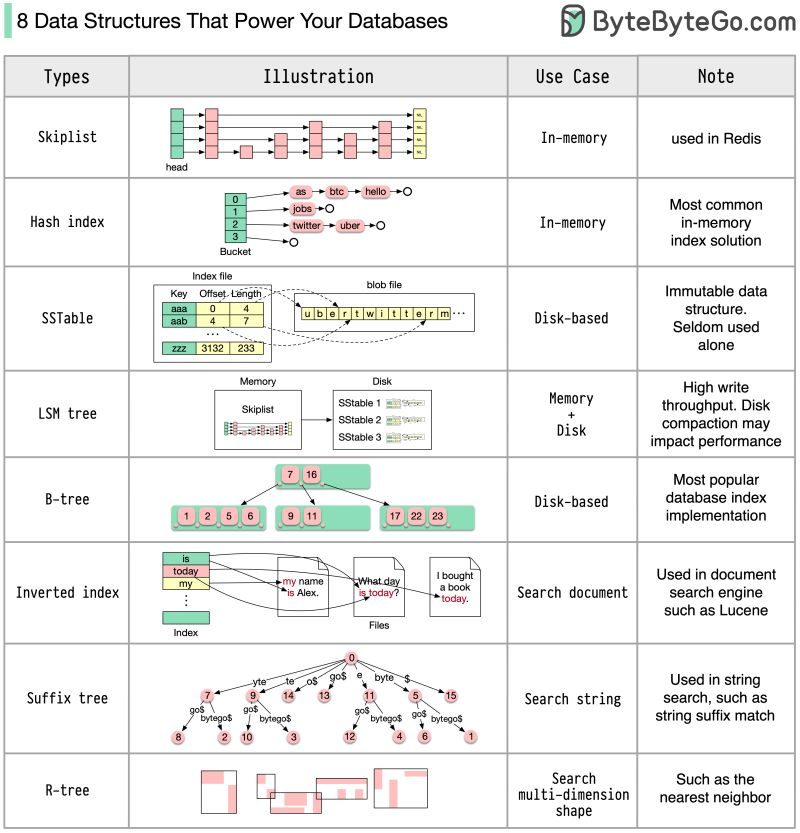

### Database Sharding

???+ info "A Crash Course on Database Sharding"

    The core concepts of database sharding. It covers the definition and benefits (scalability, performance, availability), different types of sharding (range-based, directory-based, key-based), criteria for selecting shard keys (cardinality, frequency, monotonic change), and strategies for routing requests to shards.

[📊 Vergrößern](images/SystemDesign_UnderstandingDatabaseSharding_DatabaseSharding.png){ .md-button .md-button--primary }

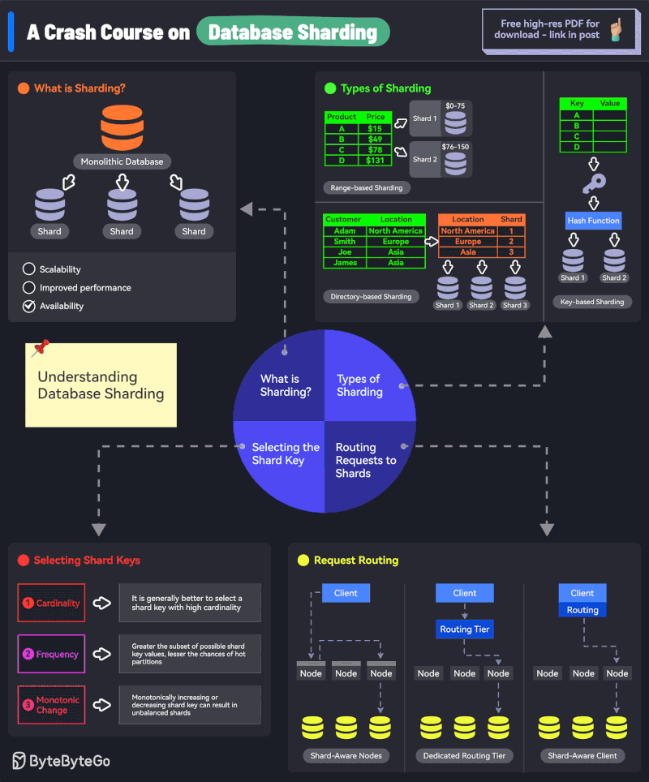

### Full-Text Search, Real-Time Analytics, Machine Learning, Geo-Data Applications, Log Analysis, Security Information and Event Management

???+ info "ElasticSearch"

    Six primary use cases for ElasticSearch, featuring architectural diagrams for Full-Text Search (with inverted indices), Real-Time Analytics (using Flink), Machine Learning (anomaly detection), Geo-Data Applications (k-d tree indexing), Log Analysis (ELK stack pipeline), and Security Information and Event Management (SIEM).

[📊 Vergrößern](images/Databases_UseCases_FullTextSearchReal.png){ .md-button .md-button--primary }

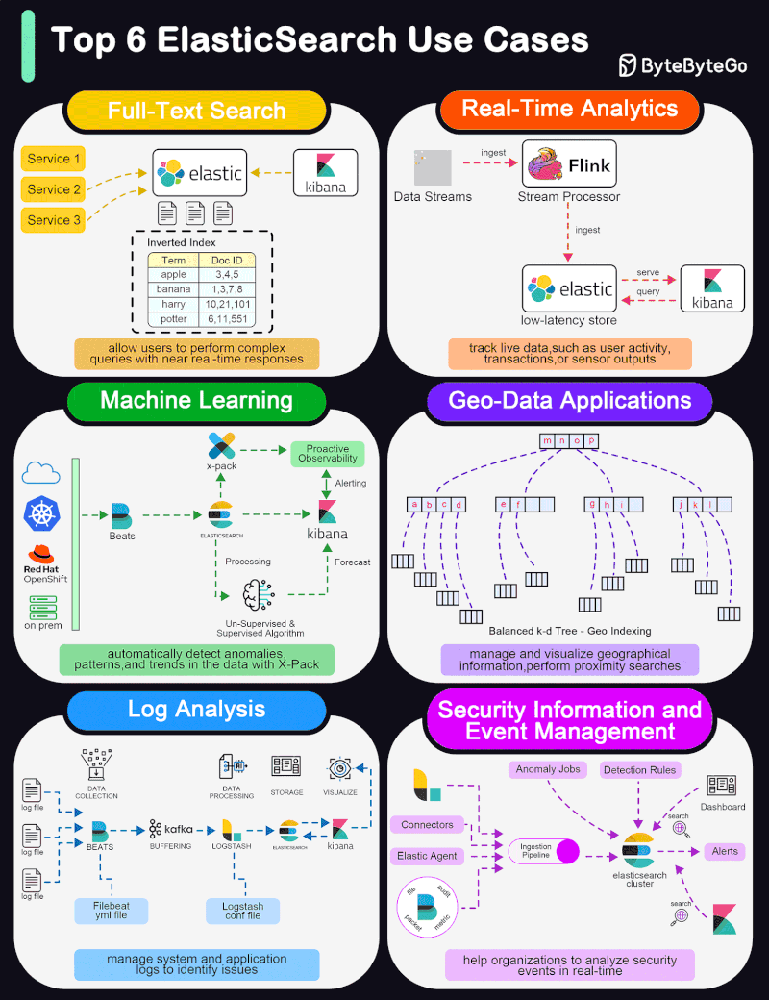

### History of Redis Features and Architecture

???+ info "Redis Architecture"

    The evolution of Redis architecture from 2010 to 2020. It details key milestones including the transition from standalone to persistent storage (AOF/RDB), replication, high availability with Sentinel, sharding with Redis Cluster, the introduction of Streams, and the implementation of multi-threaded I/O.

[📊 Vergrößern](images/Databases_EvolutionTimeline_HistoryOfRedisFeaturesAndArchitecture.png){ .md-button .md-button--primary }

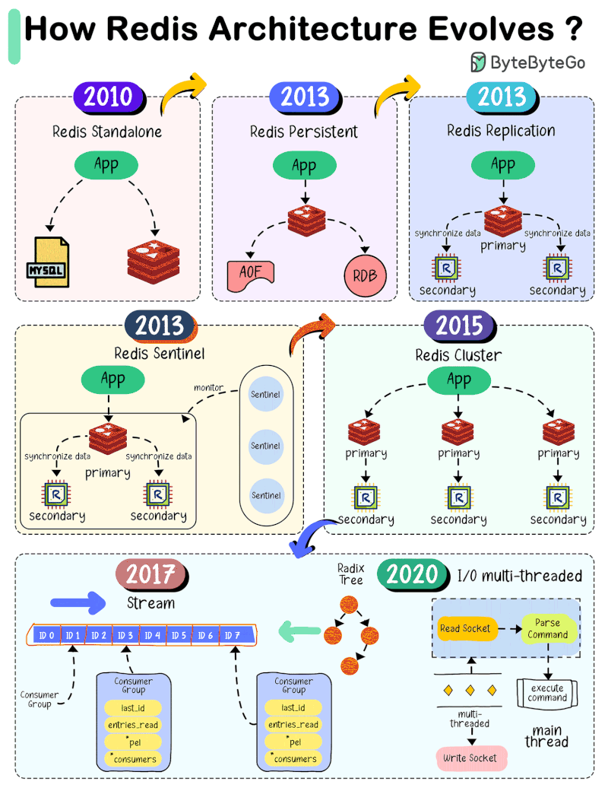

### Relational Database Design Overview

???+ info "Cheatsheet for Relational Database Design"

    The basics of relational databases. It covers SQL definitions and CRUD operations, types of keys (Primary, Natural, Foreign) with code examples, visual representations of Join Types (Inner, Left, Right), Relationship Types (One-to-One, One-to-Many, Many-to-Many), and fundamental structural concepts like Tables, Rows, Columns, Indexes, and Views.

[📊 Vergrößern](images/Databases_CoreConceptsAndFundamentals_RelationalDatabaseDesignOverview.png){ .md-button .md-button--primary }

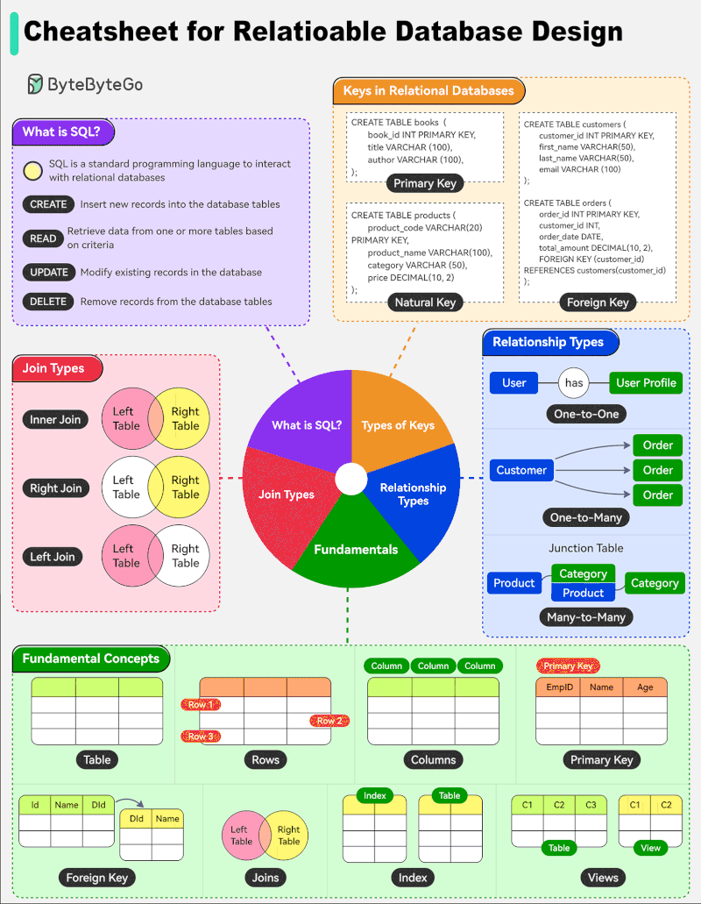

### Relational, Time-series, and NoSQL Database Comparison

???+ info "Database Systems"

    A flowchart diagram categorizing databases into three main types: Relational/SQL, Time-series, and NoSQL. For each type, it lists popular examples (such as MySQL, InfluxDB, and MongoDB) and details their specific characteristics, including features like ACID properties, high-write performance, and various data models like document-based or key-value stores.

[📊 Vergrößern](images/Databases_TypesOfDatabases_RelationalTimeSeriesAndNoSQLDatabaseComparison.png){ .md-button .md-button--primary }

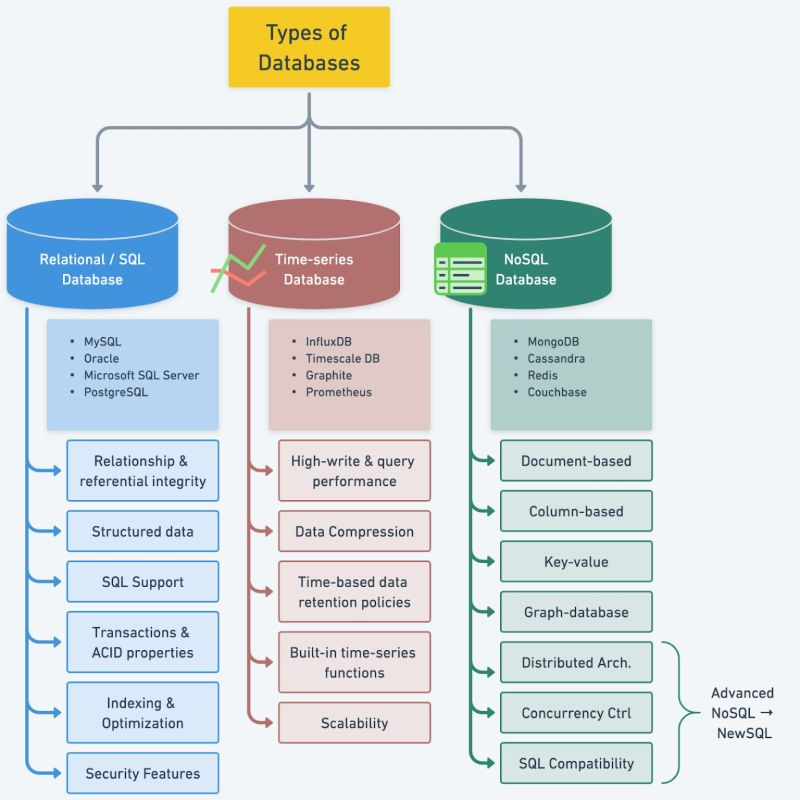

### SQL Command Categories and Components

???+ info "How to Learn SQL"

    A comprehensive mind map illustrating the structure of SQL, breaking it down into major categories like DDL, DQL, DML, DCL, and TCL, along with associated operators, functions, and data types.

[📊 Vergrößern](images/Databases_SQLOverviewAndStructure_SQLCommAndCategoriesAndComponents.png){ .md-button .md-button--primary }

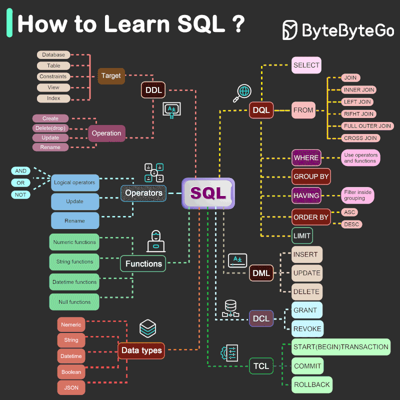

### SQL Query Execution Order

???+ info "SQL"

    The logical order in which SQL clauses are processed. It visualizes the transformation of data tables (grids) step-by-step through clauses like FROM, JOIN, ON, WHERE, GROUP BY, HAVING, ORDER BY, and LIMIT, contrasting the execution order with the written query order.

[📊 Vergrößern](images/Databases_QueryExecution_SQLQueryExecutionOrder.png){ .md-button .md-button--primary }

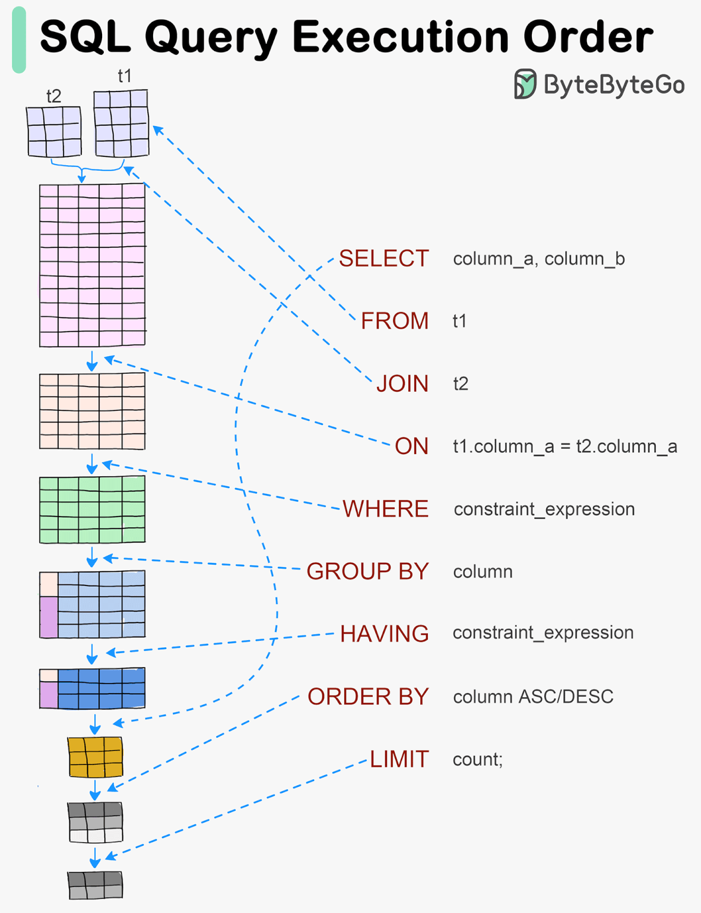

### Top 6 Database Models

???+ info "Database Architecture"

    Six common database models: Flat Model (represented by Excel), Hierarchical Model (tree structure with XML/JSON), Relational Model (tables with Oracle/MySQL), Star Schema (fact and dimension tables with Redshift/Teradata), Snowflake Model (normalized dimensions with Snowflake/Redshift), and Network Model (graph structure with Neo4j).

[📊 Vergrößern](images/Databases_TypesOfDatabaseModels_DatabaseModels.png){ .md-button .md-button--primary }

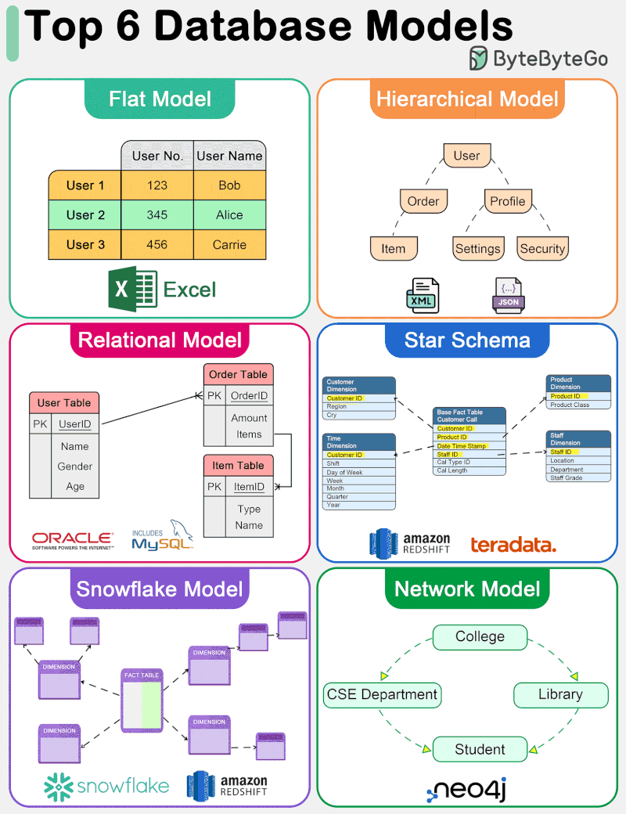

### What does ACID Mean?

???+ info "Database Transactions"

    The four key properties of database transactions: Atomicity (all or nothing), Consistency (preserving invariants), Isolation (concurrent transactions are isolated), and Durability (data persistence after commit).

[📊 Vergrößern](images/Databases_ACIDProperties_WhatdoesACIDMean.png){ .md-button .md-button--primary }

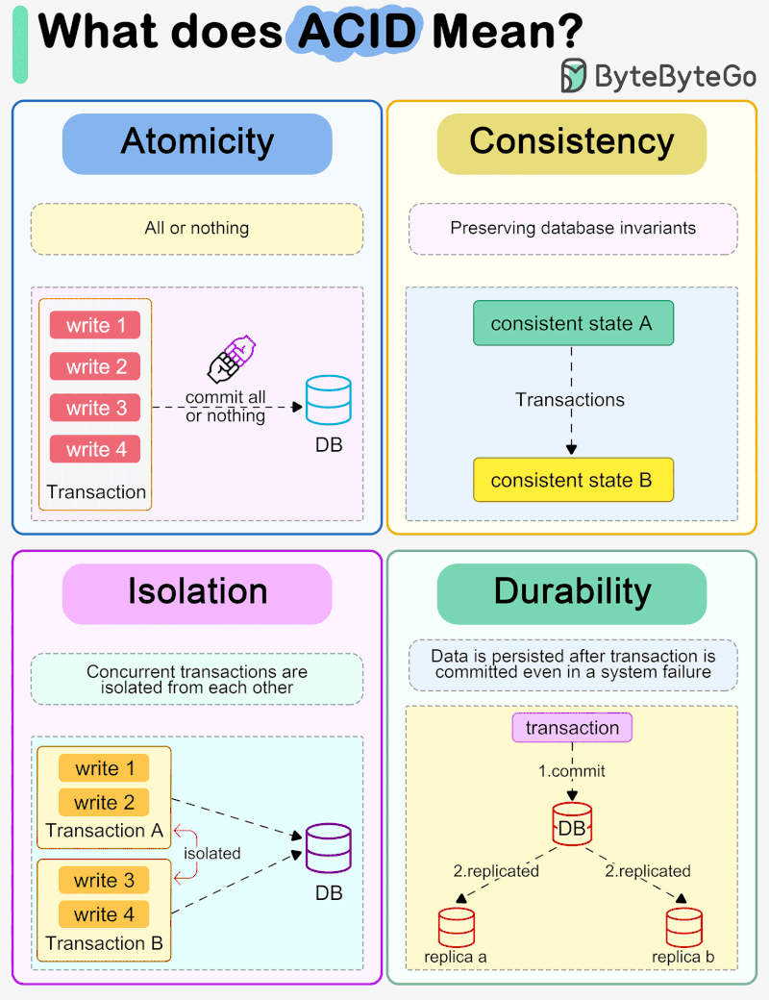

### Zero-Copy Optimization

???+ info "Kafka Internals"

    A diagram comparing data flow architectures in Kafka. The top section illustrates a standard read process ('Read without zero copy') involving multiple data copies between Application Buffer, OS Buffer, Socket Buffer, and NIC Buffer across User and Kernel contexts. The bottom section illustrates an optimized 'Read with zero copy' process where data is transferred directly from the OS Buffer to the NIC Buffer, minimizing context switches and CPU overhead.

[📊 Vergrößern](images/Databases_WhyisKafkaFast_ZeroCopyOptimization.png){ .md-button .md-button--primary }

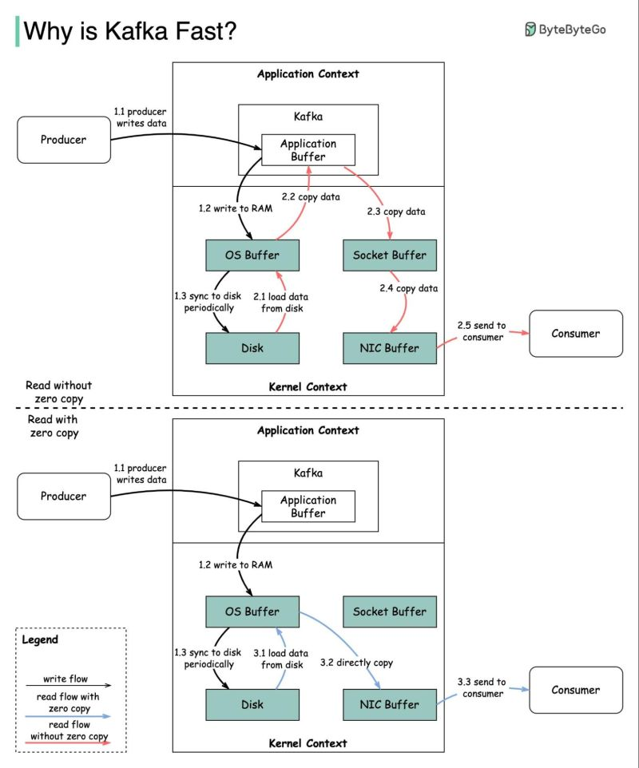

*14 Themen verfügbar*
