# Miscellaneous

### 15 System Design Core Concepts

???+ info "System Design"

    Titled 'System Design Cheat Sheet' by ByteByteGo that outlines 15 fundamental concepts of system design. It categorizes these concepts into groups such as Requirement Gathering, System Architecture, Data Design, Scalability, Reliability, Availability, Performance, Security, Maintainability, Testing, User Experience Design, Cost Estimation, Documentation, and Migration Plan, providing three key points for each.

[📊 Vergrößern](images/SystemDesign_CoreConcepts_SystemDesignCoreConcepts.png){ .md-button .md-button--primary }

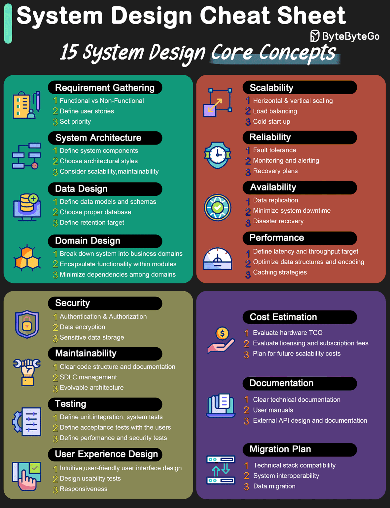

### 2024 Edition

???+ info "System Design"

    Learn 2024 Edition - The Big Archive. Key concepts and practical implementation.

[📊 Vergrößern](images/SystemDesign_TheBigArchive_Edition.png){ .md-button .md-button--primary }

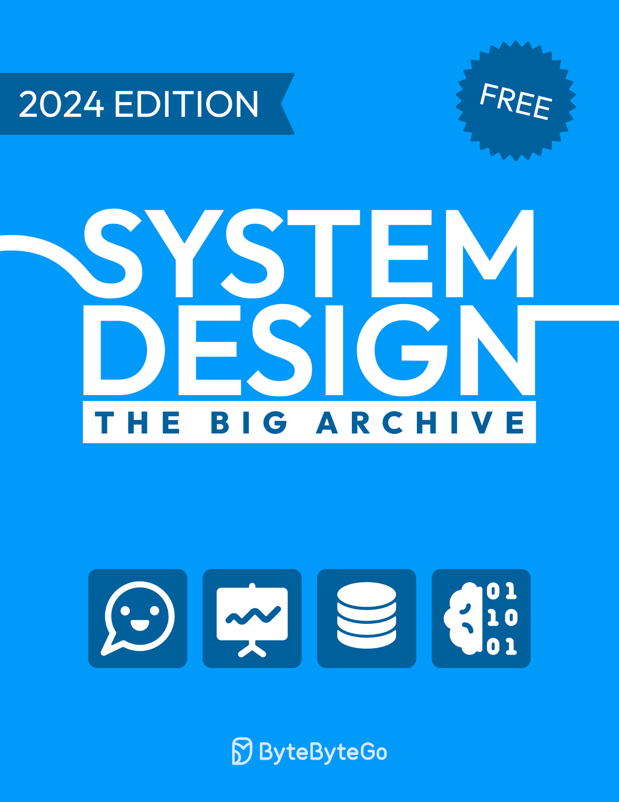

### 4 Popular Patterns (Client-based, BFF, Monolithic, Federation)

???+ info "GraphQL"

    Titled '4 Popular GraphQL Adoption Patterns' illustrating four distinct architectural approaches: Client-based GraphQL (wrapping REST APIs on the client), GraphQL with BFFS (Backend for Frontend layer), The Monolithic GraphQL (single server for multiple clients), and GraphQL Federation (gateway with subgraphs).

[📊 Vergrößern](images/Networking_AdoptionPatterns_PopularClientPatterns.png){ .md-button .md-button--primary }

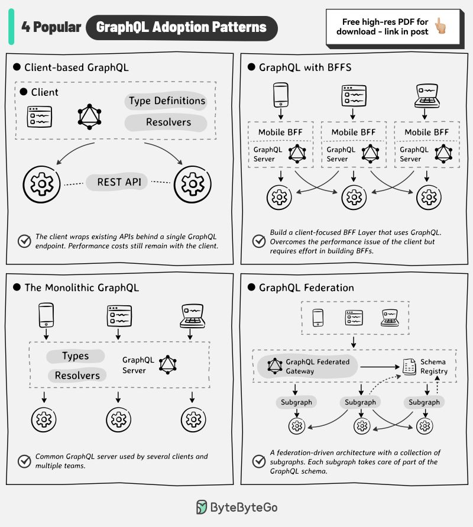

### 9 Essential Components of Production Microservice App

???+ info "System Design"

    A system architecture diagram illustrating the key components required for a production-ready microservice application. It visualizes the interaction between an API Gateway, Service Registry, Service Layer, Authorization Server, Database Layer with replication, Distributed Cache, Distributed Messaging, Load Balancer, and Observability tools (Metrics via Prometheus/Grafana and Logs via ELK Stack).

[📊 Vergrößern](images/SystemDesign_MicroservicesArchitecture_EssentialComponentsOfMicroserviceApp.png){ .md-button .md-button--primary }

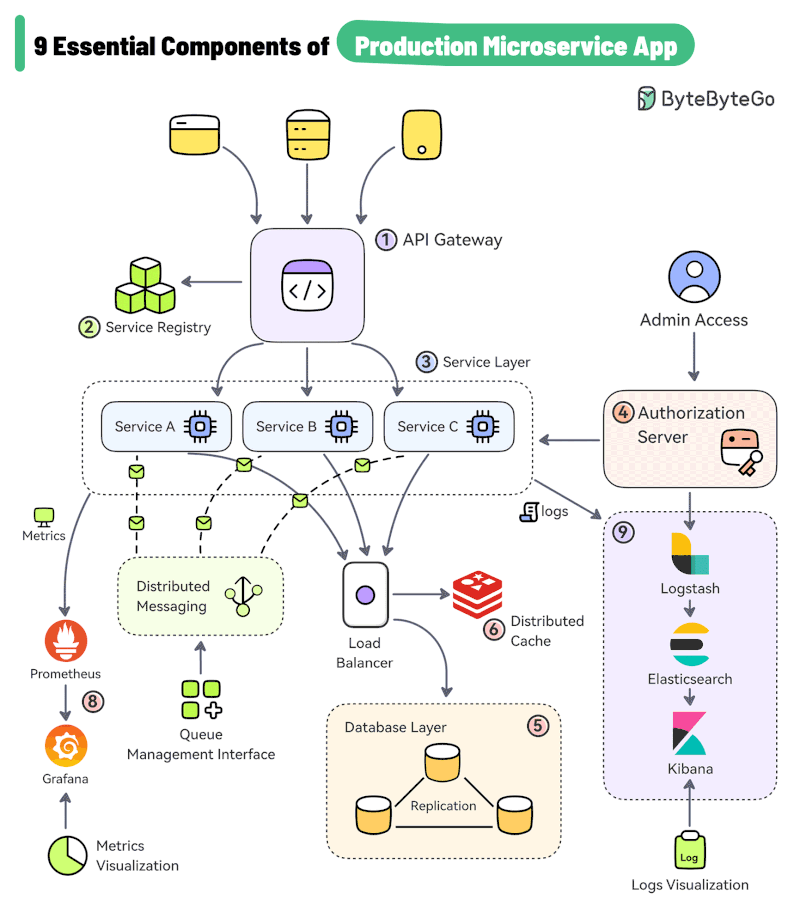

### Automatic Memory Management Strategies

???+ info "Garbage Collection 101"

    Garbage Collection (GC) as an automatic memory management feature. It details and compares specific GC mechanisms and algorithms for Java (Generational GC, G1), Python (Reference Counting, Mark-and-Sweep), and Go (Tricolor Mark-and-Sweep, Hybrid Write Barrier).

[📊 Vergrößern](images/SystemDesign_LanguageImplementations_AutomaticMemoryManagementStrategies.png){ .md-button .md-button--primary }

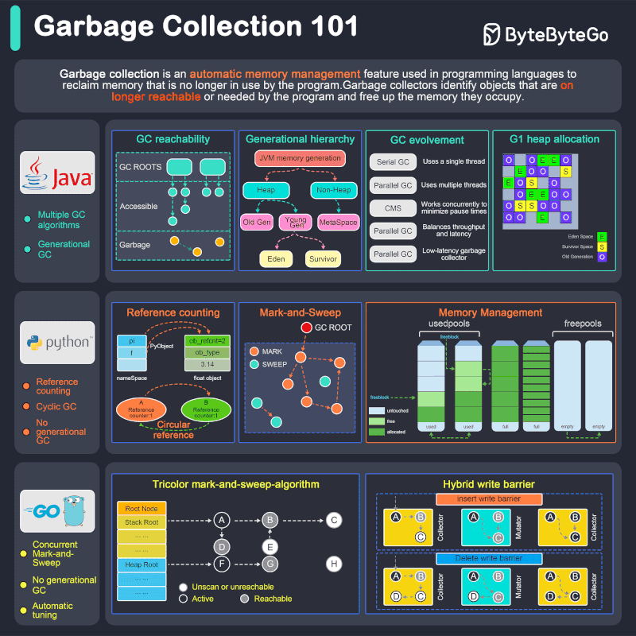

### CAP, BASE, SOLID, and KISS Principles

???+ info "System Design"

    Four major acronyms in software engineering: CAP (Consistency, Availability, Partition Tolerance) with a Venn diagram, BASE (Basically Available, Soft State, Eventual Consistency) compared to ACID, SOLID (object-oriented design principles) with illustrative diagrams, and KISS (Keep It Simple, Stupid) illustrated with Swiss Army knives.

[📊 Vergrößern](images/SystemDesign_KeyAcronyms_CAPBASESOLIDAndKISSPrinciples.png){ .md-button .md-button--primary }

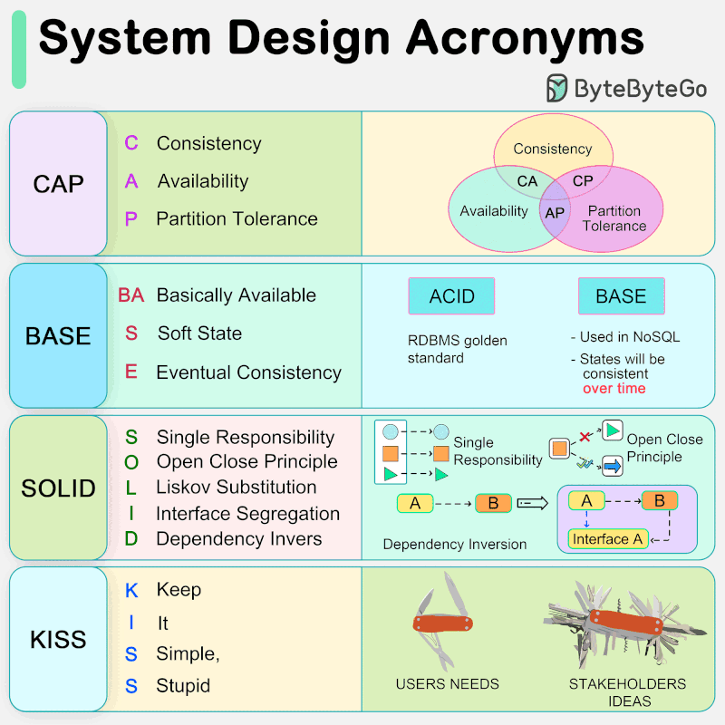

### CI/CD Pipeline and DevOps Workflow

???+ info "How Companies Ship Code To Production"

    A comprehensive flowchart illustrating the end-to-end software delivery lifecycle. It details five key phases: Plan (creating stories in Jira), Development (coding and committing to GitHub), Build & Package (using Jenkins, JUnit, SonarQube), Test (QA and UAT environments), and Release (deployment to production with monitoring by SREs).

[📊 Vergrößern](images/CloudInfrastructure_PlanDevelopmentBuildPackageTes_CICDPipelineAndDevOpsWorkflow.png){ .md-button .md-button--primary }

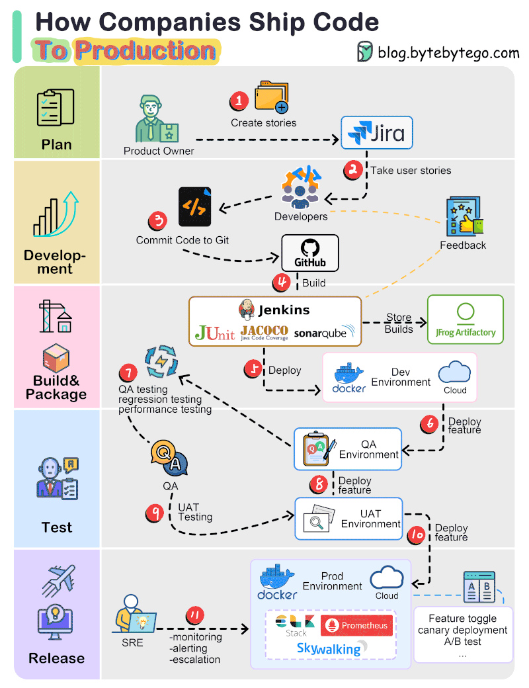

### Caching Layers in Distributed Systems

???+ info "System Design"

    A system architecture diagram illustrating eight distinct locations where data caching can be implemented. The flow starts from the Client App (1) and CDN (2), moves through a Load Balancer (3) and API Gateway, and branches out to a Message Broker (4), Application Services (5), Distributed Cache like Redis (6), Full-text Search like Elasticsearch (7), and finally the Relational Database (8) which includes internal caching mechanisms like buffer pools and logs.

[📊 Vergrößern](images/SystemDesign_WheredoWeCacheData_CachingLayersinDistributedSystems.png){ .md-button .md-button--primary }

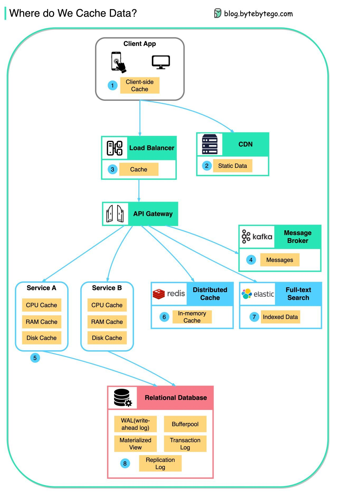

### Class Structure, Components, and Relationships

???+ info "UML Class Diagram"

    A comprehensive visual guide detailing the standard notation for UML Class Diagrams. It breaks down the structure of a Class (Name, Attributes, Methods/Operations), defines Interfaces and Enumerations, and illustrates various relationship types including Association, Aggregation, Composition, Inheritance, and Implementation.

[📊 Vergrößern](images/Programming_General_ClassStructureComponentsAndRelationships.png){ .md-button .md-button--primary }

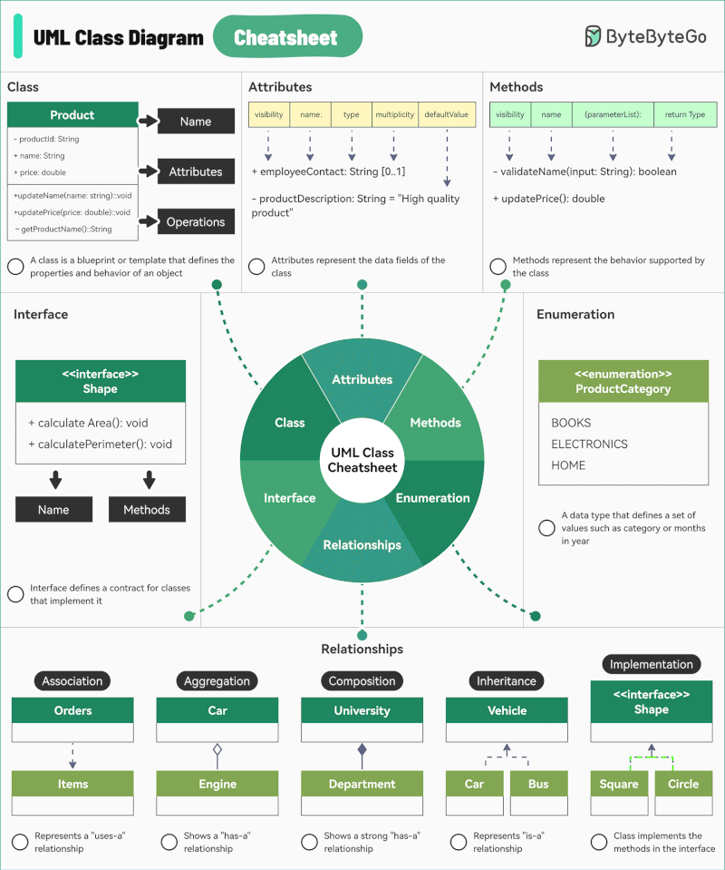

### Computer Program Execution and System Architecture

???+ info "How Computer Programs Run"

    The six stages of how a computer program runs: 1. Program Compilation and Loading, 2. User Interaction and Memory Allocation, 3. System Calls, 4. CPU Status and Memory Structure, 5. Von Neumann Architecture, and 6. Program Termination and Resource Recovery.

[📊 Vergrößern](images/SystemDesign_ProgramExecutionLifecycleSteps_ComputerProgramExecutionAndSystemArchitecture.png){ .md-button .md-button--primary }

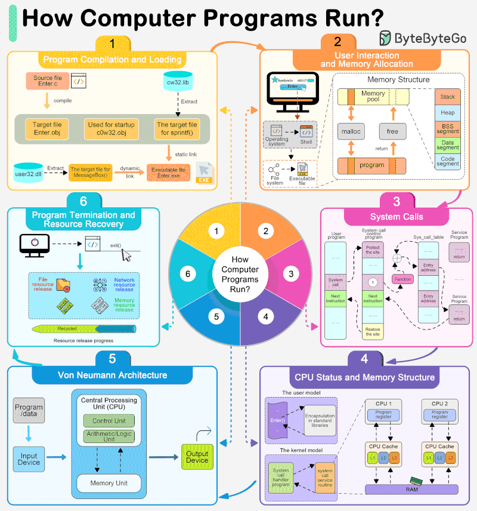

### Data Management Patterns (Cache Aside, Materialized View, CQRS, Event Sourcing, Index Table, Sharding)

???+ info "Top 6 Data Management Patterns"

    Six common data management patterns. Each pattern (Cache Aside, Materialized View, CQRS, Event Sourcing, Index Table, Sharding) is presented with a architectural diagram, its specific purpose, and a list of restrictions or trade-offs.

[📊 Vergrößern](images/SystemDesign_DataArchitectureOverview_DataManagementPatternsCacheAsideMaterializedViewCQ.png){ .md-button .md-button--primary }

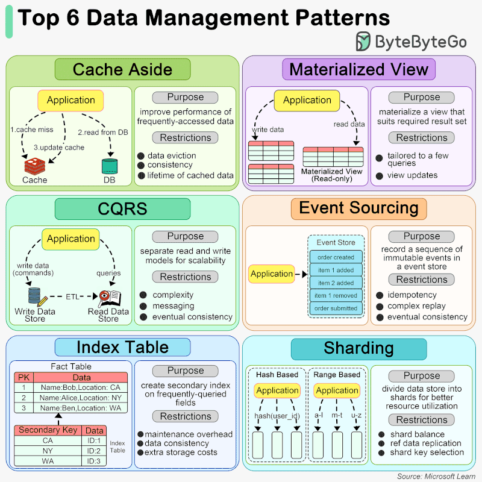

### Data Security and Management Strategies

???+ info "Cheat Sheet for Managing Sensitive Data"

    Four key strategies for managing sensitive data: encryption and key management (using HTTPS, salts, and key vaults), data desensitization (using GCM mode), minimal data permissions (via RBAC), and the data lifecycle management process. It also categorizes examples of sensitive data such as PII, health information, and financial records.

[📊 Vergrößern](images/Security_Encryption_DataSecurityManagementStrategies.png){ .md-button .md-button--primary }

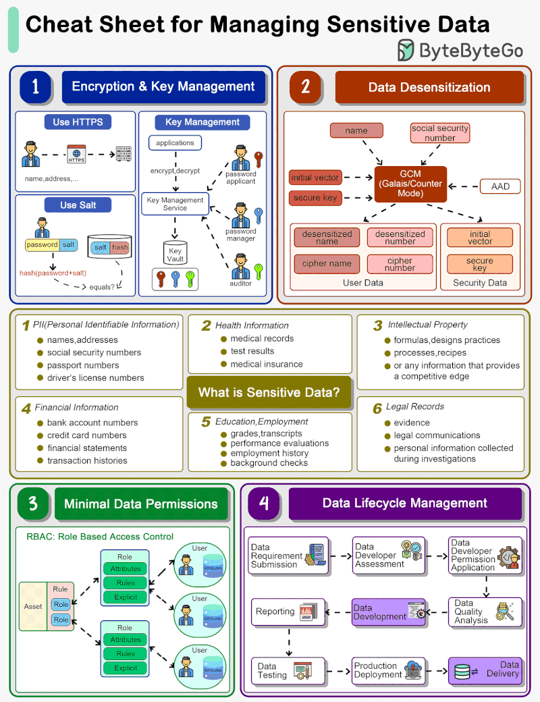

### Database Scaling and Migration

???+ info "How Discord Stores Trillions Of Messages"

    The evolution of Discord's message storage infrastructure. It shows the transition from MongoDB (2015) to Cassandra (2017) due to RAM limitations, and finally to ScyllaDB (2023) to handle trillions of messages and avoid garbage collection pauses. The right side details the modern architecture including a Python API, a Rust Data Service, and the internal components of the Scylla shard-per-core database (Memtable, SSTables, Commit Log).

[📊 Vergrößern](images/SystemDesign_ArchitectureEvolution_DatabaseScalingAndMigration.png){ .md-button .md-button--primary }

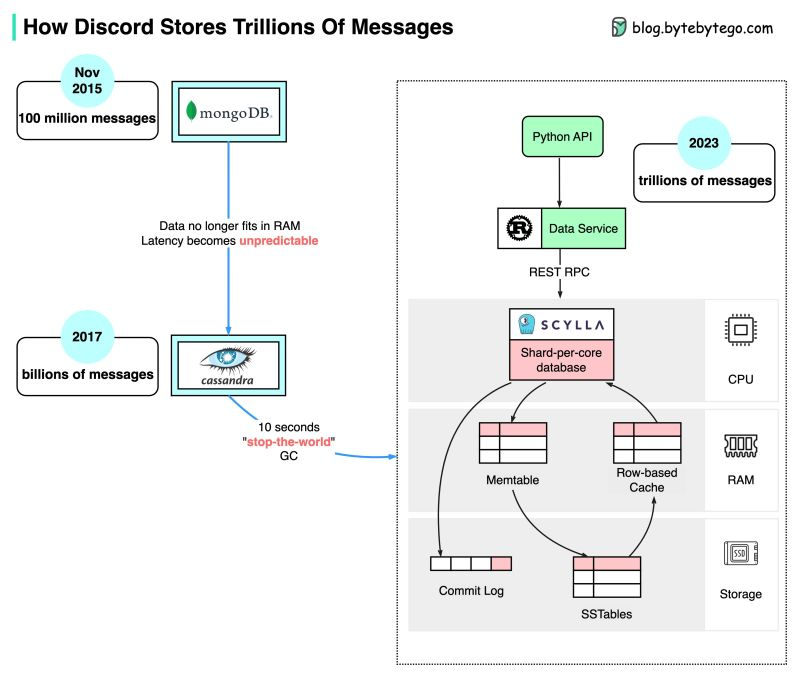

### Deadlock

???+ info "What is a Deadlock?"

    The concept of a Deadlock in computer science. It illustrates a scenario where two transactions block each other, lists the four necessary Coffman Conditions (Mutual Exclusion, Hold and Wait, Circular Wait, No Preemption), and outlines strategies for Deadlock Recovery (selecting a victim, rollback) and Deadlock Prevention (resource ordering, timeouts, Banker's Algorithm).

[📊 Vergrößern](images/Miscellaneous_ConditionsRecoveryAndPreventio_Deadlock.png){ .md-button .md-button--primary }

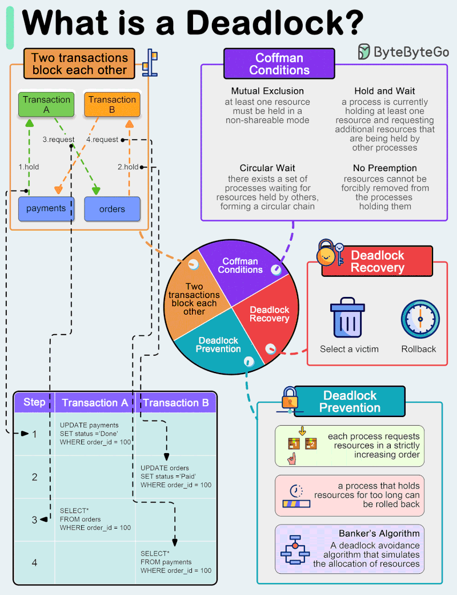

### Diagram-as-Code Tools

???+ info "Top 6 Tools to Turn Code into Beautiful Diagrams"

    Six software tools that generate diagrams from code, featuring visual examples for Diagrams (Python library), Mermaid (sequence diagrams), Markmap (mind maps), ASCII editors, PlantUML (cloud architecture), and Go-Diagrams.

[📊 Vergrößern](images/CareerLearning_ToolOverview_DiagramAsCodeTools.png){ .md-button .md-button--primary }

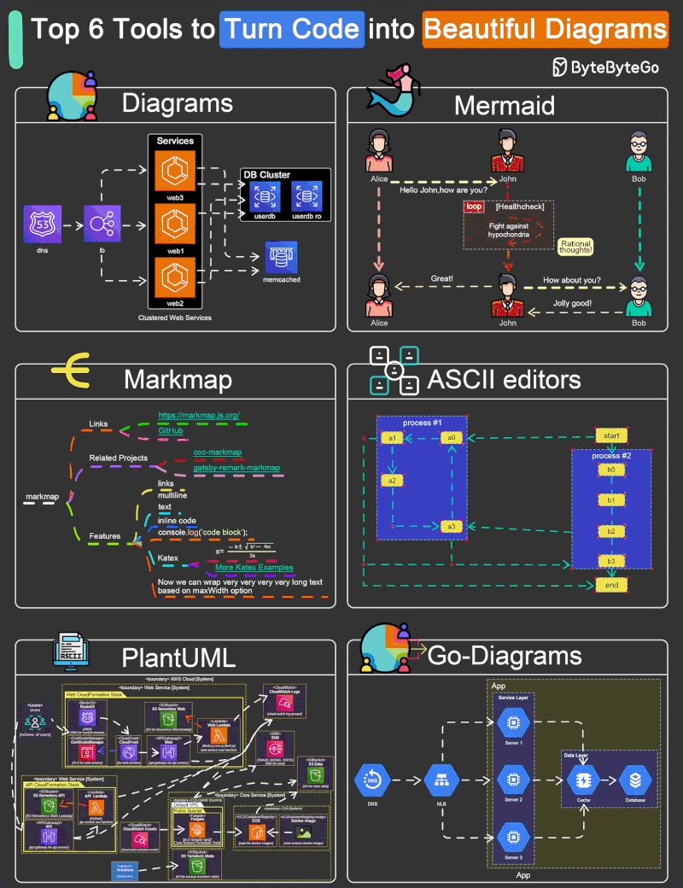

### Differences between Encoding, Encryption, and Tokenization

???+ info "Encoding vs Encryption vs Tokenization"

    By ByteByteGo comparing three data protection methods. It is divided into three color-coded sections: Encoding (red), Encryption (orange), and Tokenization (blue). Each section illustrates the process flow (e.g., plain text to cipher text, or PAN to token), the keys or algorithms involved, and specific use cases such as ASCII/Base64 for encoding, HTTPS/Blockchain for encryption, and Credit Card Tokenization/PCI DSS for tokenization.

[📊 Vergrößern](images/Security_DataSecurityMechanismsComparis_DifferencesbetweenEncodingEncryptionAndTokenizatio.png){ .md-button .md-button--primary }

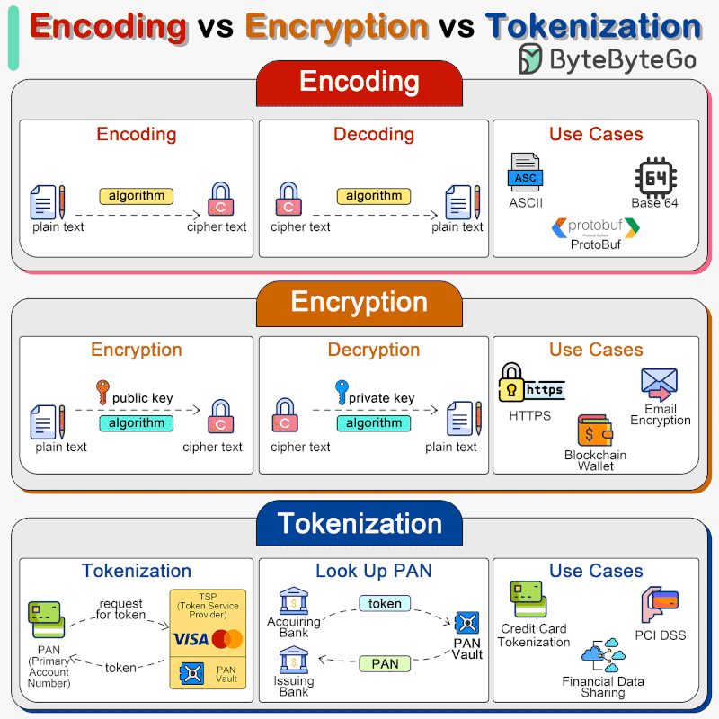

### Distributed System Architecture

???+ info "System Design Blueprint"

    A comprehensive architectural diagram illustrating a scalable system design. It details the flow from DNS resolution and load balancing to backend services, database sharding, caching strategies, and specific modules for video uploading and common fan-out services like notifications and analytics.

[📊 Vergrößern](images/SystemDesign_TheUltimateGuide_DistributedSystemArchitecture.png){ .md-button .md-button--primary }

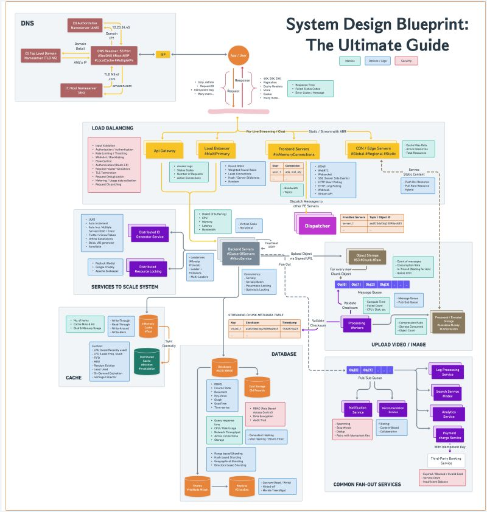

### Endianness (Big Endian vs Little Endian)

???+ info "Computer Architecture"

    Learn Endianness (Big Endian vs Little Endian) - Data Representation. Key concepts and practical implementation.

[📊 Vergrößern](images/SystemDesign_DataRepresentation_EndiannessBigEndianvsLittleEndian.png){ .md-button .md-button--primary }

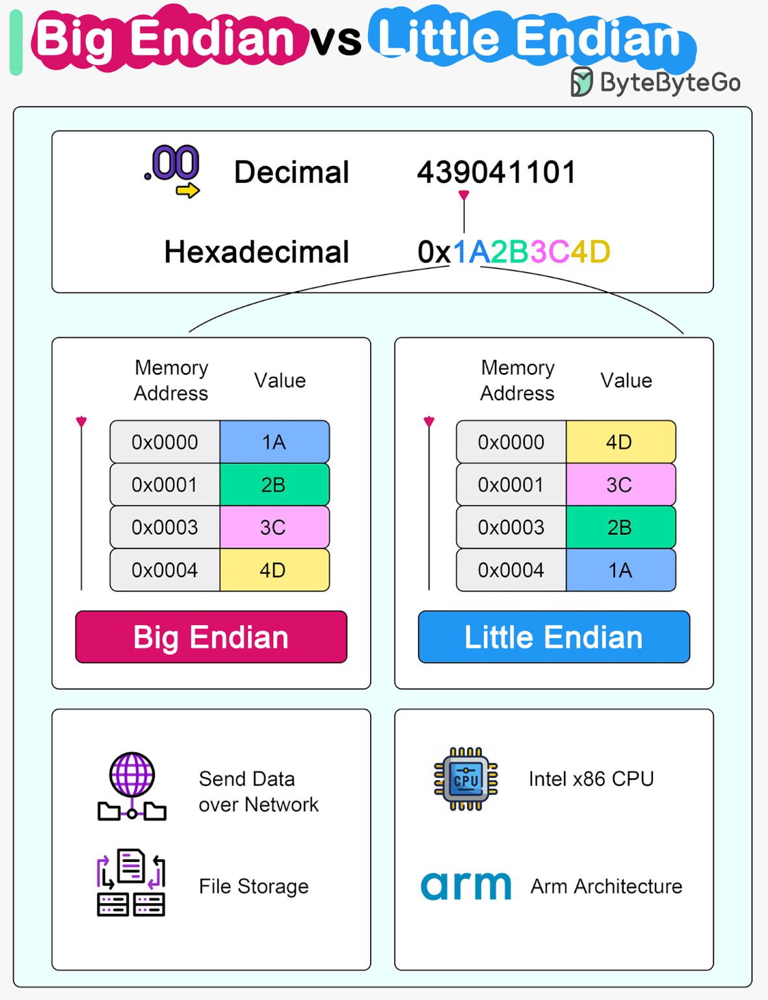

### Essential Technical Standards for Software Development

???+ info "8 Standards Developers Should Know"

    Eight critical standards for developers: 1. TCP/IP networking layers, 2. HTTP protocol structure, 3. SQL command categories (DDL, DML, etc.), 4. OAuth authorization flow, 5. HTML/CSS specifications and browser compatibility, 6. ECMAScript versions (ES5, ES6, TypeScript), 7. ISO 8601 date/time formatting, and 8. OpenAPI for documentation.

[📊 Vergrößern](images/CareerLearning_Overview_EssentialTechnicalStandardsForSoftwareDevelopment.png){ .md-button .md-button--primary }

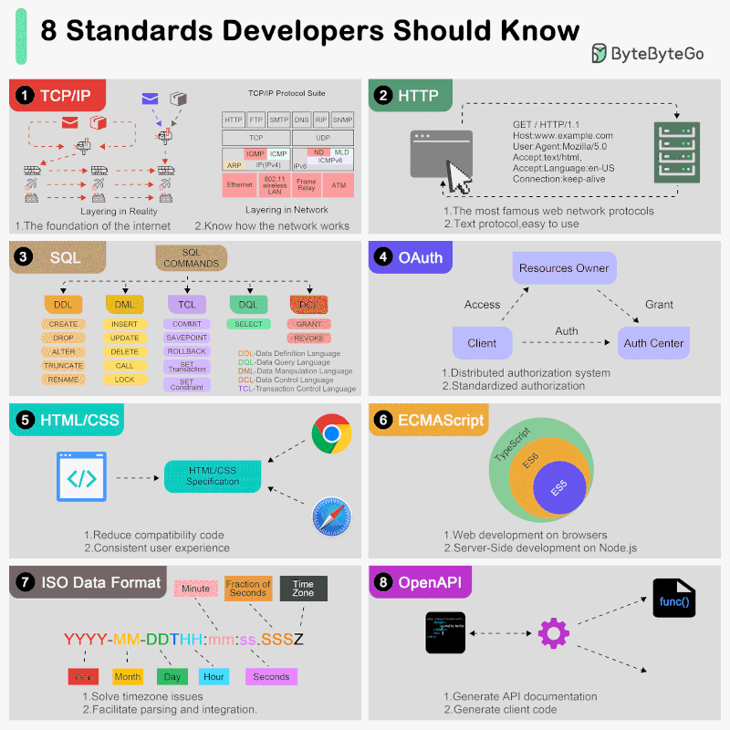

### Frontend Performance Tips

???+ info "Frontend Performance"

    Titled 'Frontend Performance Cheatsheet' by ByteByteGo. It features a central hub labeled 'Frontend Performance Tips' connected to eight surrounding panels. These panels illustrate specific optimization techniques: Selective Rendering (distinguishing above/below the fold), Code Splitting (breaking large bundles into smaller ones), Compression (zipping files), Loading Sequence (ordering HTML, CSS, JS), Dynamic Imports (loading modules based on user action), Priority-Based Loading (loading critical resources first), Pre-fetching (caching resources proactively), and Tree Shaking (removing unused code from bundles).

[📊 Vergrößern](images/Miscellaneous_General_FrontendPerformanceTips.png){ .md-button .md-button--primary }

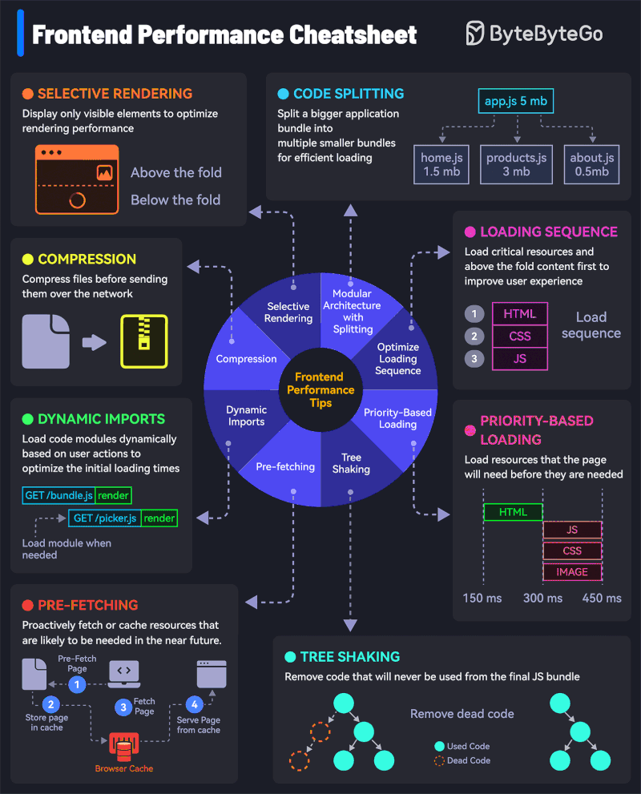

### GraphQL Overview and Architecture

???+ info "What is GraphQL?"

    From ByteByteGo explaining GraphQL. It is divided into four sections: a history timeline of API technologies (CORBA, SOAP, REST, etc.), a comparison between REST and GraphQL focusing on data fetching and efficiency, a diagram listing the advantages of GraphQL (such as no over-fetching and detailed error tracking), and a technical illustration of how a GraphQL request aggregates data from multiple microservices into a single response.

[📊 Vergrößern](images/Networking_HistoryComparisonAndBenefits_GraphQLOverviewAndArchitecture.png){ .md-button .md-button--primary }

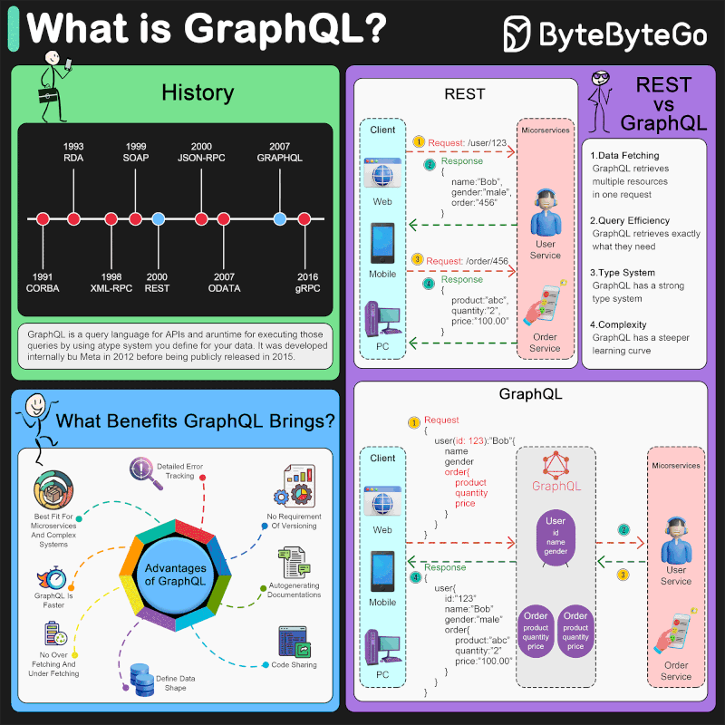

### High Availability, High Throughput, and High Scalability

???+ info "System Design"

    Key system design pillars. It details measurements (such as uptime nines, QPS, TPS, Response Time) and common architectural solutions (like Hot-Hot, Caching, Async Processing, Microservices) for achieving High Availability, High Throughput, and High Scalability.

[📊 Vergrößern](images/SystemDesign_General_HighAvailabilityHighThroughputAndHighScalability.png){ .md-button .md-button--primary }

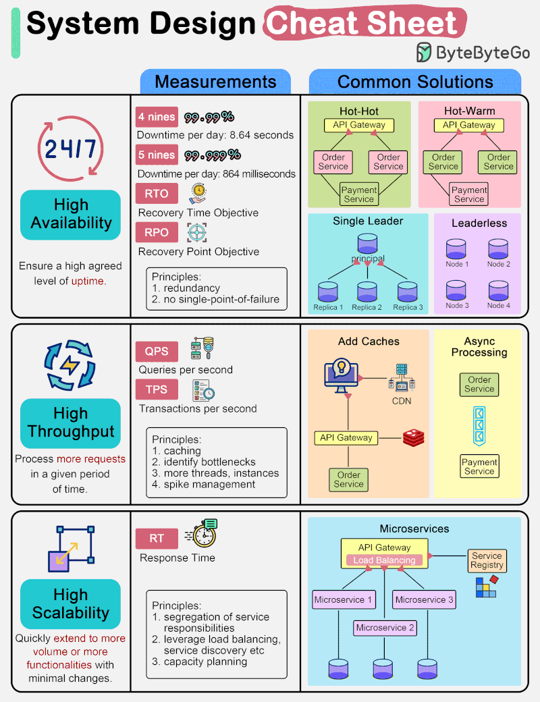

### How Are Notifications Pushed to Our Devices

???+ info "Miscellaneous"

    A technical flowchart illustrating the architecture and workflow of push notifications using Firebase Cloud Messaging (FCM). The diagram details a 7-step process: (1-3) Client apps registering with FCM to get a Registration Token, (4) Servers (App Server or Console) building and sending messages, (5) FCM storing messages if devices are offline, (6) FCM forwarding messages to platform transport layers, and (7) Client apps receiving and displaying notifications. It also includes a reference table for FCM credentials like Sender ID, API Key, and App ID.

[📊 Vergrößern](images/SystemDesign_HowAreNotificationsPushedtoOur_HowAreNotificationsPushedtoOurDevices.png){ .md-button .md-button--primary }

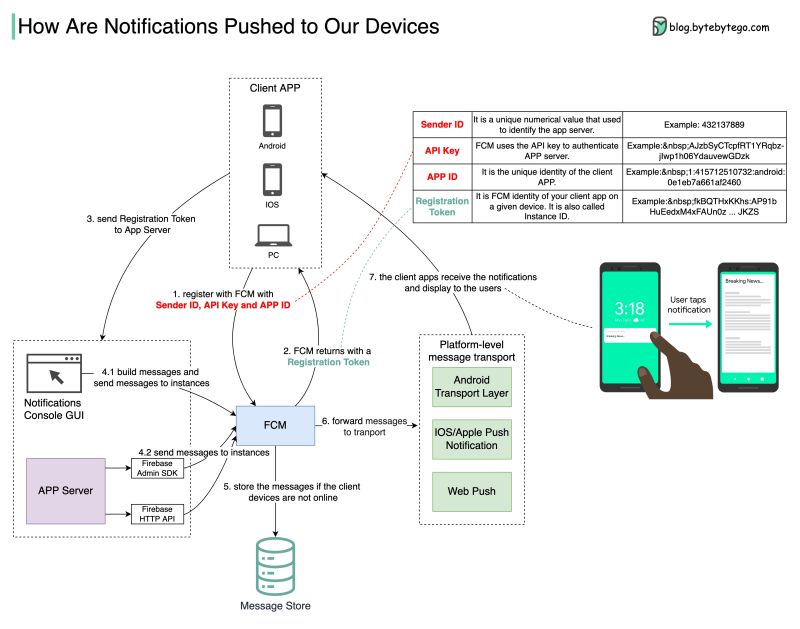

### How Live Streaming Works

???+ info "Live Streaming"

    A flowchart illustrating the end-to-end process of live streaming, divided into three main stages: Video Capture, Server processing (compression, segmentation, streaming server), and View Devices (CDN distribution, decoding, playback). It highlights protocols like RTMP, HLS, and DASH, and notes latency.

[📊 Vergrößern](images/SystemDesign_ArchitectureAndWorkflow_HowLiveStreamingWorks.png){ .md-button .md-button--primary }

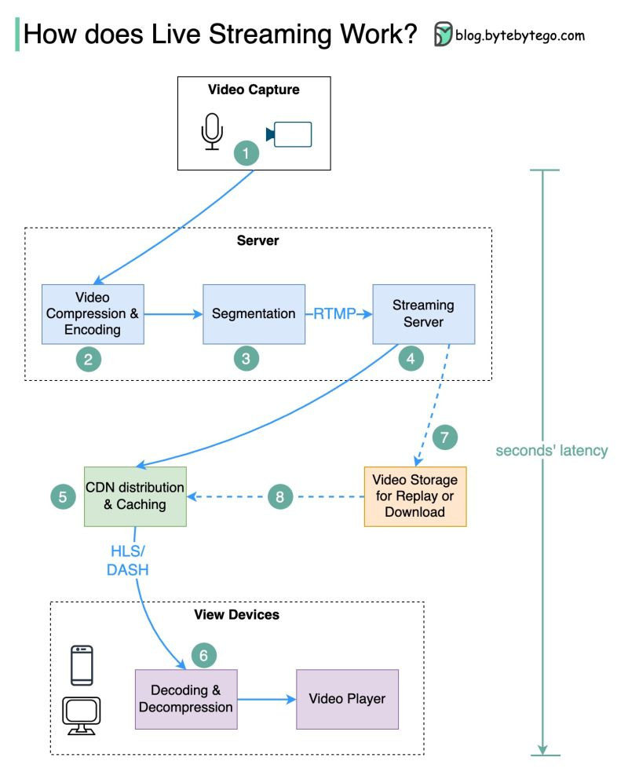

### Influential Open Source Software

???+ info "15 Open Source Projects That Changed the World"

    Categorizing 15 major open-source projects into five key areas: Web Development, Data Management, Developer Tools, Machine Learning & Big Data, and DevOps and Containerization.

[📊 Vergrößern](images/CareerLearning_CategorizedbyDomain_InfluentialOpenSourceSoftware.png){ .md-button .md-button--primary }

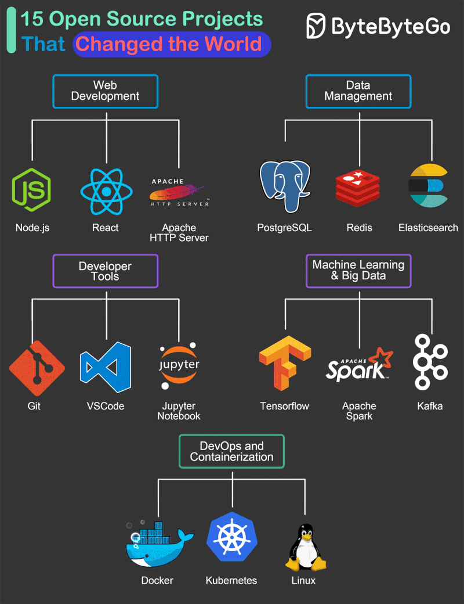

### Influential Open Source Software Technologies

???+ info "15 Open Source Projects That Changed the World"

    15 major open source projects grouped by their primary domain. The categories include Web Development (Node.js, React, Apache HTTP Server), Data Management (PostgreSQL, Redis, Elasticsearch), Developer Tools (Git, VSCode, Jupyter Notebook), Machine Learning & Big Data (Tensorflow, Apache Spark, Kafka), and DevOps and Containerization (Docker, Kubernetes, Linux).

[📊 Vergrößern](images/CareerLearning_WebDevelopmentDataManagementDe_InfluentialOpenSourceSoftwareTechnologies.png){ .md-button .md-button--primary }

### Introduction to Cascading Style Sheets

???+ info "What is CSS?"

    Six core concepts of CSS: the role of CSS in styling HTML structure, how CSS selectors apply rules, the priority hierarchy of cascading (specificity), layout models (Flexbox and CSS Grids), animations using keyframes, and adaptability (responsive design) across devices.

[📊 Vergrößern](images/Programming_CSSFundamentals_IntroductiontoCascadingStyleSheets.png){ .md-button .md-button--primary }

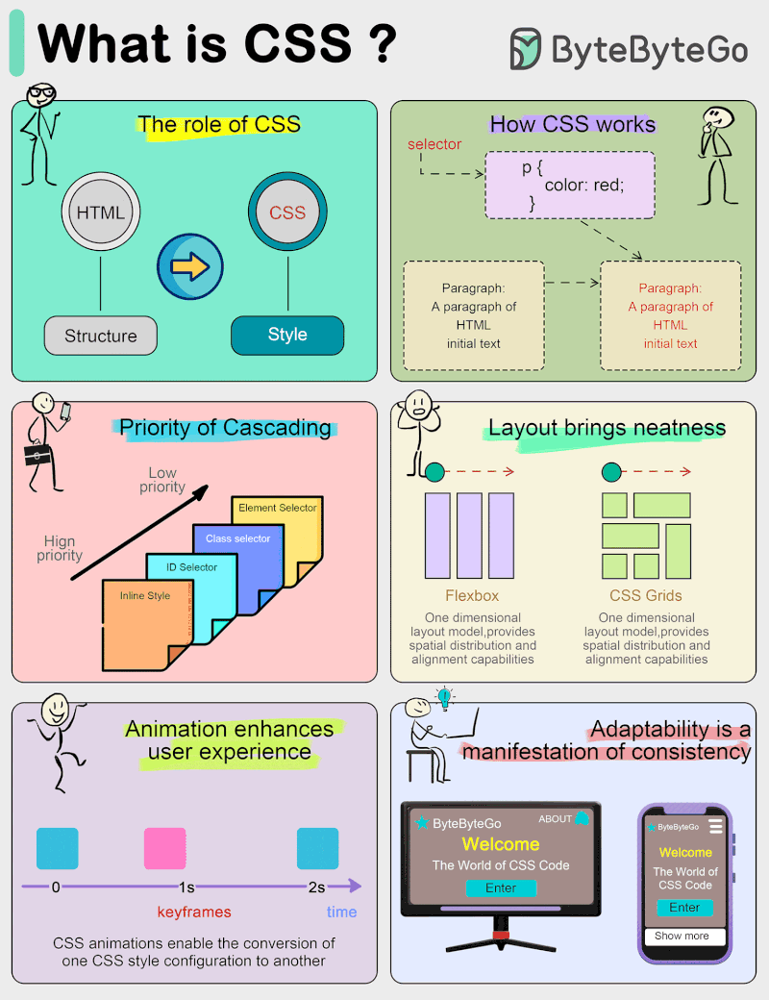

### Key to leverage real-time Data

???+ info "Change Data Capture"

    An architectural diagram illustrating the Change Data Capture (CDC) workflow. It shows a 5-step process where a user updates a database, changes are recorded in a transaction log, captured by a Debezium Source Connector, sent to a Message Broker, and finally distributed via Sink Connectors to downstream systems like Redis, a Data Warehouse, and Elasticsearch.

[📊 Vergrößern](images/SystemDesign_CDCSolution_KeytoleveragerealtimeData.png){ .md-button .md-button--primary }

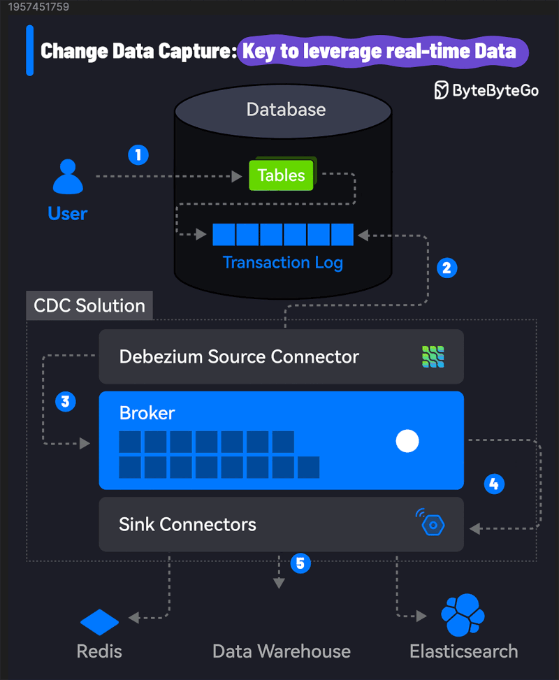

### Latency Numbers You Should Know

???+ info "System Design"

    A hierarchical pyramid chart illustrating the scale of latency in computer systems, ranging from 1 nanosecond (L1 Cache) to 10 seconds (retry intervals). The chart maps specific hardware and software operations to time scales, with annotations linking real-world technologies like Redis, Memcached, RocksDB, PostgreSQL, Zoom, and Grafana to their corresponding latency tiers.

[📊 Vergrößern](images/SystemDesign_PerformanceAndLatency_LatencyNumbersYouShouldKnow.png){ .md-button .md-button--primary }

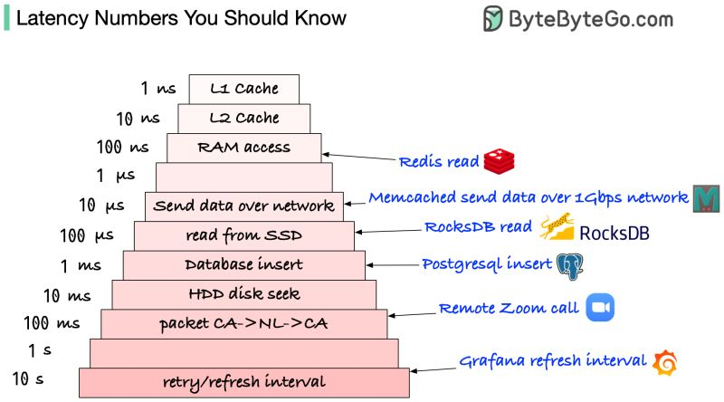

### Linux Text Processing Utilities (grep, cut, sed, awk, sort, uniq)

???+ info "Top 6"

    Cheat sheet detailing the top 6 command-line tools for parsing logs. It lists GREP, CUT, SED, AWK, SORT, and UNIQ, providing a basic usage example, a brief description of function, and numbered specific use-cases with command syntax for each tool.

[📊 Vergrößern](images/Miscellaneous_LogParsingCommands_LinuxTextProcessingUtilitiesgrepcutsedawksortuniq.png){ .md-button .md-button--primary }

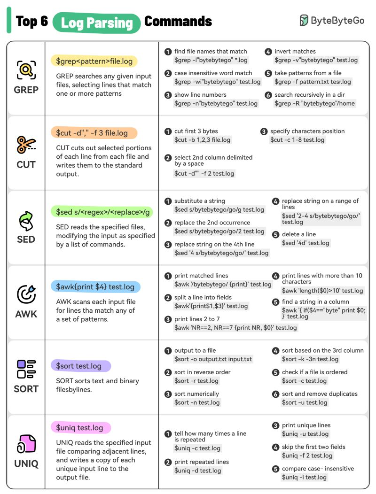

### Load Balancing

???+ info "Load Balancer 101"

    An educational infographic providing a comprehensive overview of load balancers. It covers the definition and benefits (distributing traffic, scaling, performance, availability), types of load balancers (Hardware, Software, Cloud-based, Layer 4, Layer 7, GSLB), common load balancing algorithms (Round Robin, Sticky, Weighted, Hash, Least Connections, Least Time), and key metrics for monitoring (Traffic, Performance, Health, Error, Load, Security, Availability).

[📊 Vergrößern](images/SystemDesign_CommonStrategies_LoadBalancingTechniques.png){ .md-button .md-button--primary }

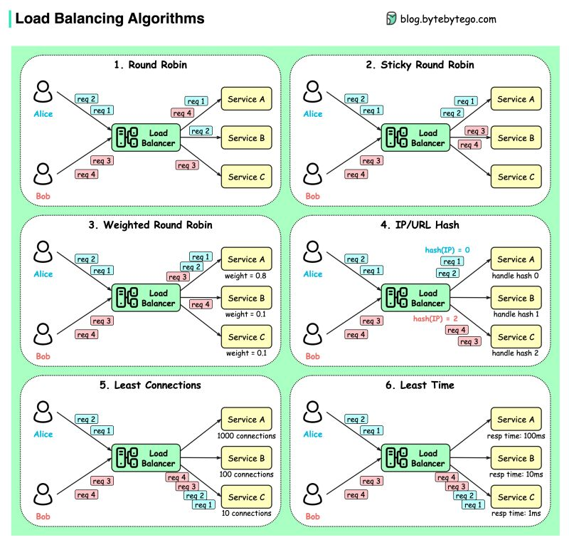

### Load Balancing Strategies

???+ info "Top 6 Load Balancer Use Cases"

    Six primary use cases for load balancers: Traffic Distribution (splitting traffic by percentage), High Availability (routing around failed services), SSL Termination (decrypting HTTPS traffic before passing to backend), Session Persistence (maintaining user sessions on specific servers), Scalability (distributing load across multiple service instances), and Health Monitoring (checking service status via heartbeats).

[📊 Vergrößern](images/SystemDesign_LoadBalancerFunctions_LoadBalancingStrategies.png){ .md-button .md-button--primary }

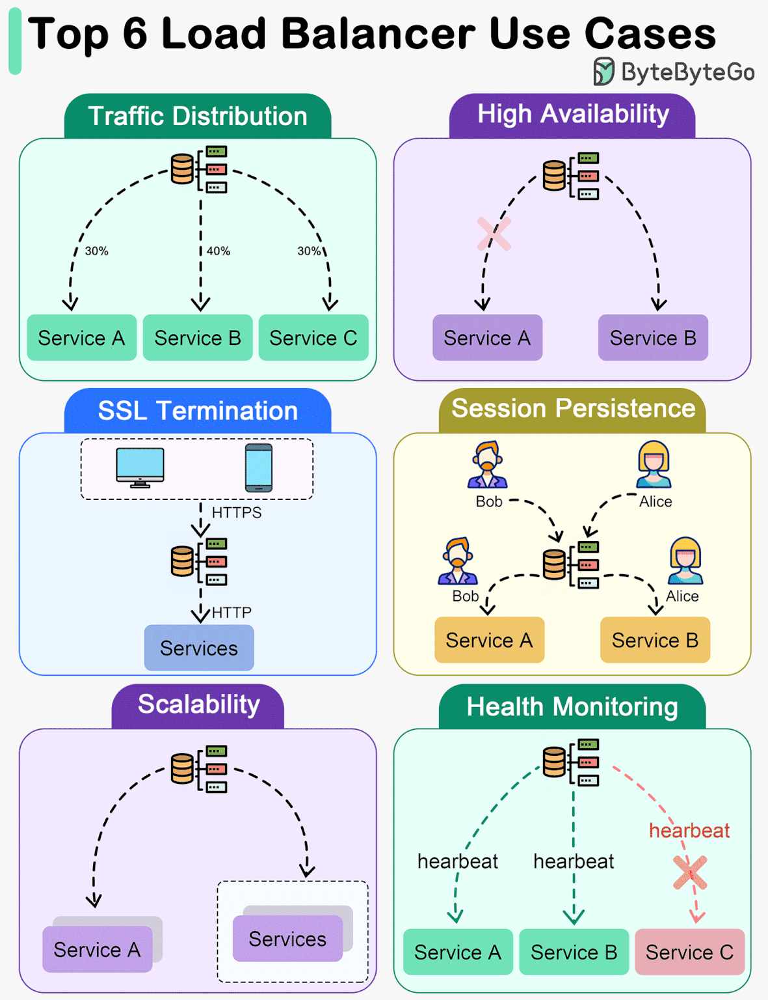

### Load Balancing Strategies and Patterns

???+ info "Load Balancer"

    Six realistic use cases for load balancers: 1. Failure Handling (routing around failed instances), 2. Instance Health Checks (monitoring /health endpoints), 3. Platform Specific Routing (directing traffic based on Desktop vs Mobile), 4. SSL Termination (decrypting HTTPS at the load balancer), 5. Cross Zone Load Balancing (distributing traffic across availability zones), and 6. User Stickiness (maintaining session affinity).

[📊 Vergrößern](images/SystemDesign_RealisticUseCases_LoadBalancingStrategiesAndPatterns.png){ .md-button .md-button--primary }

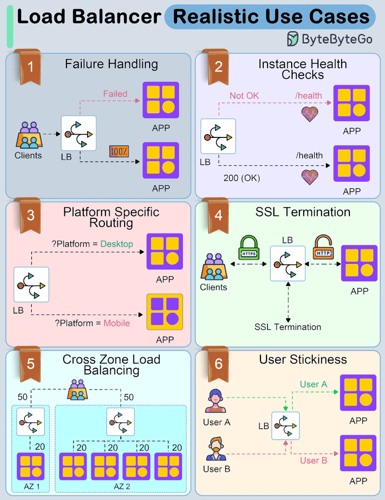

### Load Balancing Techniques

???+ info "Load Balancing Algorithms"

    Six different load balancing algorithms: Round Robin, Sticky Round Robin, Weighted Round Robin, IP/URL Hash, Least Connections, and Least Time. Each panel demonstrates how a load balancer distributes requests from users (Alice and Bob) to backend services (Service A, B, C) based on the specific logic of that algorithm.

[📊 Vergrößern](images/SystemDesign_CommonStrategies_LoadBalancingTechniques.png){ .md-button .md-button--primary }

### Monolithic vs. Microservices Architecture

???+ info "Stack Overflow Architecture"

    Comparing the perceived complex microservices architecture of Stack Overflow (top panel) with its actual simpler monolithic architecture (bottom panel).

[📊 Vergrößern](images/SystemDesign_PerceptionvsReality_MonolithicvsMicroservicesArchitecture.png){ .md-button .md-button--primary }

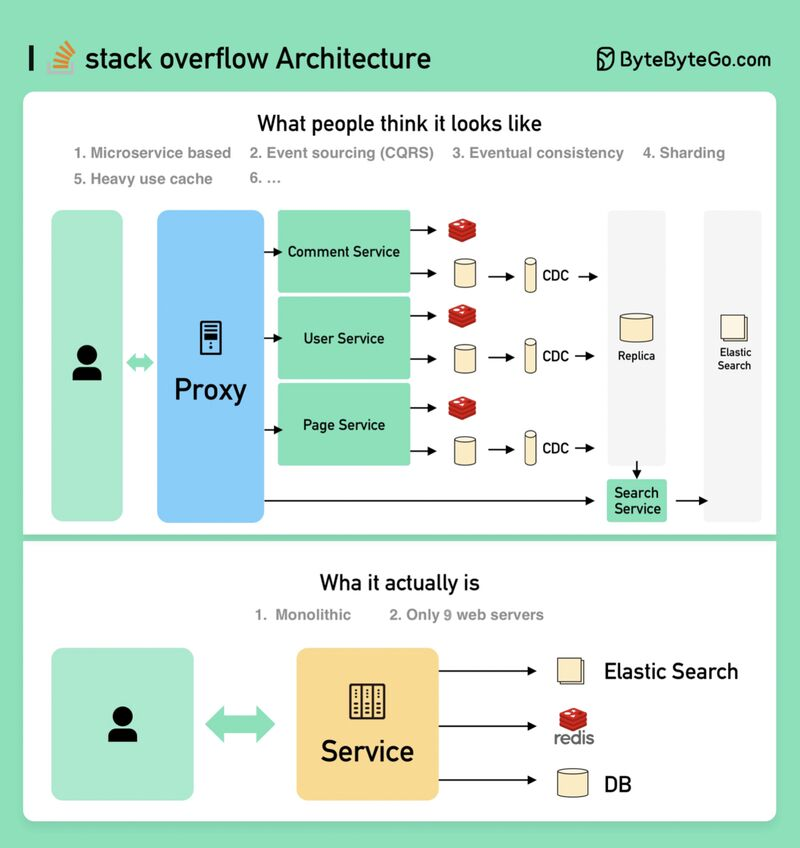

### Netflix Microservices Stack: API Gateway, BFF, and GraphQL

???+ info "How NETFLIX Really Uses Java?"

    Three distinct architectural layers used by Netflix. The top layer shows an API Gateway using Netflix Zuul and Guice. The middle layer depicts Backend for Frontend (BFF) services built with Groovy and RxJava. The bottom layer demonstrates a GraphQL Federation architecture using OpenJDK and Domain Graph Services (DGS).

[📊 Vergrößern](images/SystemDesign_ArchitecturePatterns_NetflixMicroservicesStackAPIGatewayBFFAndGraphQL.png){ .md-button .md-button--primary }

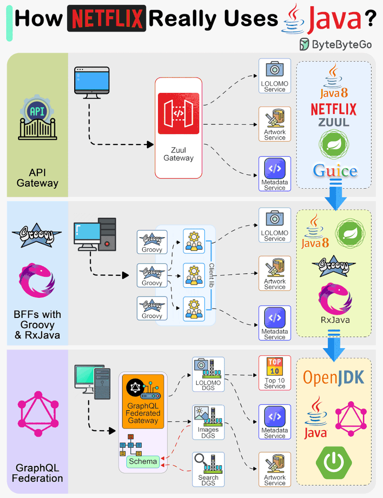

### Network Traffic Filtering Mechanisms

???+ info "Top 6 Firewall Use Cases"

    Six common methods for configuring firewall rules: Port-Based Rules (allowing specific ports like 80/443), IP Address Filtering (using allowlists), Protocol-Based Rules (filtering by TCP/UDP), Time-Based Rules (restricting access by time of day), Stateful Inspection (tracking connection states), and Application-Based Rules (allowing/blocking specific apps like Zoom or BitTorrent).

[📊 Vergrößern](images/Security_FirewallRuleTypes_NetworkTrafficFilteringMechanisms.png){ .md-button .md-button--primary }

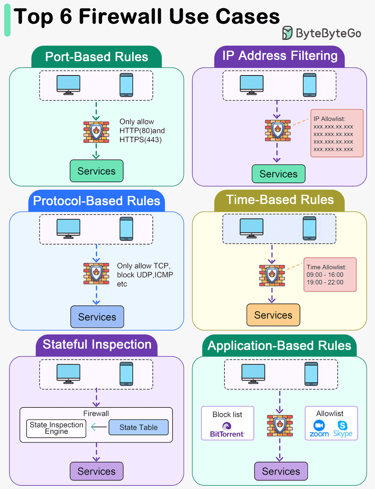

### Open-Source Software Portfolios

???+ info "20 Popular Open-Source Projects by Big Tech"

    Displaying logos of 20 popular open-source projects categorized by the major technology companies that created or maintain them: Google, Meta, Microsoft, Netflix, LinkedIn, and RedHat.

[📊 Vergrößern](images/CareerLearning_CorporateOpenSourceInitiatives_OpenSourceSoftwarePortfolios.png){ .md-button .md-button--primary }

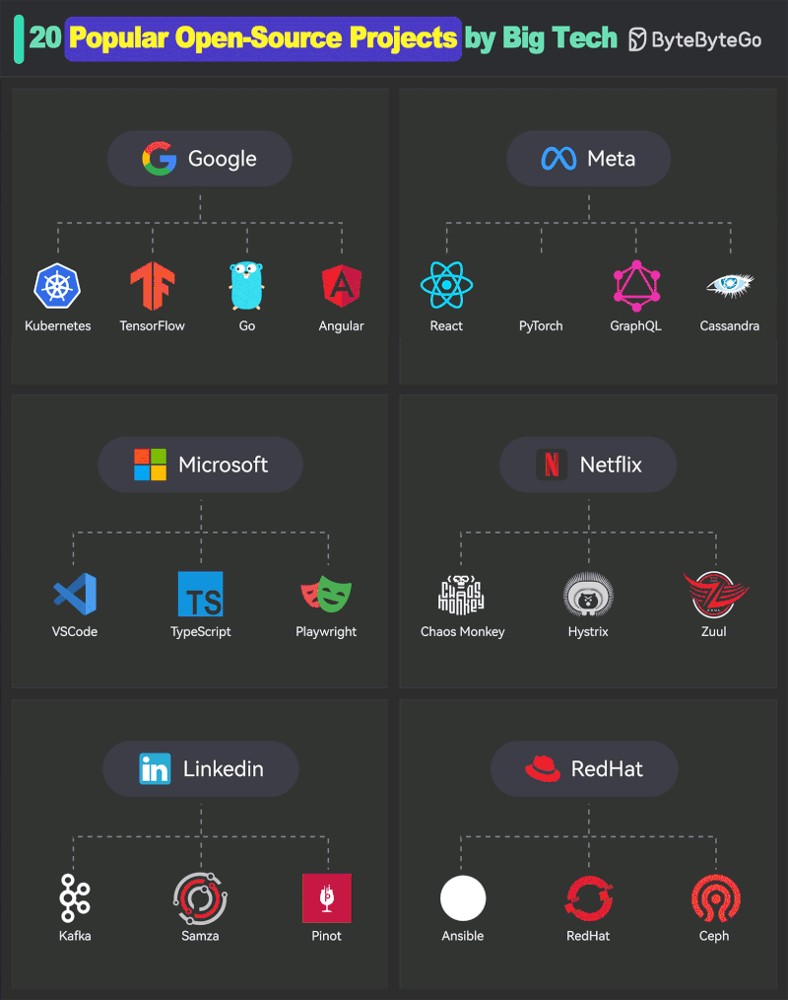

### Overall Architecture and Tech Stack

???+ info "System Design Case Studies"

    A detailed architectural diagram of Netflix's system, breaking down the technology stack into five main pillars: Frontend (Mobile/Web/API), Backend (Services/Databases/Messaging), Streaming (Video/Transcoding), Big Data (Storage/Processing), and CI/CD (DevOps tools). It lists specific technologies like React, Spring Boot, Cassandra, Kafka, AWS services, and Spark.

[📊 Vergrößern](images/SystemDesign_Netflix_OverallArchitectureAndTechStack.png){ .md-button .md-button--primary }

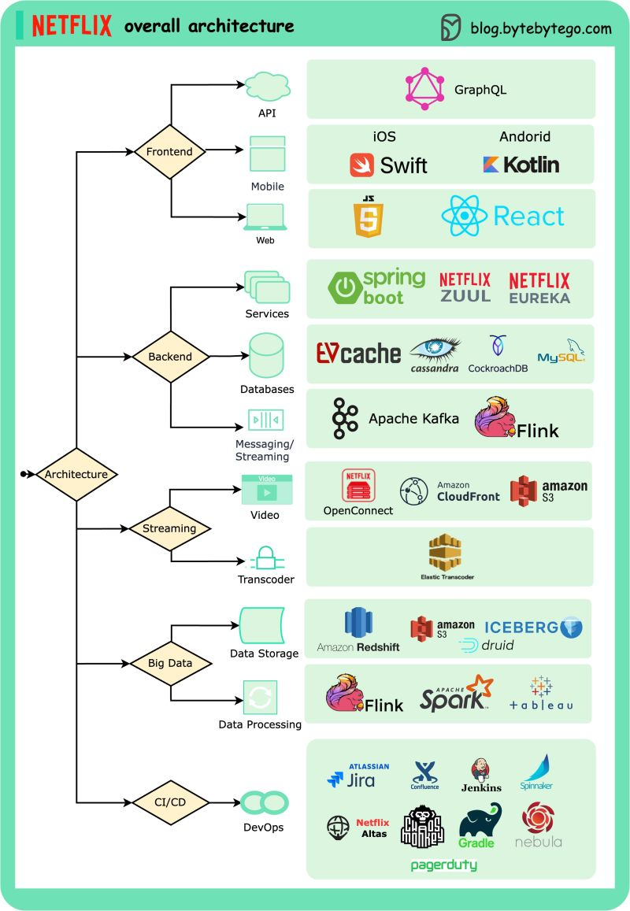

### Polling vs Webhook

???+ info "System Design"

    By ByteByteGo comparing two methods of data communication: Polling and Webhooks. The image features diagrams illustrating the interaction between Service A and Service B for both methods. Below the diagrams is a comparison table analyzing the two approaches based on Data Flow, Resource Utilization, Developer Control, and Risks.

[📊 Vergrößern](images/SystemDesign_APICommunicationPatterns_PollingvsWebhook.png){ .md-button .md-button--primary }

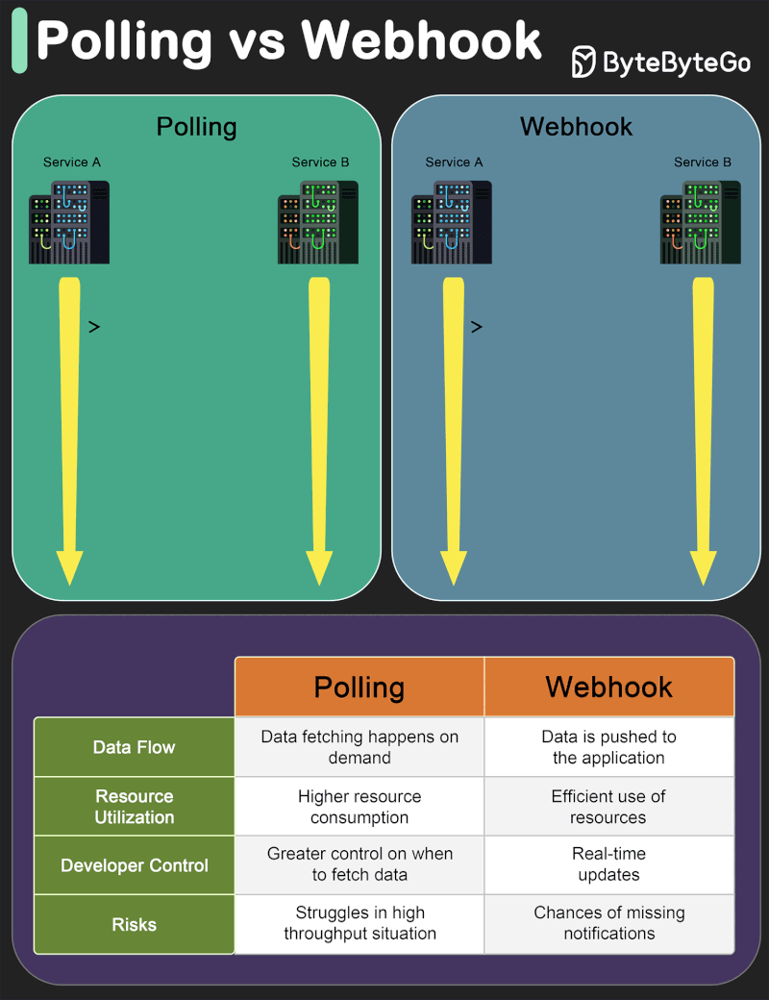

### Project Management Methodologies

???+ info "How We Manage Projects?"

    Eight different software development and project management methodologies arranged around a central wheel. The models depicted are Waterfall, Spiral, Agile (spelled 'AGLIE'), Iterative, V-Model, Incremental, Big Bang, and RAD (Rapid Application Development).

[📊 Vergrößern](images/CareerLearning_SoftwareDevelopmentLifeCycleSD_ProjectManagementMethodologies.png){ .md-button .md-button--primary }

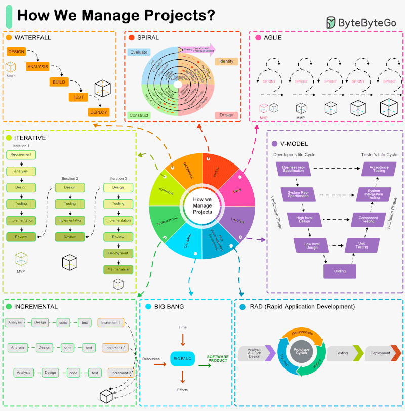

### Replication, Sharding, Distributed Caching, and CQRS

???+ info "Scaling the Data Layer"

    From ByteByteGo illustrating four primary patterns for scaling the data layer: Replication (leader-follower models), Sharding (partitioning data), Distributed Caching (cache clusters and invalidation), and the CQRS Pattern (separating commands and queries).

[📊 Vergrößern](images/SystemDesign_KeyStrategies_ReplicationShardingDistributedCachingAndCQRS.png){ .md-button .md-button--primary }

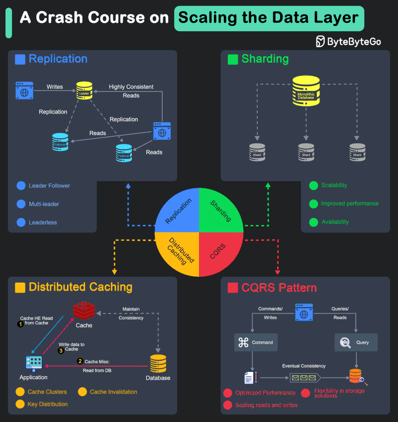

### Reverse proxy vs API gateway vs Load balancer

???+ info "System Architecture"

    A diagram comparing three network components. The top section shows a Reverse Proxy hiding the service address. The middle section depicts an API Gateway acting as a single entry point for different APIs. The bottom section illustrates a Load Balancer distributing traffic to multiple instances of the same service.

[📊 Vergrößern](images/SystemDesign_NetworkInfrastructure_ReverseproxyvsAPIgatewayvsLoadbalancer.png){ .md-button .md-button--primary }

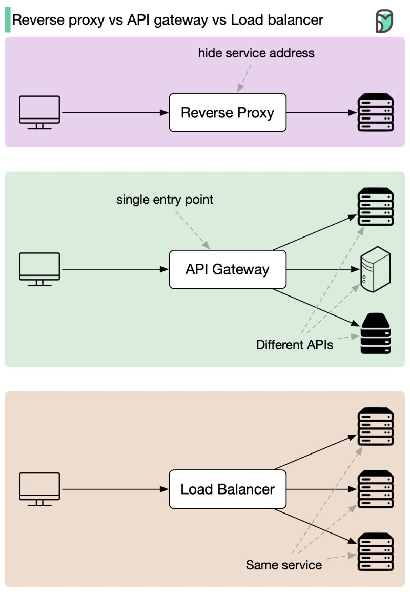

### SSO Authentication Workflow

???+ info "Authentication"

    A flowchart diagram titled 'How does SSO Work?' illustrating the step-by-step process of Single Sign-On. It depicts a user logging into GMail (Domain 1) via an SSO Authentication Server, receiving a token, and then navigating to YouTube (Domain 2). The diagram shows 14 steps where the second domain validates the existing token, allowing the user to access resources without re-entering credentials.

[📊 Vergrößern](images/Security_SingleSignOnSSO_SSOAuthenticationWorkflow.png){ .md-button .md-button--primary }

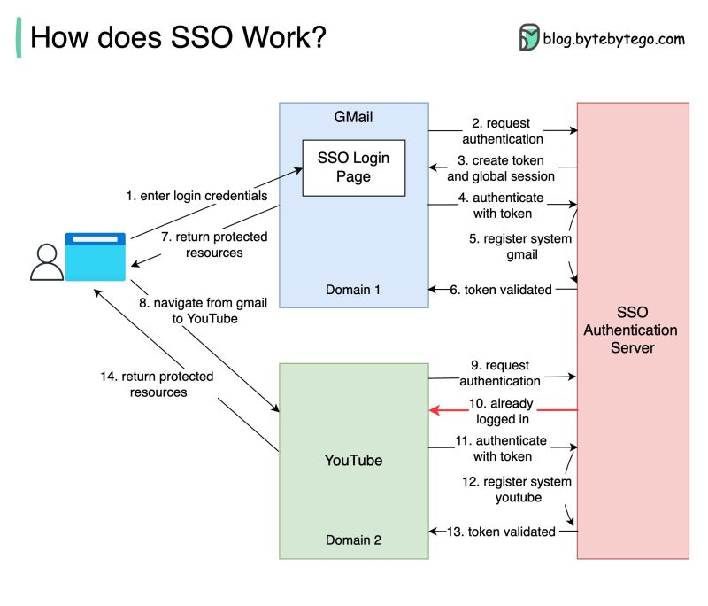

### Search Engine Architecture and Workflow

???+ info "How do Search Engines Work?"

    Diagram illustrating the end-to-end process of how search engines function. It is split into two main columns: the right side details the backend processes of Crawling (fetching webpages via a scheduler and crawler), Indexing (parsing and storing data), and Ranking (ordering indexed pages). The left side depicts the user-facing 'Search' process, where a user submits queries to Google, which are processed by a Query Engine to retrieve and display the ranked pages.

[📊 Vergrößern](images/SystemDesign_CrawlIndexRankSearch_SearchEngineArchitectureAndWorkflow.png){ .md-button .md-button--primary }

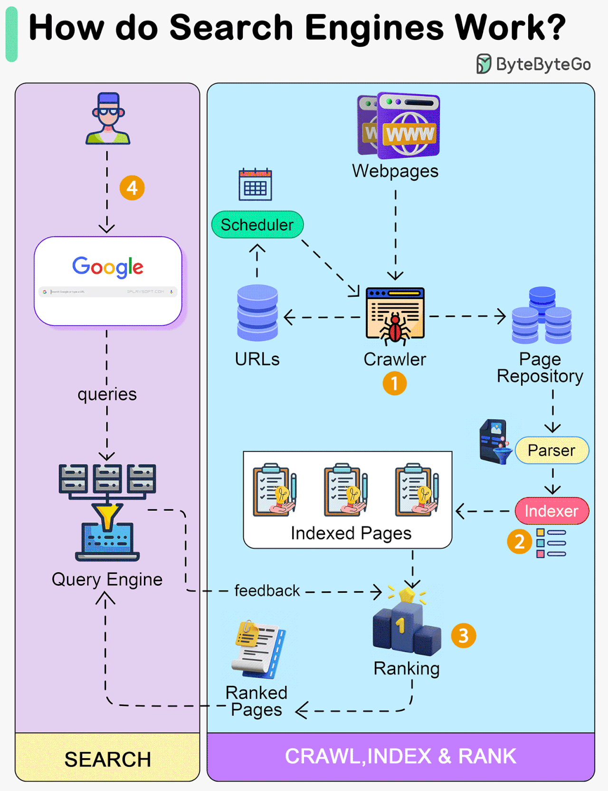

### Search Engine Components: Crawling, Indexing, and Ranking

???+ info "How do Search Engines Work?"

    A detailed flowchart illustrating the architecture and operational workflow of a search engine. It depicts the lifecycle of data from webpages to the user, highlighting key components such as the Crawler (step 1), Parser, Page Repository, Indexer (step 2), Indexed Pages, Ranking system (step 3), Query Engine, and User Interface (step 4). The diagram shows how a client query triggers the retrieval and ranking of pages.

[📊 Vergrößern](images/SystemDesign_SystemArchitectureAndWorkflow_SearchEngineComponentsCrawlingIndexingAndRanking.png){ .md-button .md-button--primary }

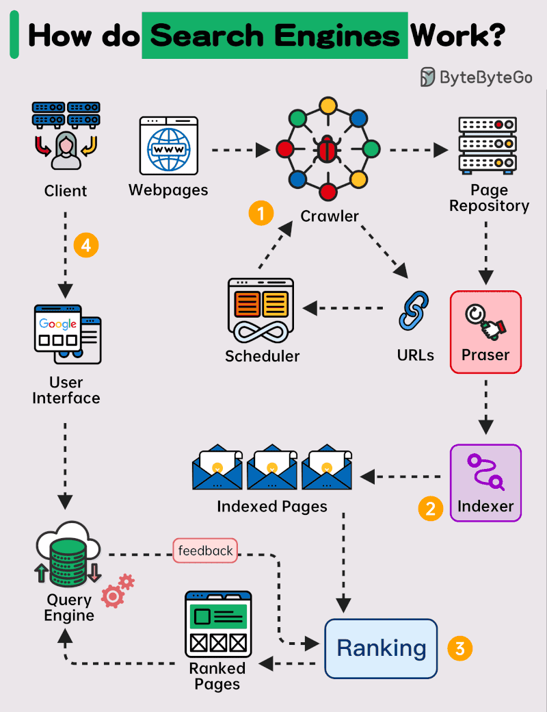

### Secure System Design Domains

???+ info "Cheat Sheet for Designing Secure Systems"

    A circular infographic titled 'Cheat Sheet for Designing Secure Systems' by ByteByteGo. It features a wheel divided into 12 color-coded segments, numbered 1 through 12. Each segment represents a critical area of system security: Authentication, Authorization, Encryption, Vulnerability, Audit & Compliance, Network Security, Terminal Security, Emergency Responses, Container Security, API Security, 3rd-Party Management, and Disaster Recovery. Surrounding the wheel are detailed boxes for each section listing 'Scenarios to Protect' and 'Design Points'.

[📊 Vergrößern](images/Security_SecureDesign_Domains.png){ .md-button .md-button--primary }

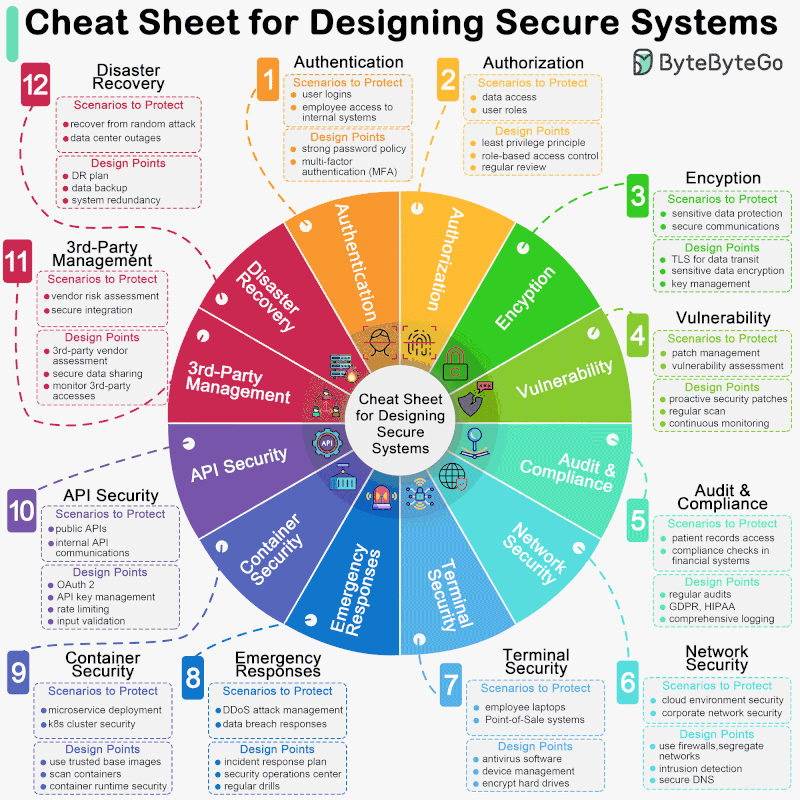

### Semantic Versioning (SemVer) Components

???+ info "What is Semantic Versioning?"

    The structure of semantic versioning numbers (Major.Minor.Patch), explaining when to increment each number based on incompatible API changes, backward-compatible features, or bug fixes. It also visualizes optional pre-release labels and build metadata, and outlines the standard release progression from Alpha to Beta, Release Candidates (RC), and final Release.

[📊 Vergrößern](images/CareerLearning_VersionStructureAndReleaseLife_SemanticVersioningSemVerComponents.png){ .md-button .md-button--primary }

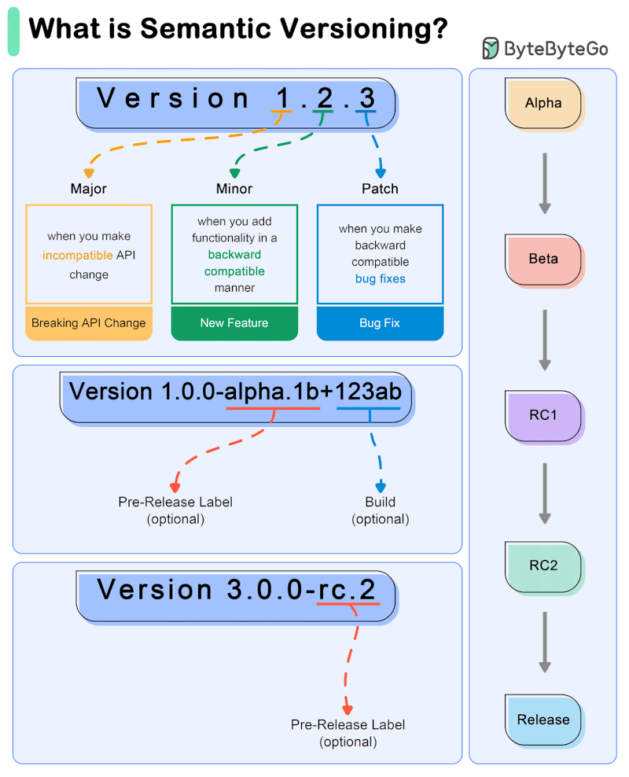

### Session, JWT, Token, SSO, OAuth 2.0

???+ info "Web Authentication and Authorization"

    The evolution and architecture of web authentication methods, ranging from basic WWW-Authenticate and Session-cookies to modern standards like JWT, Token-based auth, Single Sign-On (SSO), and OAuth 2.0 grant flows.

[📊 Vergrößern](images/Security_AuthenticationMechanisms_SessionJWTTokenSSOOAuth.png){ .md-button .md-button--primary }

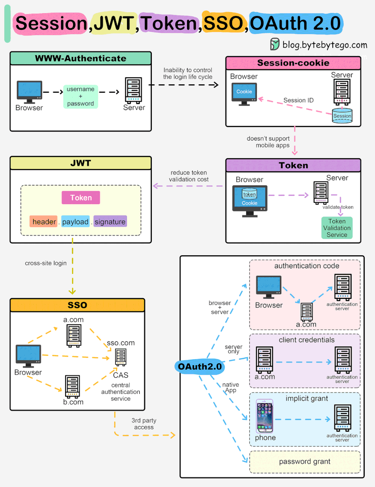

### Software Architecture Patterns (MVC, MVP, MVVM, VIPER)

???+ info "MVC, MVP, MVVM, VIPER patterns"

    A diagram comparing five software architecture patterns: MVC, MVP, MVVM, MVVM-C, and VIPER. It illustrates the interaction and data flow between components such as View, Model, Controller, Presenter, View Model, Coordinator, Interactor, Entity, and Router for each pattern.

[📊 Vergrößern](images/Programming_ArchitecturalPatternComparison_SoftwareArchitecturePatternsMVCMVPMVVMVIPER.png){ .md-button .md-button--primary }

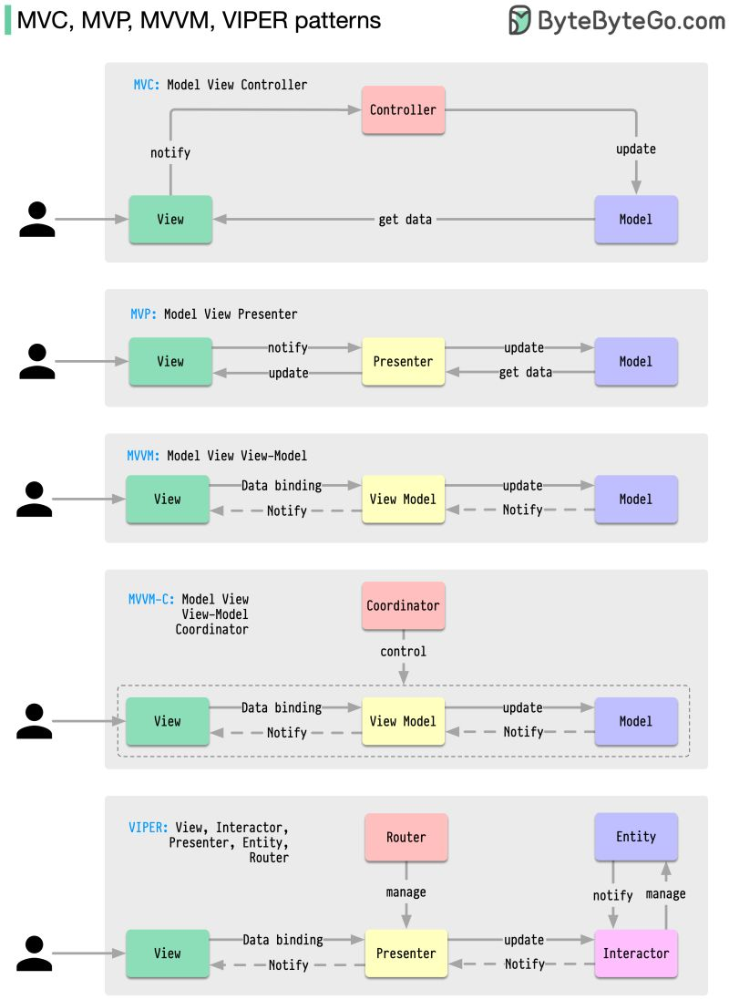

### Software Design Patterns (Observer, State, Strategy, Adapter, Bridge, Composite, Facade, Flyweight, Proxy)

???+ info "Part 1"

    A visual cheat sheet displaying UML class diagrams and brief definitions for nine common software design patterns, organized in a grid format.

[📊 Vergrößern](images/Programming_DesignPatternsCheatSheet_SoftwareDesignPatternsObserverStateStrategyAdapter.png){ .md-button .md-button--primary }

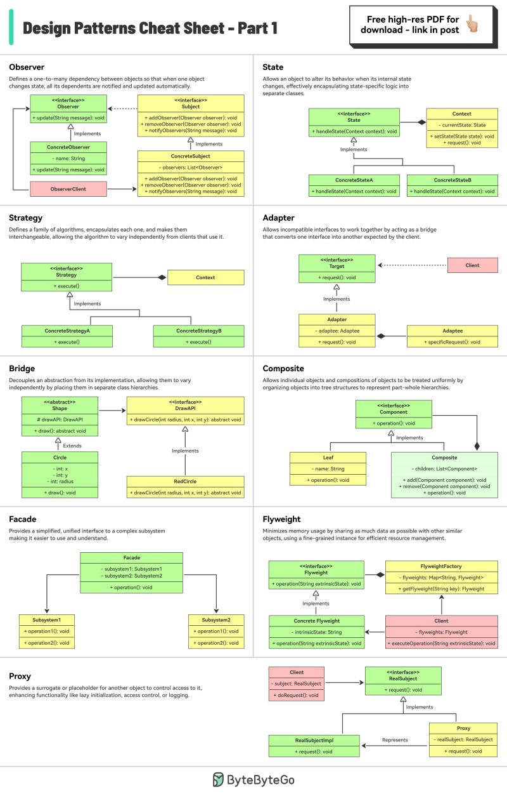

### Software Engineering Best Practices

???+ info "10 Good Coding Principles"

    A radial infographic illustrating 10 key principles for writing good code. The central wheel is divided into segments for Security Assurance, Code Specification, Documents and Annotations, Robustness, SOLID Principle, Easy to Test, Moderate Abstraction, Design Patterns, Reduce Global Dependencies, and Continuous Refactoring. Each segment is connected to detailed explanations, diagrams, and examples (e.g., SQL Injection for security, SOLID acronyms, evolution chart for refactoring).

[📊 Vergrößern](images/Programming_General_SoftwareEngineeringBestPractices.png){ .md-button .md-button--primary }

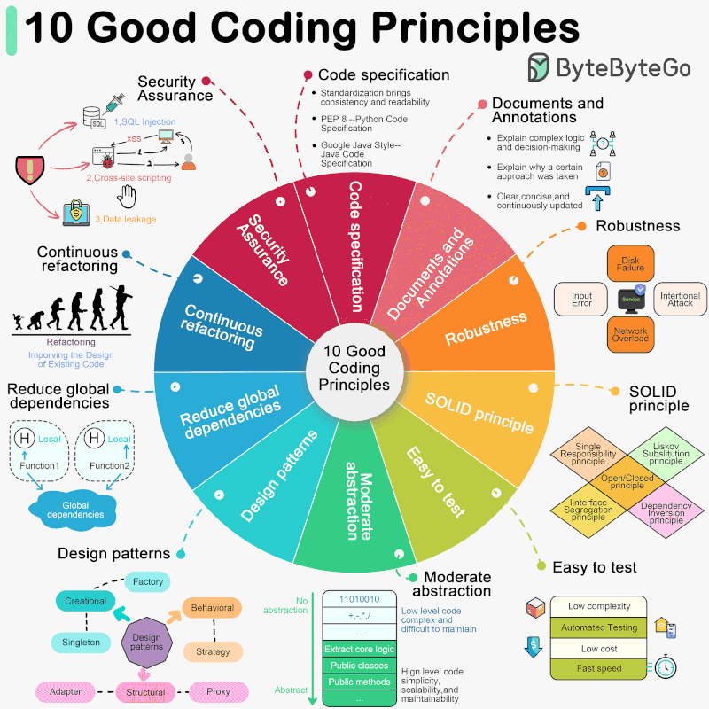

### System Design Bottlenecks and Mitigation Strategies

???+ info "8 Common System Design Problems and Solutions"

    Diagram illustrating eight common system design problems (center blue circles like 'Read-Heavy System', 'High-Write Traffic') mapped to eight corresponding technical solutions (numbered boxes 1-8) such as caching, async writes, load balancing, CDNs, and database sharding.

[📊 Vergrößern](images/SystemDesign_ArchitecturalPatternsAndSoluti_SystemDesignBottlenecksAndMitigationStrategies.png){ .md-button .md-button--primary }

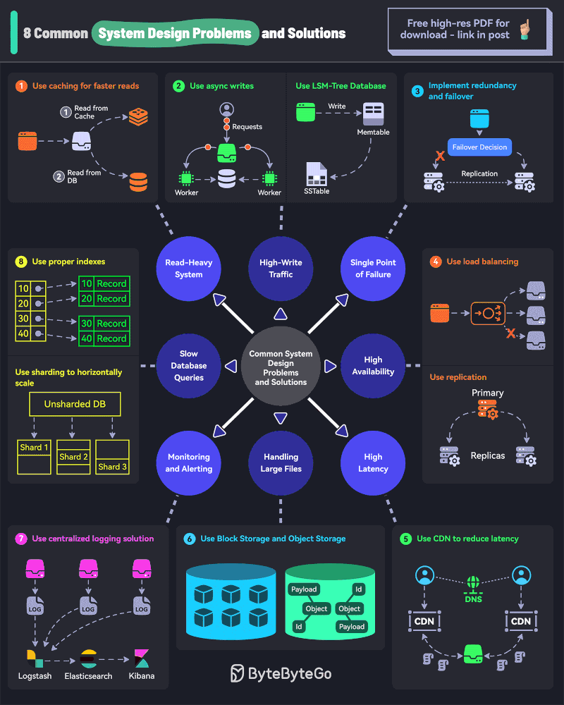

### System Design Patterns for Fault Tolerance

???+ info "Fault-Tolerant Systems"

    A comprehensive cheat sheet illustrating the definition of fault tolerance and six key strategies to achieve it: Replication (with Apache Cassandra example), Redundancy (Active-Active/Passive and RAID), Load Balancing, Failover (including AWS regions), Graceful Degradation, and Monitoring & Alerting (using Prometheus, Grafana, PagerDuty).

[📊 Vergrößern](images/SystemDesign_StrategiesAndArchitectures_SystemDesignPatternsForFaultTolerance.png){ .md-button .md-button--primary }

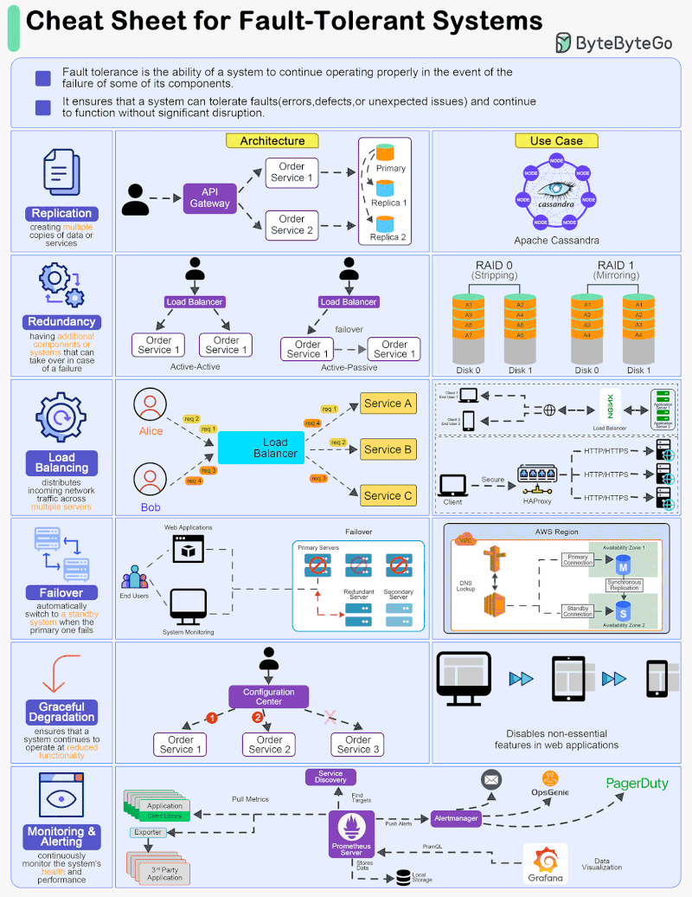

### System Integration Architectures

???+ info "Top 9 System Integrations"

    Nine common system integration patterns: Peer-to-Peer, API Gateway, Pub-Sub, Request-Response, Event Sourcing, ETL (Extract, Transform, Load), Batching, Streaming Processing, and Orchestration.

[📊 Vergrößern](images/SystemDesign_IntegrationPatterns_SystemIntegrationArchitectures.png){ .md-button .md-button--primary }

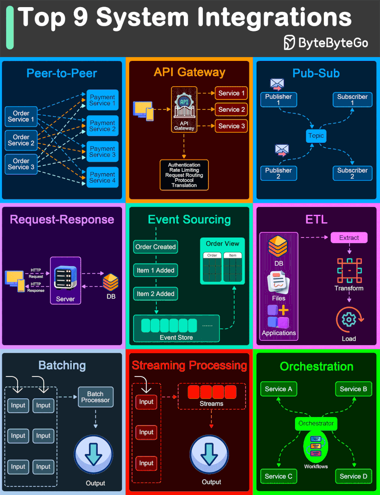

### System Performance and CPU Bottlenecks

???+ info "Top 9 Cases Behind 100% CPU Usage"

    Nine specific technical scenarios that lead to maximum CPU utilization. It covers coding errors like infinite loops and busy waiting, system resource issues like insufficient memory and concurrent processes, and external factors such as high traffic volume and malware.

[📊 Vergrößern](images/OperatingSystems_CommonCauses_SystemPerformanceAndCPUBottlenecks.png){ .md-button .md-button--primary }

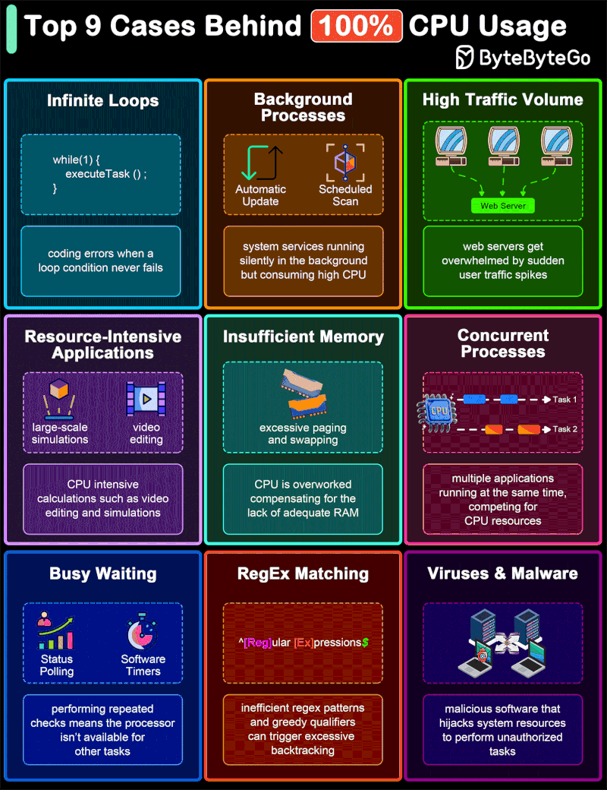

### Technology Engineering Blogs

???+ info "9"

    A graphic displaying a grid of nine logos representing popular engineering blogs from major tech companies, including Netflix, Uber, Cloudflare, Meta, LinkedIn, Discord, AWS, Slack, and Stripe.

[📊 Vergrößern](images/Miscellaneous_FavoriteEngBlogs_TechnologyEngineeringBlogs.png){ .md-button .md-button--primary }

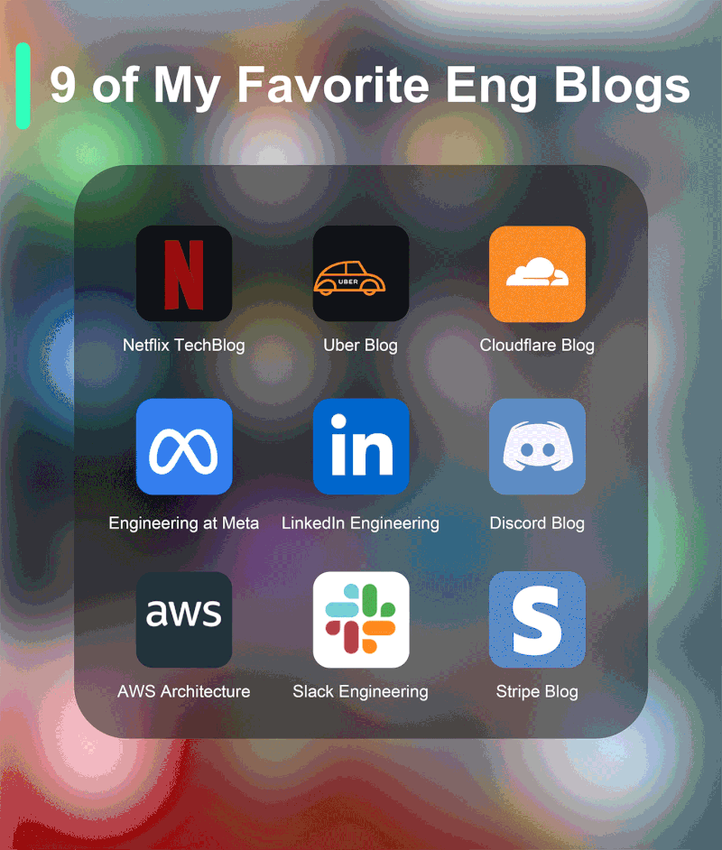

### Thunder Herd Problem, Cache Penetration, Cache Breakdown, Cache Crash

???+ info "How Caches Can Go Wrong?"

    Four common caching failure scenarios: Thunder Herd Problem, Cache Penetration, Cache Breakdown, and Cache Crash. For each scenario, it provides a problem description showing the interaction between the Application, Redis cache, and Database, along with recommended solutions.

[📊 Vergrößern](images/SystemDesign_CommonCachingPitfalls_ThunderHerdProblemCachePenetrationCacheBreakdownCa.png){ .md-button .md-button--primary }

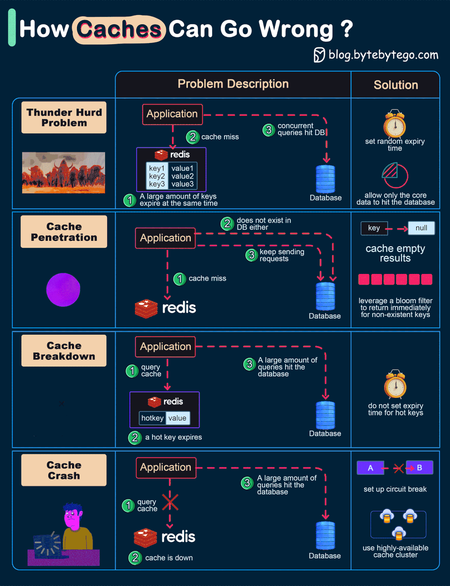

### Thunder Herd Problem, Cache Penetration, Cache Breakdown, Cache Crash

???+ info "How Caches Can Go Wrong?"

    Four common caching failure scenarios: Thunder Herd Problem, Cache Penetration, Cache Breakdown, and Cache Crash. For each scenario, it illustrates the data flow between the Application, Redis cache, and Database, explains the specific problem mechanism, and offers a technical solution.

[📊 Vergrößern](images/SystemDesign_ProblemDescriptionAndSolution_ThunderHerdProblemCachePenetrationCacheBreakdownCa.png){ .md-button .md-button--primary }

### Thunder Herd Problem, Cache Penetration, Cache Breakdown, Cache Crash

???+ info "How Caches Can Go Wrong?"

    Table detailing four specific caching issues: Thunder Herd Problem, Cache Penetration, Cache Breakdown, and Cache Crash. For each issue, it visualizes the problem flow between the Application, Redis cache, and Database, and provides corresponding technical solutions such as setting random expiry times, using Bloom filters, and implementing circuit breakers.

[📊 Vergrößern](images/SystemDesign_CommonCacheFailureModes_ThunderHerdProblemCachePenetrationCacheBreakdownCa.png){ .md-button .md-button--primary }

### Top 5 Strategies to Reduce Latency

???+ info "System Design"

    Table illustrating six technical strategies to reduce system latency: Database Indexing, Caching, Load Balancing, Content Delivery Networks (CDN), Async Processing, and Data Compression. Each row details the process with an icon, a visual diagram of the data flow, and specific implementation steps.

[📊 Vergrößern](images/SystemDesign_PerformanceOptimization_StrategiestoReduceLatency.png){ .md-button .md-button--primary }

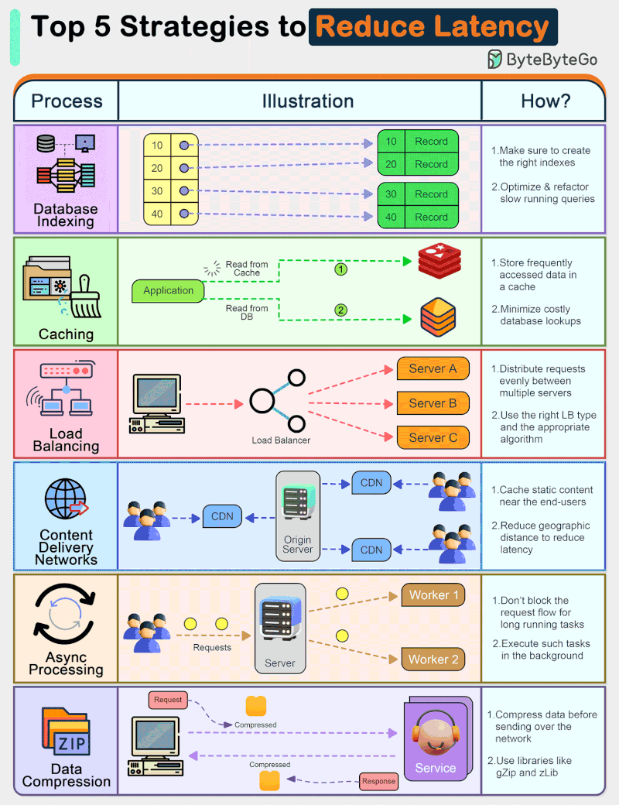

### Top 6 Heartbeat Detection Mechanisms

???+ info "Distributed Systems"

    Six different mechanisms for heartbeat detection in distributed systems: Push-Based, Pull-Based, with Health Check, with Timestamps, with Acknowledgement, and with Quorum.

[📊 Vergrößern](images/SystemDesign_FailureDetection_HeartbeatDetectionMechanisms.png){ .md-button .md-button--primary }

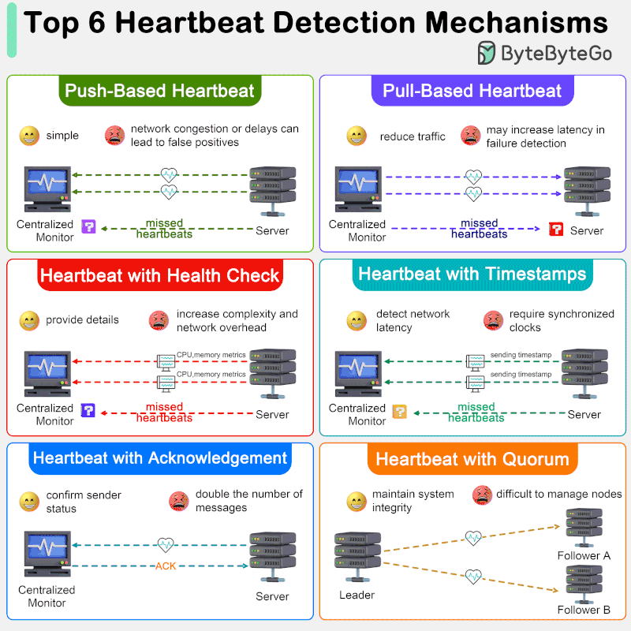

### Types of Memory and Storage

???+ info "Computer Hardware"

    A hierarchical tree diagram illustrating the classification of computer memory and storage. It branches memory into RAM (further divided into SRAM and DRAM) and ROM, and storage into devices like HDD, SSD, USB drives, and SD cards.

[📊 Vergrößern](images/OperatingSystems_MemoryAndStorage_TypesOfMemoryAndStorage.png){ .md-button .md-button--primary }

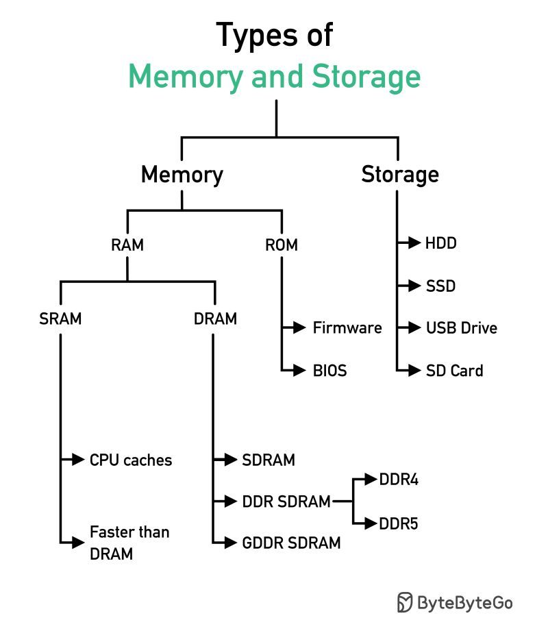

### Typical Microservice Architecture

???+ info "System Design"

    A standard microservice architecture. It shows clients (Web, Mobile, PC) accessing the system through a CDN and Load Balancer, which route traffic to an API Gateway. The gateway communicates with microservices grouped by domain (Domain A and Domain B), each having specific REST APIs and dedicated databases. Additional components include an Identity Provider, Service Registry & Discovery, and a Management module.

[📊 Vergrößern](images/SystemDesign_Microservices_TypicalMicroserviceArchitecture.png){ .md-button .md-button--primary }

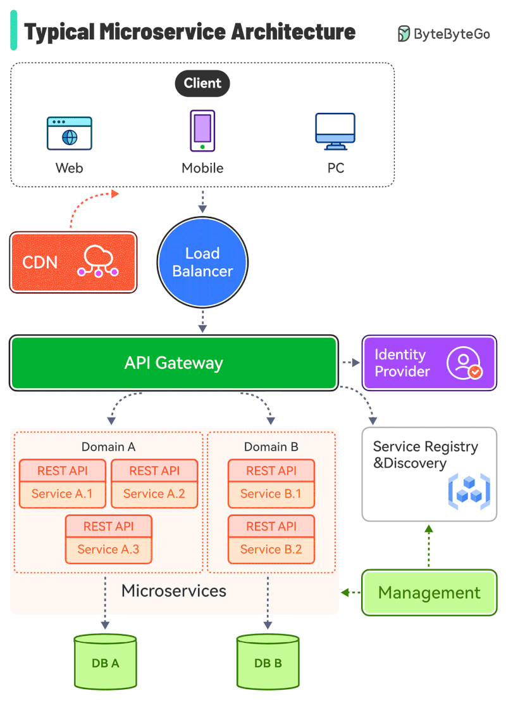

### User Datagram Protocol (UDP) Applications

???+ info "Top 4 UDP Use Cases"

    Four primary scenarios where the UDP protocol is preferred: Live Video Streaming for real-time low-latency delivery, DNS for fast and lightweight queries, Multicasting for efficient data delivery in low-latency trading, and IoT for handling small packets with low overhead.

[📊 Vergrößern](images/Networking_LiveVideoStreamingDNSMulticast_UserDatagramProtocolUDPApplications.png){ .md-button .md-button--primary }

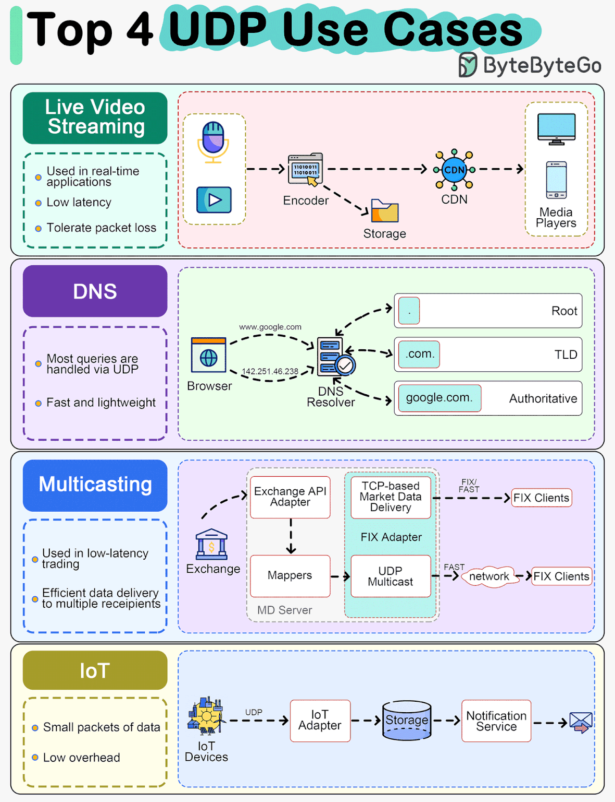

### Video Upload, Processing, and Streaming Pipeline

???+ info "How to Design a System Like YouTube?"

    A detailed system design diagram illustrating the 9-step workflow for a video platform like YouTube. It covers the process from a user's upload request through load balancing, raw storage, metadata management, video transcoding, status updates, and finally content delivery via a CDN for streaming requests.

[📊 Vergrößern](images/SystemDesign_SystemArchitectureAndWorkflow_VideoUploadProcessingAndStreamingPipeline.png){ .md-button .md-button--primary }

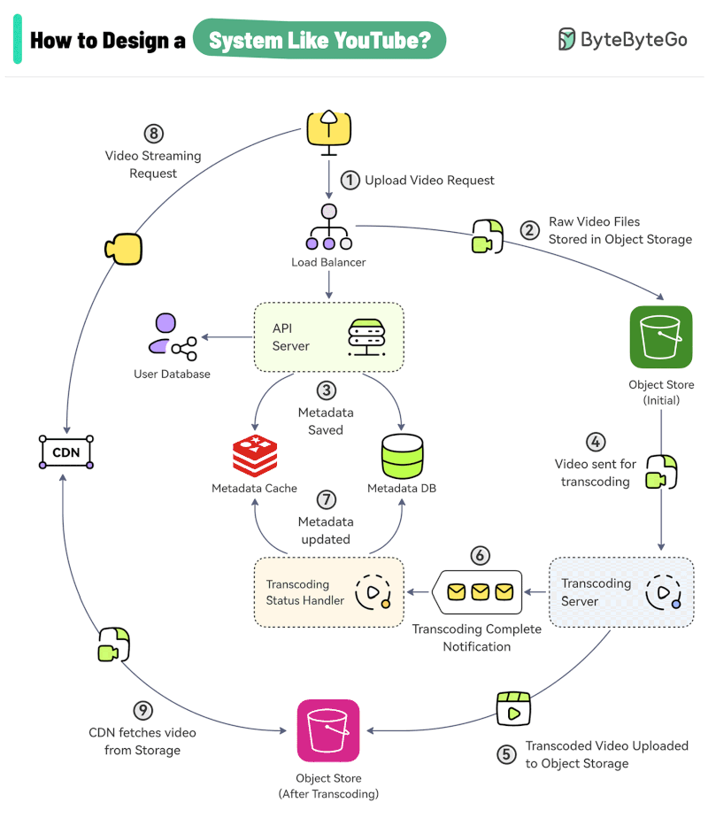

### Web Request Lifecycle and DNS Resolution

???+ info "What happens when you type a URL into your browser?"

    A flowchart illustrating the step-by-step process of loading a webpage. It shows a user entering a URL, the breakdown of URL components (Scheme, Domain, Path, Resource), the DNS lookup process (Cache, Resolver, Server), establishing a TCP connection, sending an HTTP request, receiving a response, and finally rendering the content.

[📊 Vergrößern](images/Miscellaneous_URLComponents_WebRequestLifecycleAndDNSResolution.png){ .md-button .md-button--primary }

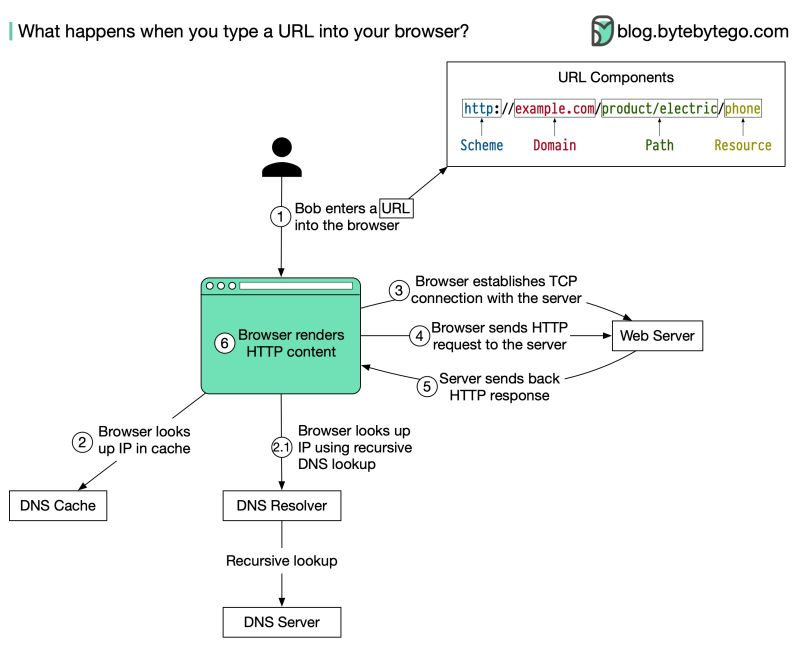

### Website Performance Optimization

???+ info "9 Must-Know Website Performance Metrics"

    Nine critical metrics for measuring website speed and efficiency, including Load Time, Time to First Byte (TTFB), Request Count, DOM Content Loaded, Time to above-the-fold Load, First Contentful Paint (FCP), Page Size, Round Trip Time (RTT), and Render Blocking Resources.

[📊 Vergrößern](images/SystemDesign_CorePerformanceIndicators_WebsitePerformanceOptimization.png){ .md-button .md-button--primary }

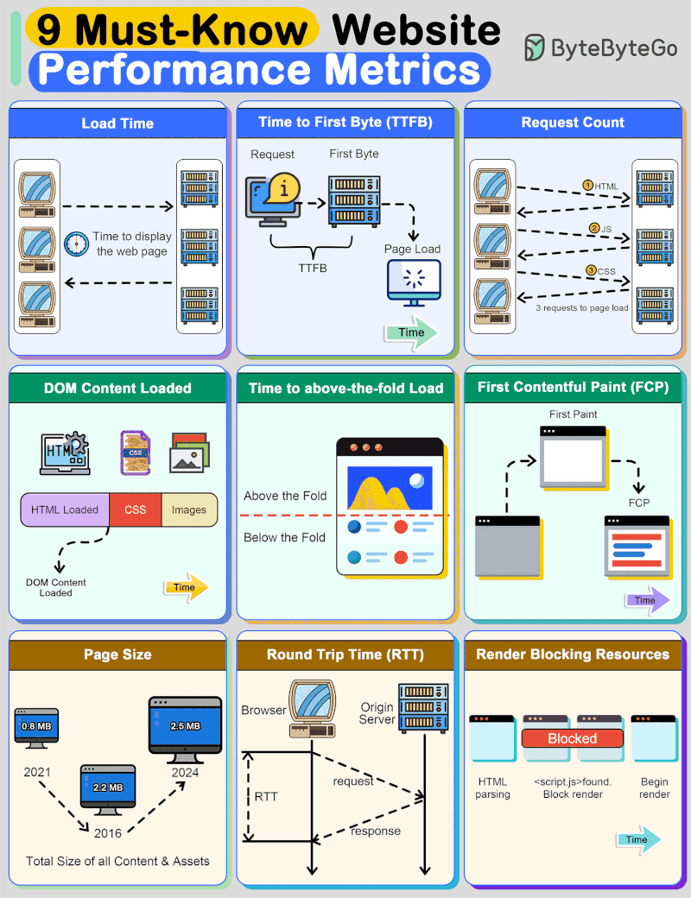

*68 Themen verfügbar*
