# Networking

### API Architecture Patterns and Evolution

???+ info "Evolution of an API Architecture"

    The progression of API architectures. It shows four stages: 1) Monolith, where clients connect to a single large backend; 2) Direct Access, where clients connect directly to a mesh of microservices; 3) Gateway Aggregation Layer, introducing an intermediary gateway; and 4) Federated Gateway, showing a more complex gateway structure with sub-gateways.

[📊 Vergrößern](images/SystemDesign_MonolithDirectAccessGatewayAgg_APIArchitecturePatternsAndEvolution.png){ .md-button .md-button--primary }

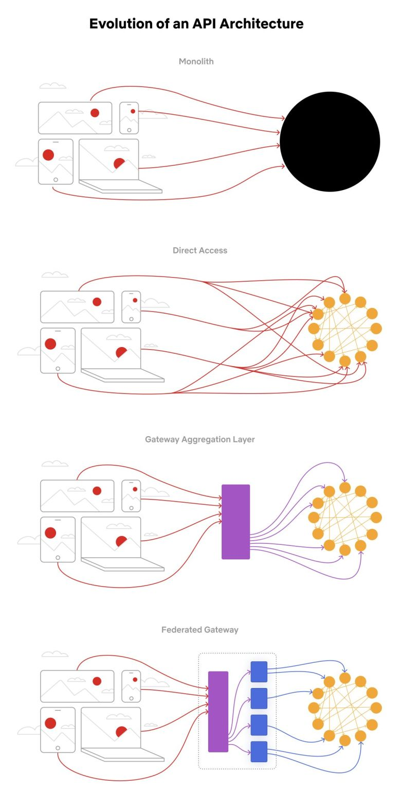

### API Testing Classifications

???+ info "9 Types API Testing"

    Nine distinct types of API testing (Smoke, Functional, Integration, Regression, Load, Stress, Security, UI, and Fuzz), providing visual workflows and brief definitions for each testing strategy.

[📊 Vergrößern](images/Programming_TestingMethodologies_APITestingClassifications.png){ .md-button .md-button--primary }

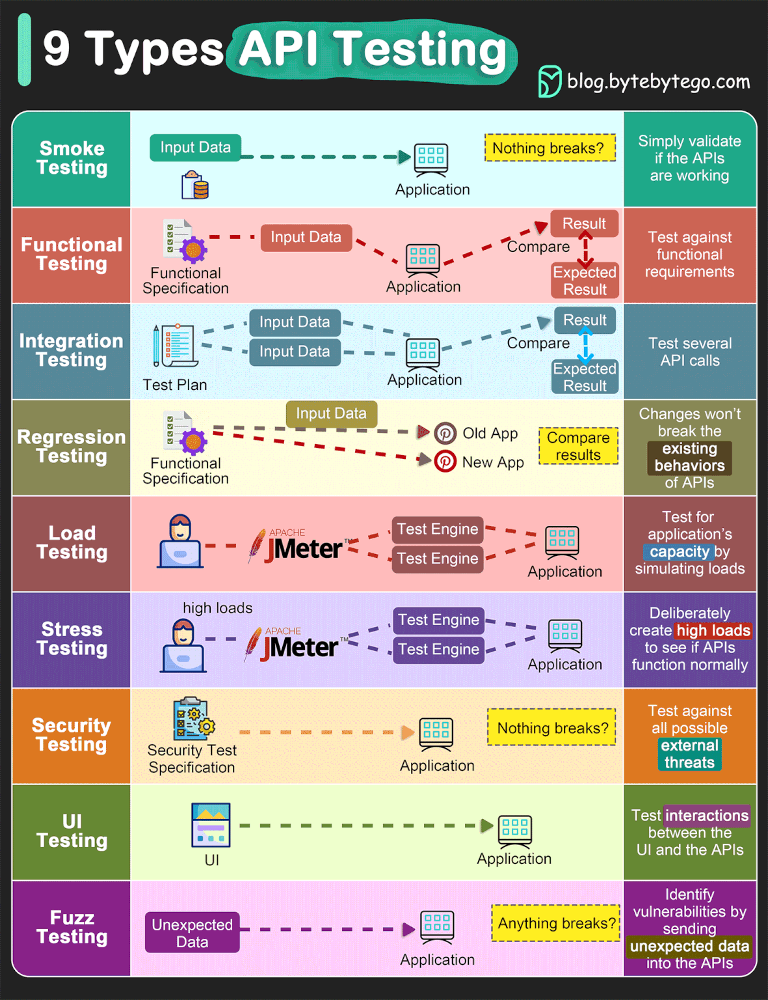

### Comparison of API and SDK workflows

???+ info "API Vs SDK"

    The differences between an API and an SDK. The top section details the structure of an API request (HTTP Method, End Point, Query Parameters) and demonstrates a request/response cycle between a Delivery App and a Maps API. The bottom section depicts an SDK as a 'Tool Box to Build Apps', showing how developers choose programming languages (Java, .NET, Kotlin), pull specific SDKs (Android, Windows), and use them to build and release applications that integrate with web APIs.

[📊 Vergrößern](images/Networking_APICommunicationAndSDKTooling_ComparisonOfAPIAndSDKworkflows.png){ .md-button .md-button--primary }

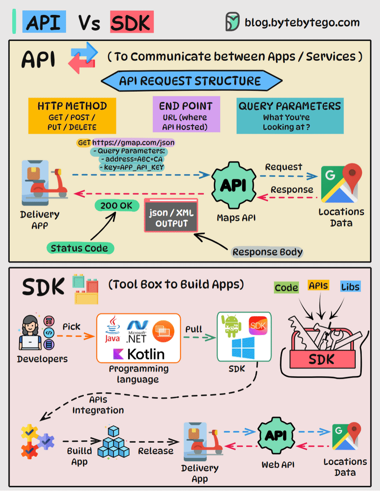

### Comparison of Basic, Token, OAuth, and API Key Authentication

???+ info "REST API"

    Four common REST API authentication methods. It details the step-by-step request and response flows for Basic Authentication (plaintext credentials), Token Authentication (encrypted tokens), OAuth Authentication (authorization grants via third parties), and API Key Authentication.

[📊 Vergrößern](images/Networking_AuthenticationMethods_ComparisonOfBasicTokenOAuthAndAPIKeyAuthentication.png){ .md-button .md-button--primary }

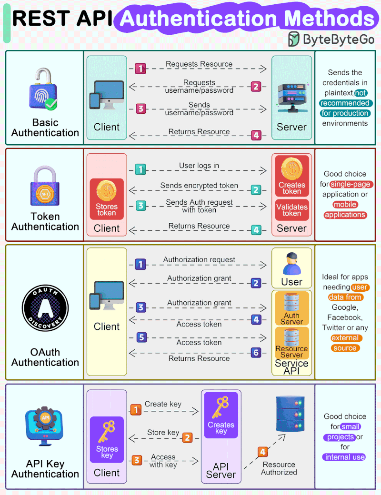

### HTTP Cookies

???+ info "What is a Cookie?"

    A comic strip illustrating the concept of web cookies using a cafe loyalty card analogy where a customer (Bob) receives a card with his order details to speed up future visits. It concludes with a technical diagram showing the client-server exchange of login credentials and cookies.

[📊 Vergrößern](images/Networking_ConceptExplanation_HTTPCookies.png){ .md-button .md-button--primary }

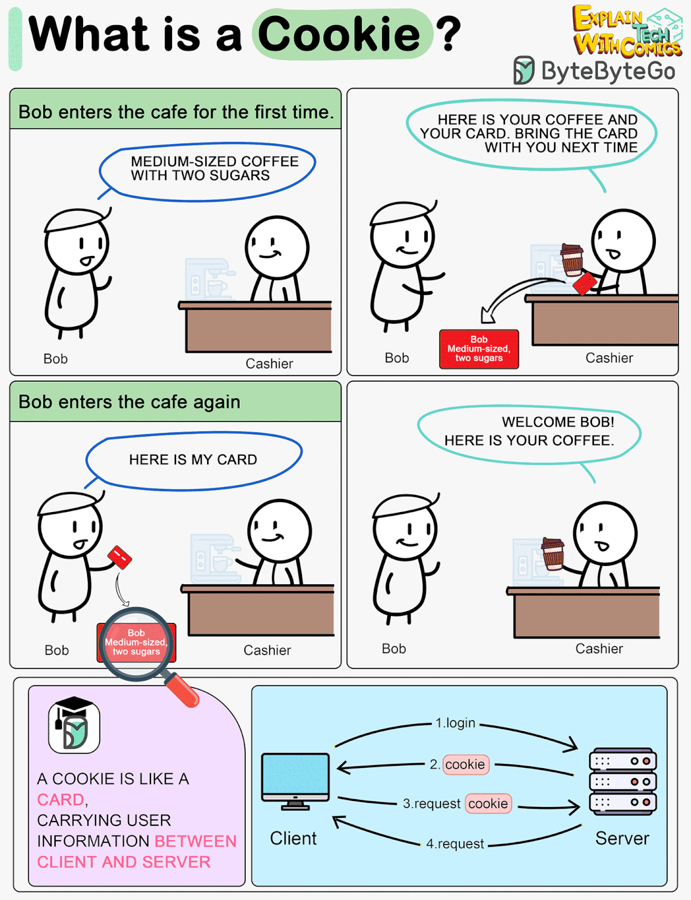

### HTTP Response Status Code Classes

???+ info "HTTP Status Codes"

    The four main categories of HTTP status codes. It shows the interaction between a client and a server for each category: Successful (2xx codes like 200 OK), Redirection (3xx codes like 301 Moved Permanently), Client Error (4xx codes like 404 Not Found), and Server Error (5xx codes like 500 Internal Server Error).

[📊 Vergrößern](images/Networking_CategoriesSuccessfulRedirectio_HTTPResponseStatusCodeClasses.png){ .md-button .md-button--primary }

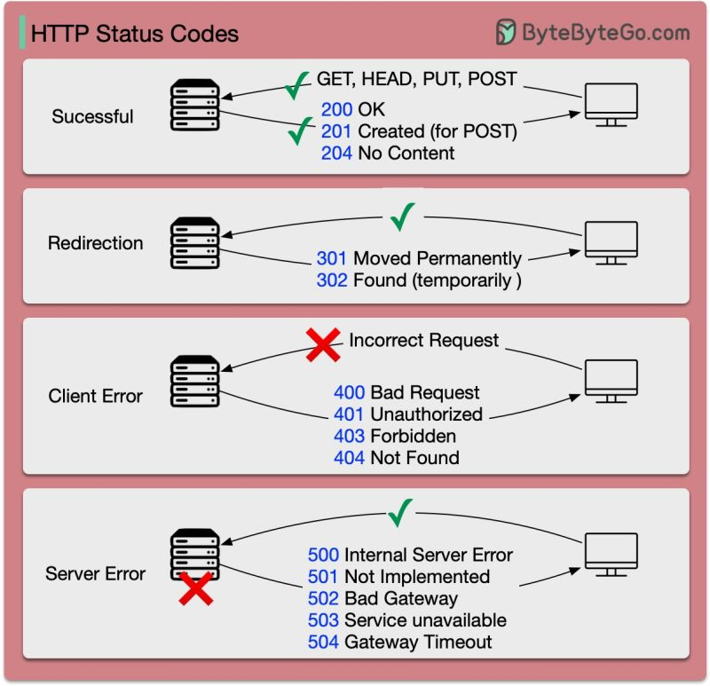

### Network Protocols

???+ info "8 Popular Network Protocols"

    Chart comparing eight common network protocols (HTTP, HTTP/3, HTTPS, WebSocket, TCP, UDP, SMTP, FTP). For each protocol, it provides a visual diagram of how the connection works (e.g., handshakes, data channels) and lists specific real-world use cases like web browsing, video conferencing, and email.

[📊 Vergrößern](images/Networking_ProtocolMechanicsAndUseCases_NetworkProtocols.png){ .md-button .md-button--primary }

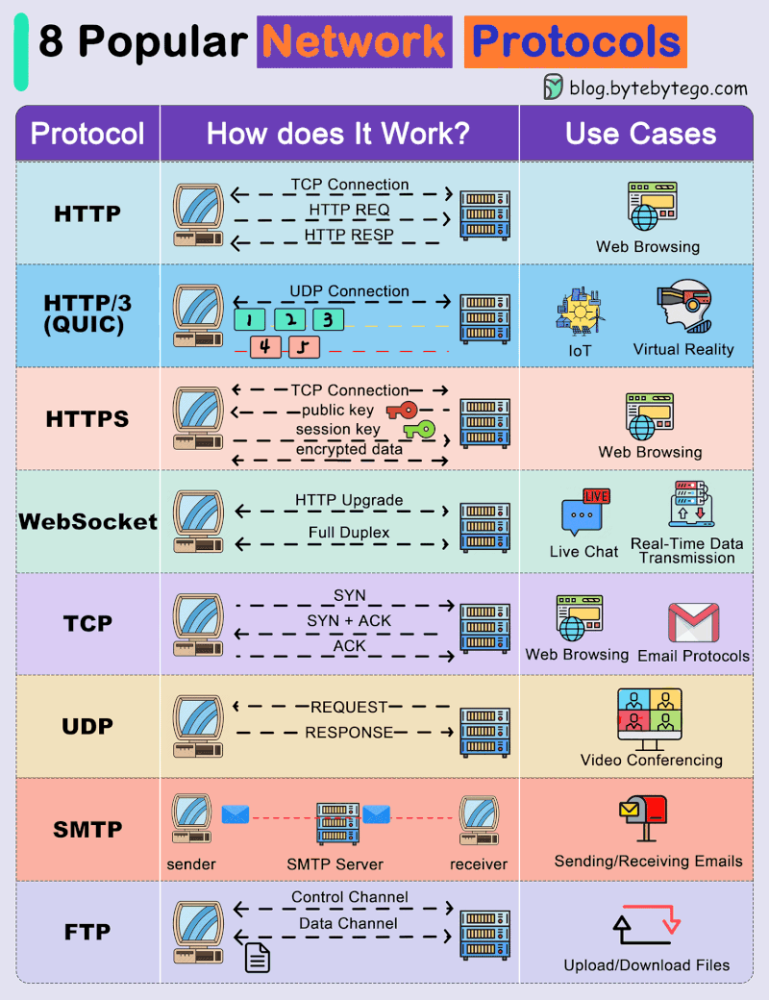

### Overview of API Protocols and Architectures

???+ info "API Protocols"

    A central wheel labeled 'API Technologies' divided into segments for various protocols. Surrounding the wheel are detailed explanations, definitions, and architectural diagrams for REST, Webhooks, GraphQL, SOAP, WebSocket, gRPC, MQTT, AMQP, SSE, EDI, and EDA.

[📊 Vergrößern](images/Networking_APITechnologies_OverviewOfAPIProtocolsAndArchitectures.png){ .md-button .md-button--primary }

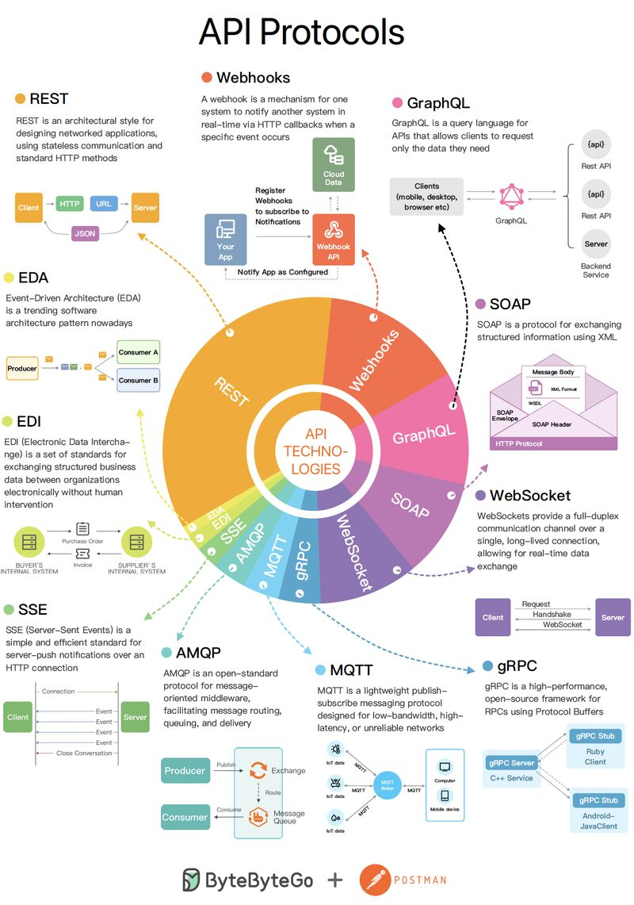

### Protocol Comparison, Header Structure, and Dual Stack

???+ info "Networking"

    Comparing IPv4 and IPv6 protocols, detailing differences in address notation (numeric vs alphanumeric), bit length (32-bit vs 128-bit), header field structures, dual-stack implementation, and the need for network translation between the two protocols.

[📊 Vergrößern](images/Networking_IPv4vsIPv6_ProtocolComparison.png){ .md-button .md-button--primary }

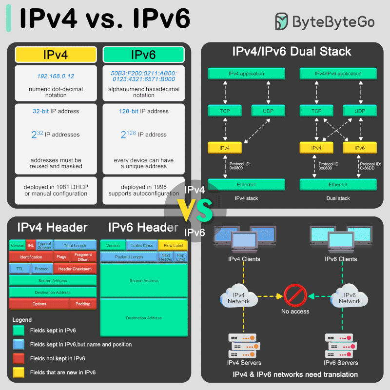

### REST Architectural Constraints and URL Structure

???+ info "REST API"

    The six architectural constraints of REST (Client-Server, Stateless, Cacheable, Layered System, Code-on-Demand, Uniform Interface) and breaking down the components of a RESTful URL including protocols, versioning, endpoints, HTTP methods, filtering, and pagination.

[📊 Vergrößern](images/Networking_General_RESTArchitecturalConstraintsAndURLStructure.png){ .md-button .md-button--primary }

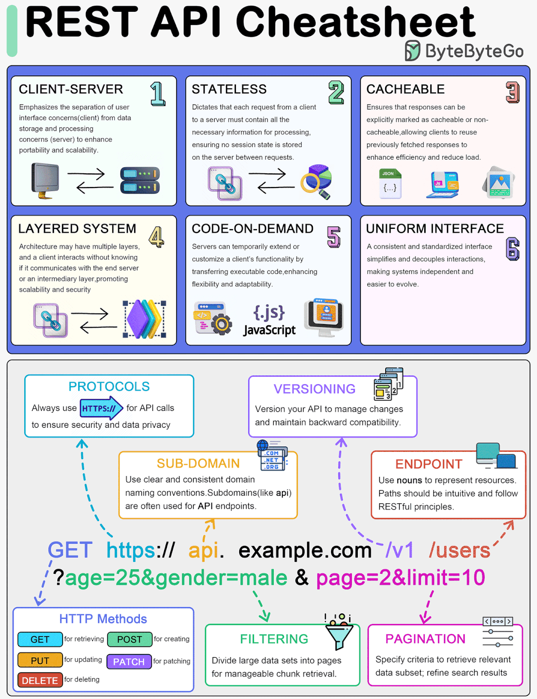

### RESTful API Design Best Practices

???+ info "Design Effective & Safe APIs"

    A comparison table illustrating correct (green check) versus incorrect (red X) ways to design API endpoints for a shopping cart feature. It covers resource naming conventions, plurals, idempotency, versioning, soft deletion queries, pagination, sorting, filtering, secure access via HMAC, resource cross-referencing, adding items to a cart, and rate limiting strategies.

[📊 Vergrößern](images/Networking_DesignaShoppingCart_RESTfulAPIDesignBestPractices.png){ .md-button .md-button--primary }

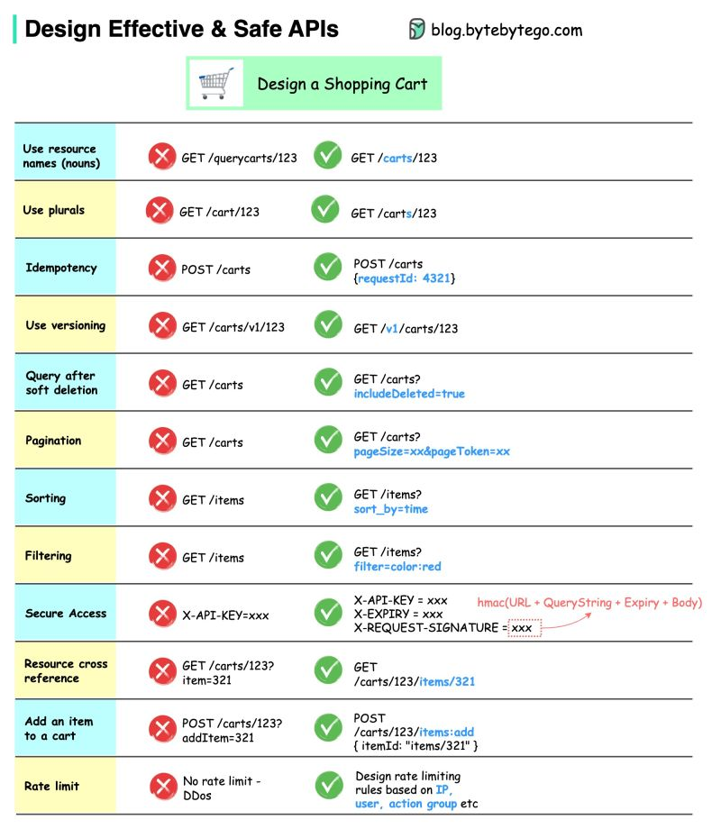

### RESTful Architecture Principles and Implementation

???+ info "REST API Design"

    A mind map illustrating the core components of REST API design. It centers on 'REST' and branches out into architectural principles (Stateless, Cacheable, Client-Server), HTTP methods (GET, POST, PUT, DELETE) with URL examples, Uniform Interface constraints (including HATEOAS), and practical implementation details like Pagination, Versioning, Security (CORS, Auth), and Monitoring.

[📊 Vergrößern](images/Networking_REST_RESTfulArchitecturePrinciplesAndImplementation.png){ .md-button .md-button--primary }

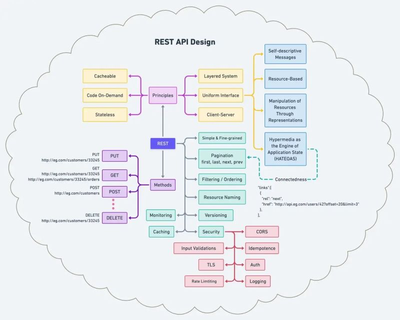

### Reducing Git Clone Time

???+ info "Pinterest: One-Line Change"

    A technical diagram illustrating how modifying the Git refspec configuration in a CI/CD pipeline reduced clone time by 99% (from 40 minutes to 30 seconds). It contrasts the default behavior of fetching all 2,500 branches with a specific configuration that fetches only the master branch.

[📊 Vergrößern](images/Programming_TheRefspecOption_ReducingGitCloneTime.png){ .md-button .md-button--primary }

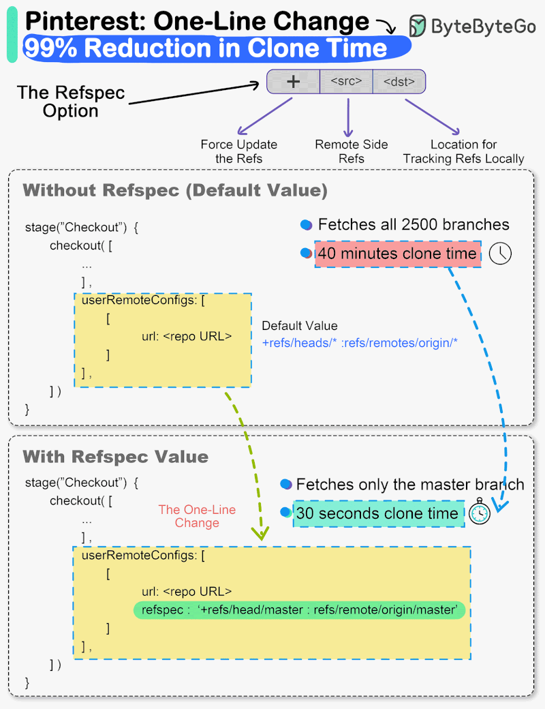

### Request/Response Flow and Data Fetching Efficiency

???+ info "REST vs. GraphQL"

    A comparative diagram illustrating the difference between REST and GraphQL communication patterns. The top section shows a REST architecture where a client must make multiple separate requests (GET /users/123, then GET /orders/456) to different microservices to gather related data. The bottom section shows a GraphQL architecture where the client sends a single POST request with a specific query to a GraphQL layer, which aggregates data from the User and Order microservices into a single, nested JSON response.

[📊 Vergrößern](images/Networking_ArchitectureComparison_RequestResponseFlowAndDataFetchingEfficiency.png){ .md-button .md-button--primary }

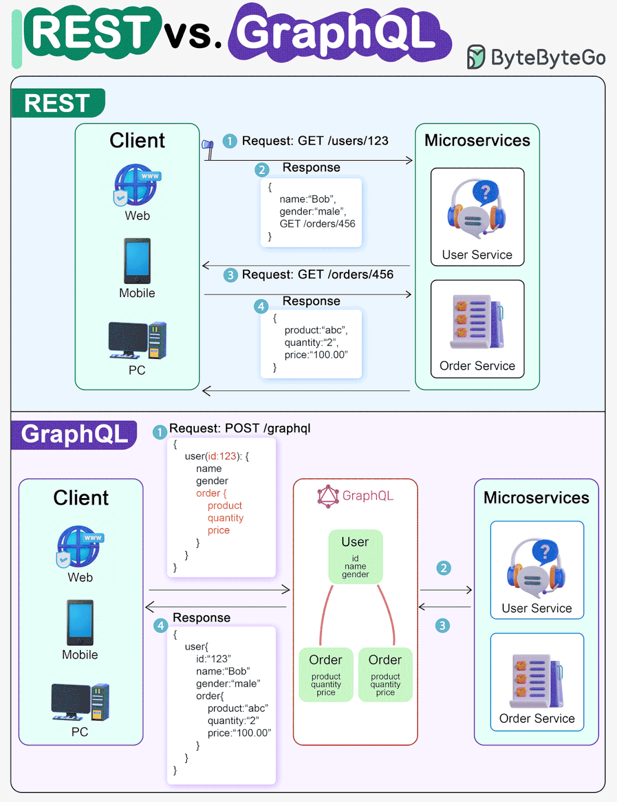

### State Management and Cookie Attributes

???+ info "HTTP"

    How HTTP cookies function to add state to the stateless HTTP protocol. It illustrates the request/response cycle for setting cookies, explains cookie isolation by domain, and details key cookie attributes like Secure, Same-site, Domain, HTTP-Only, and Priority.

[📊 Vergrößern](images/Networking_CookiesAndSessions_StateManagementAndCookieAttributes.png){ .md-button .md-button--primary }

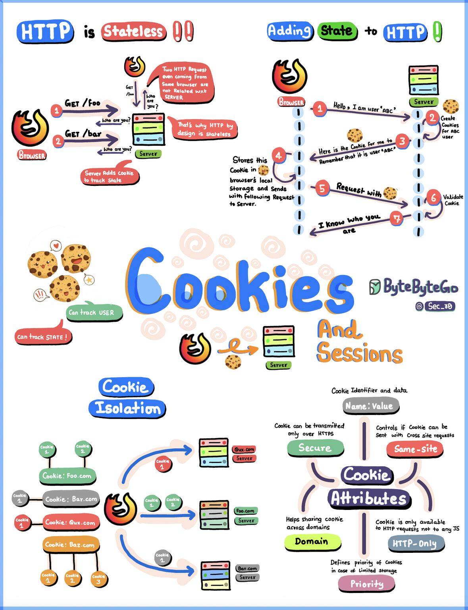

### Top 9 HTTP Request Methods

???+ info "HTTP"

    Nine common HTTP request methods (GET, PUT, POST, DELETE, PATCH, HEAD, CONNECT, OPTIONS, TRACE). Each method is presented with an example request URL, a visual representation of the request/response body structure, and a brief explanation of its specific function (e.g., retrieving, creating, updating, or deleting resources).

[📊 Vergrößern](images/Networking_RequestMethods_HTTPRequestMethods.png){ .md-button .md-button--primary }

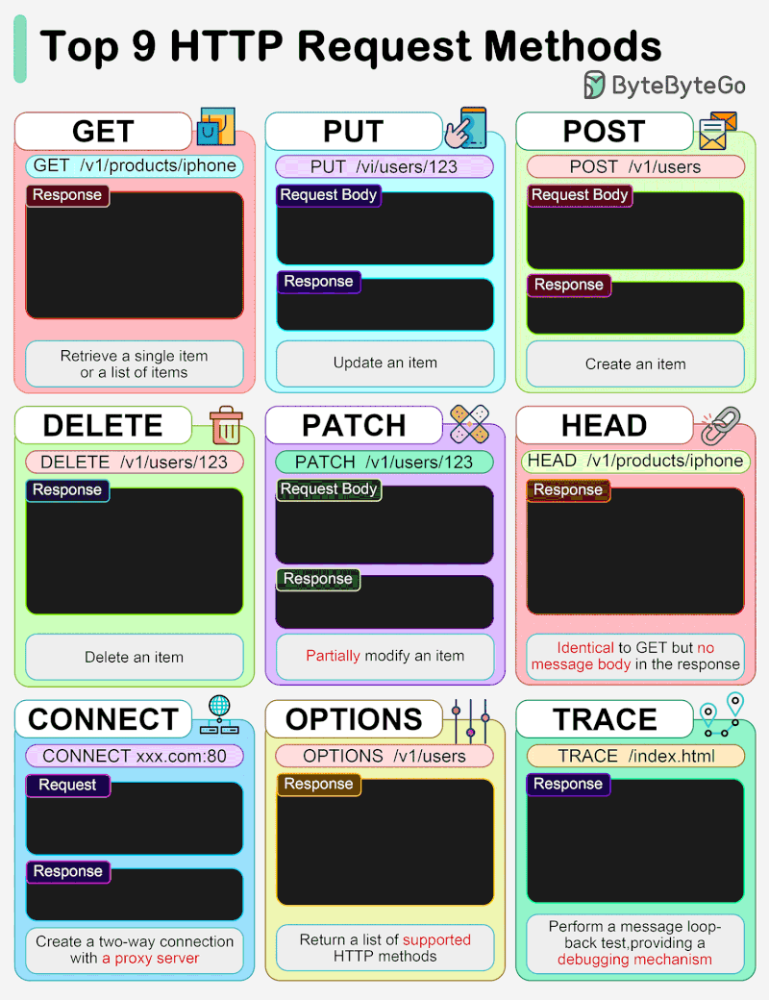

### Top HTTP2 Features

???+ info "HTTP/2"

    The five key architectural features of HTTP/2 that improve performance over HTTP/1: Binary Framing Layer, Multiplexing, Stream Prioritization, Server Push, and Header Compression (using HPACK).

[📊 Vergrößern](images/Networking_HTTP2_TopFeatures.png){ .md-button .md-button--primary }

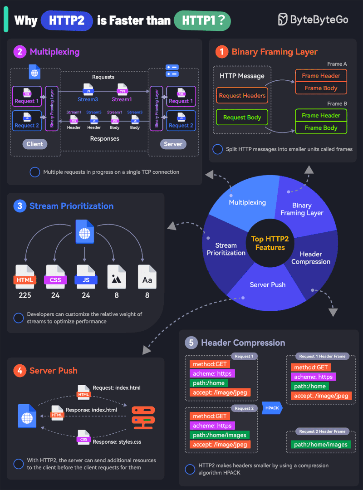

### Types of API Pagination

???+ info "API Pagination 101"

    Six common API pagination methods: Offset-Based, Cursor-Based, Page-Based, Keyset-Based, Time-Based, and Hybrid. Each section includes a description, an example API GET request, and a visual diagram explaining how the data is sliced or filtered.

[📊 Vergrößern](images/Networking_PaginationStrategies_TypesOfAPIPagination.png){ .md-button .md-button--primary }

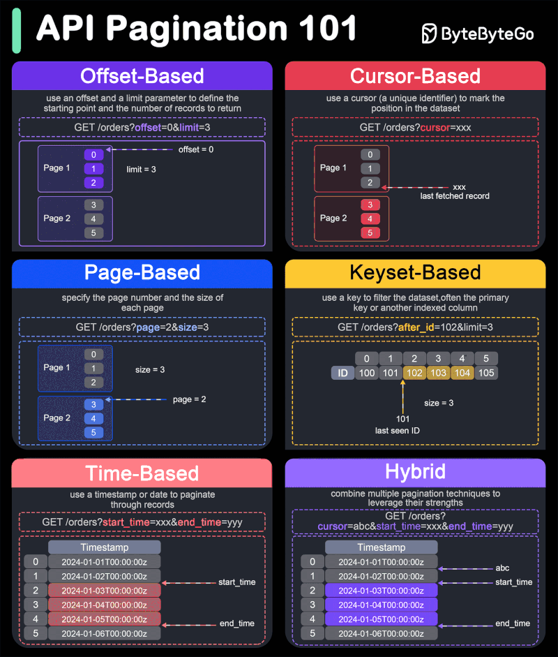

### VPN Tunneling and IP Masking

???+ info "How a VPN Works?"

    A comparative diagram illustrating the difference in data flow between a standard internet connection and a VPN-secured connection. It shows how a VPN encrypts data in a tunnel to a remote server, hiding the user's original IP address and activity from the ISP.

[📊 Vergrößern](images/Security_WithoutaVPNvsWithaVPN_VPNTunnelingAndIPMasking.png){ .md-button .md-button--primary }

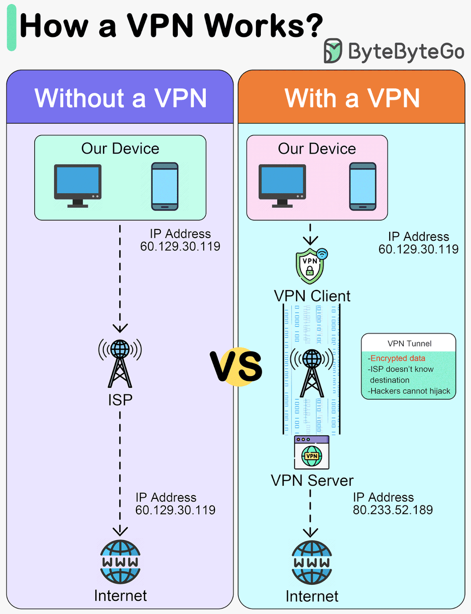

### gRPC Architecture and Communication Flow

???+ info "How does gRPC Work?"

    A technical diagram illustrating the mechanics of gRPC. The top section compares a local function call within a single process to a Remote Procedure Call (RPC) between two separate servers (Order Service and Payment Service). The bottom section details the end-to-end gRPC flow, showing the 14 steps of a request lifecycle: from a client application making an RPC call, through encoding with ProtoBuf, transmission over HTTP/2, server-side processing, and the return response.

[📊 Vergrößern](images/Networking_LocalCall_GRPCArchitectureAndCommunicationFlow.png){ .md-button .md-button--primary }

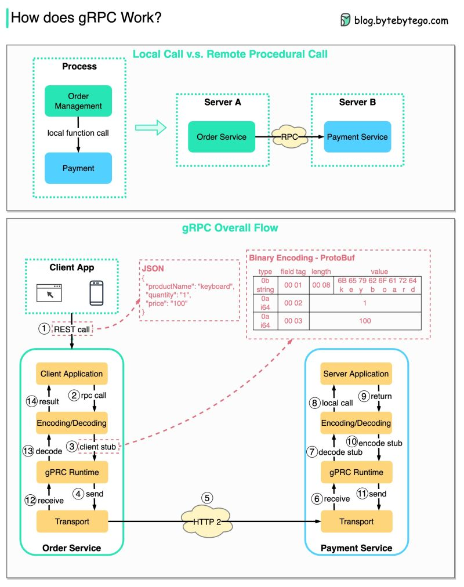

### gRPC Architecture and Data Transmission

???+ info "What is gRPC?"

    GRPC (Remote Procedural Call). It contrasts local function calls with RPC, defines the data format using Protobuf (.proto files), lists use cases like Microservices and IoT, details the data transmission stack (Client/Server Application, Encoding, gRPC Runtime, HTTP/2 Transport), and outlines the pros (high performance, language agnostic) and cons (complexity, limited human readability).

[📊 Vergrößern](images/Networking_General_GRPCArchitectureAndDataTransmission.png){ .md-button .md-button--primary }

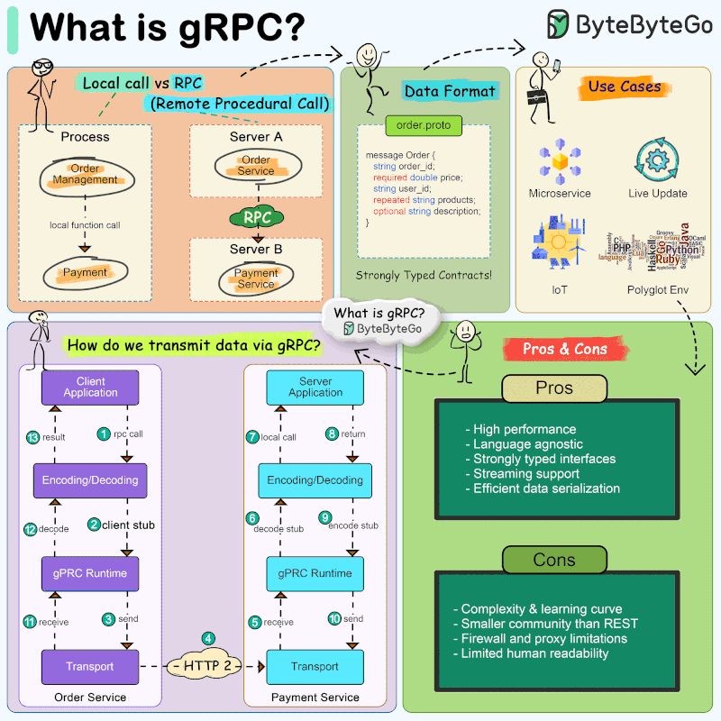

*21 Themen verfügbar*
