# Operating Systems

### API Development Learnings

???+ info "11 Things I Learned about API Development at POST/CON"

    By ByteByteGo summarizing 11 key takeaways from the POST/CON conference. The points are categorized into three main areas: API Dev Toolkit (covering workflows, monitoring, time-to-first-call, authorization, and AI tools), API Collaboration (covering streamlined workflows, producer/consumer collaboration, and cross-functional efforts), and API Community Growth (covering in-editor testing, marketing APIs, and the Postman API Network).

[📊 Vergrößern](images/Networking_APIDevToolkitAPICollaborationA_APIDevelopmentLearnings.png){ .md-button .md-button--primary }

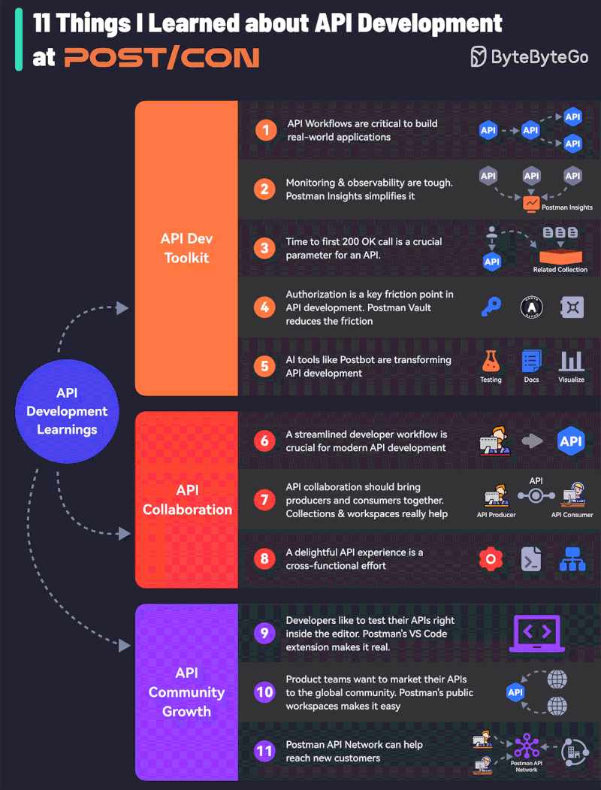

### AWS Cloud Services Overview

???+ info "Most Important AWS Services To Learn"

    Table categorizing key Amazon Web Services (AWS) into functional groups such as Cloud Computing Essentials, Networking, Databases, DevOps, Security, and Machine Learning, listing specific services like S3, EC2, Lambda, and IAM for each category.

[📊 Vergrößern](images/CloudInfrastructure_ServiceCategories_AWSCloudServicesOverview.png){ .md-button .md-button--primary }

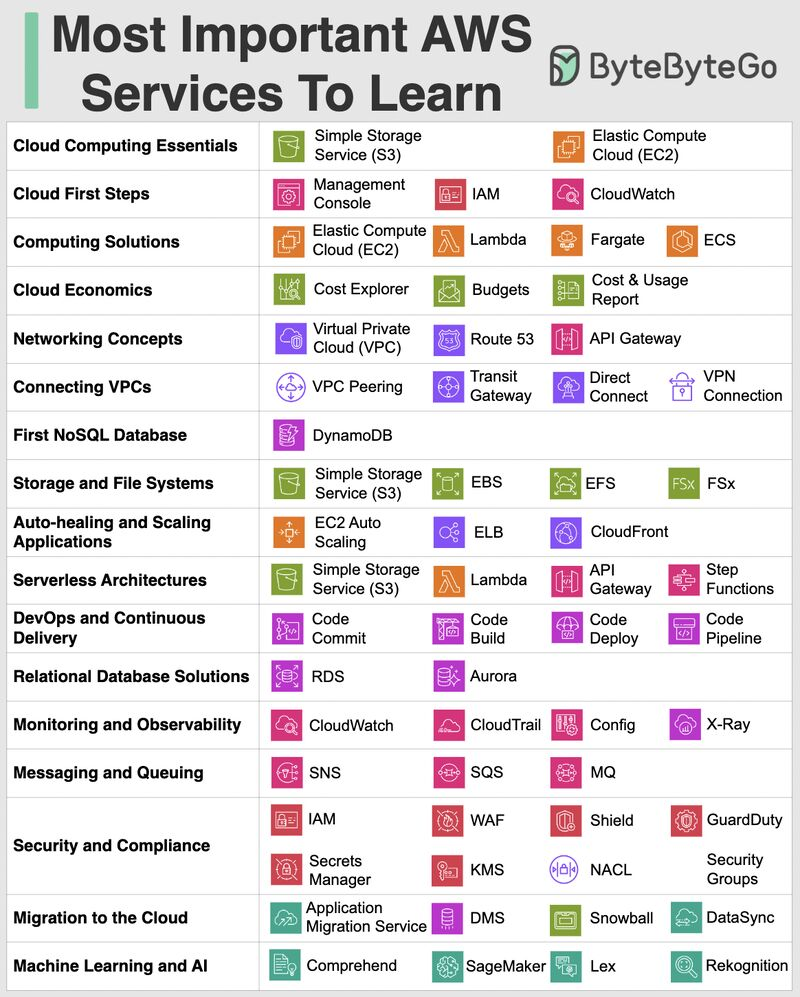

### Apache Kafka Message Loss Scenarios

???+ info "Can Kafka Lose Messages?"

    A detailed architectural diagram illustrating the data flow in Apache Kafka from Producer to Consumer. It highlights five specific cases where message loss can occur: asynchronous sending, record batching, asynchronous flushing, data replication issues among brokers, and consumer auto-commit settings.

[📊 Vergrößern](images/Databases_Kafka_ProducerBrokerMessageLossScenarios.png){ .md-button .md-button--primary }

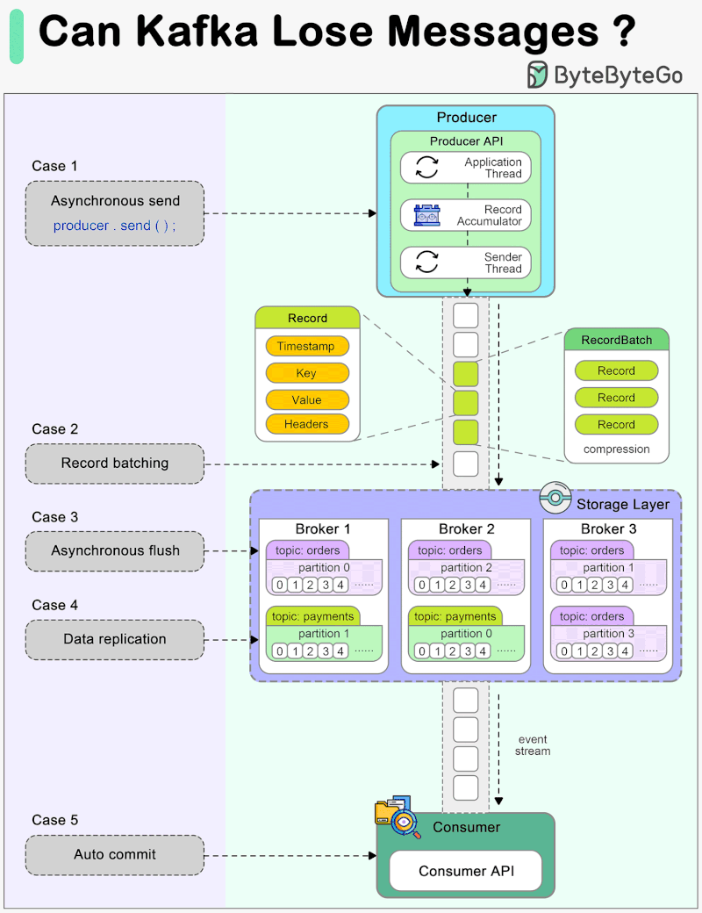

### Comparison of Popular Open-Source SQL and NoSQL Databases

???+ info "Most Popular Open Source Databases"

    Ten popular open-source databases (Cassandra, MariaDB, PostgreSQL, MySQL, Couchbase, MongoDB, Redis, CockroachDB, SQLite, and Neo4j). Each database is represented in a central wheel and connected to a detailed box listing its key characteristics, such as being a fork of MySQL, ACID compliance, or specific use cases like mobile apps or graph databases.

[📊 Vergrößern](images/Databases_DatabaseOverviewAndFeatures_ComparisonOfPopularOpenSourceSQLAndNoSQLDatabases.png){ .md-button .md-button--primary }

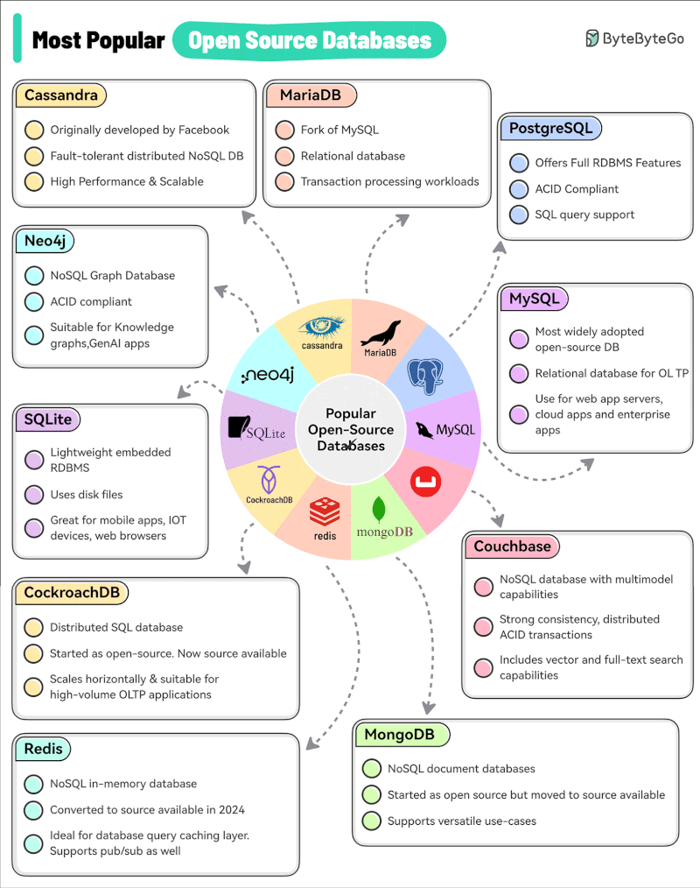

### Computer Memory Components and Hierarchy

???+ info "Memory Types"

    Different types of computer memory. It features a pyramid diagram of the memory hierarchy (from Registers to Remote Secondary Storage), a visual of HDD sectors, a detailed breakdown of CPU registers, a data flow diagram for Caches and RAM, and a block diagram of SSD internal architecture.

[📊 Vergrößern](images/OperatingSystems_MemoryHierarchyAndArchitecture_ComputerMemoryComponentsAndHierarchy.png){ .md-button .md-button--primary }

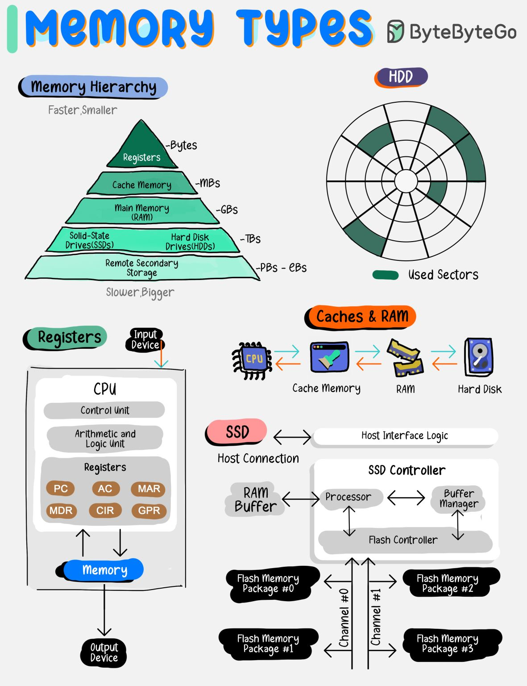

### Database Scaling Strategies

???+ info "100X Postgres Scaling at Figma"

    An architectural diagram illustrating the evolution of Figma's PostgreSQL scaling. It shows three phases: 1) Vertical Scaling with Read Replicas using Amazon RDS and PGbouncer, 2) Vertical Partitioning splitting tables by columns (e.g., User/Auth vs. Files/Image), and 3) Horizontal Partitioning (Sharding) splitting data by ID ranges across multiple shards using a DB Proxy.

[📊 Vergrößern](images/SystemDesign_VerticalScalingReplicationVert_DatabaseScalingStrategies.png){ .md-button .md-button--primary }

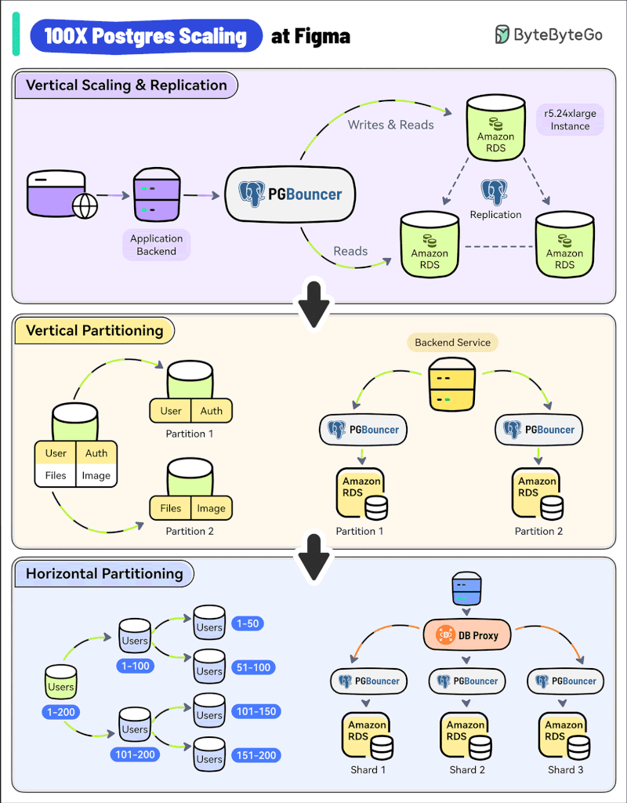

### Linux Command Line Interface (CLI)

???+ info "18 Most-used Linux Commands"

    Cheat sheet displaying a grid of 18 fundamental Linux commands (such as ls, cd, mkdir, rm, grep, etc.) along with brief descriptions of their functions.

[📊 Vergrößern](images/OperatingSystems_CommAndReference_LinuxCommAndLineInterfaceCLI.png){ .md-button .md-button--primary }

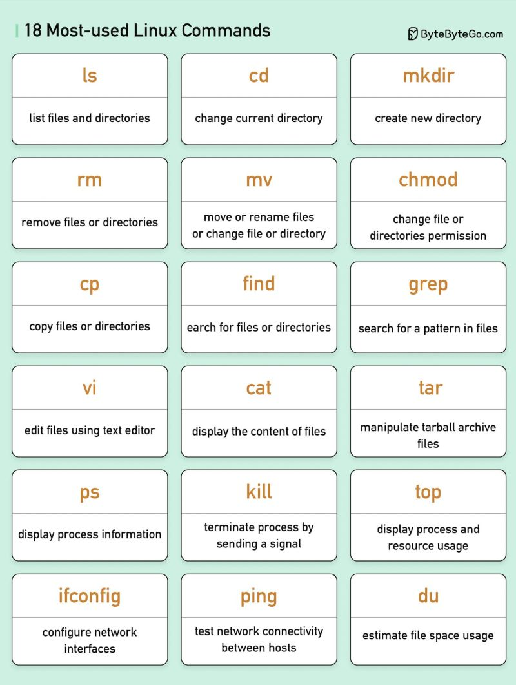

### Linux Performance Observability Tools Map

???+ info "Linux Performance"

    The Linux software stack and hardware architecture, annotated with specific command-line tools (such as strace, perf, top, iostat, and tcpdump) mapped to the specific layers or components they are used to observe and analyze.

[📊 Vergrößern](images/OperatingSystems_ObservabilityTools_LinuxPerformanceObservabilityToolsMap.png){ .md-button .md-button--primary }

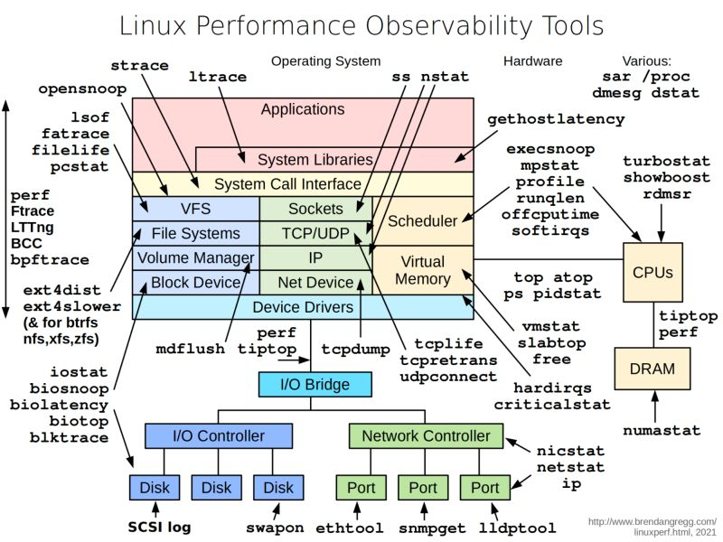

### Linux Root Directory Structure

???+ info "Linux File Systems"

    The standard Linux file system hierarchy. It features a central root directory ('/') node branching out to common subdirectories (like /bin, /etc, /home, /usr, /var) with icons and brief descriptions explaining the purpose of each directory.

[📊 Vergrößern](images/OperatingSystems_DirectoryHierarchy_LinuxRootDirectoryStructure.png){ .md-button .md-button--primary }

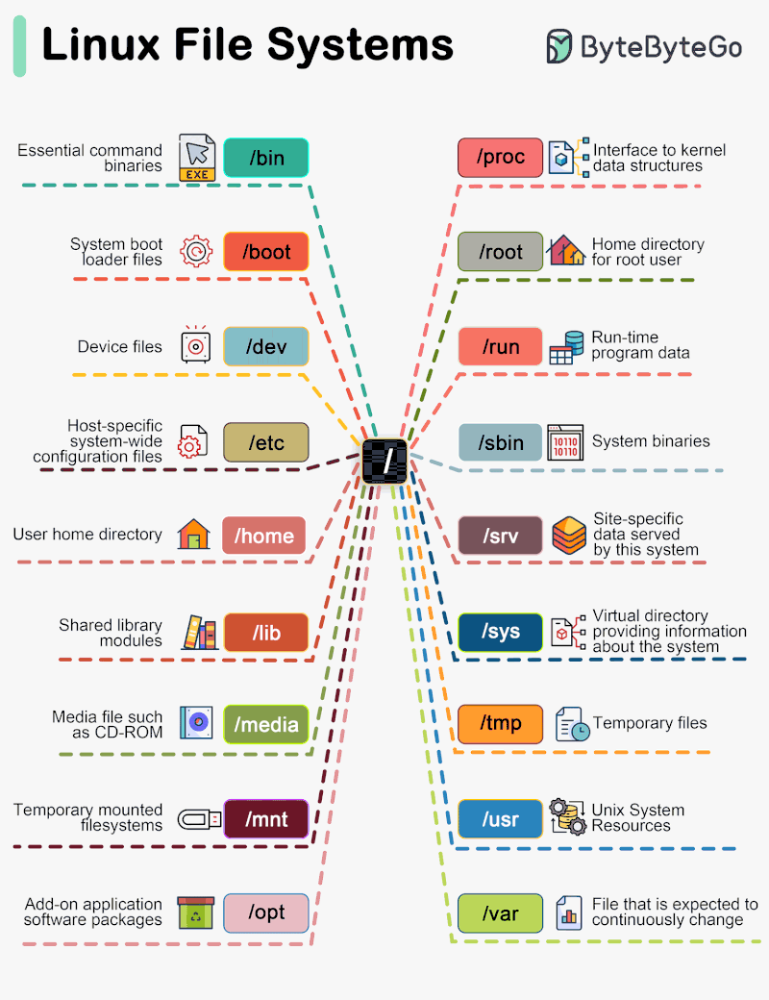

### Linux System Initialization

???+ info "Linux Boot Process Explained"

    A flowchart diagram illustrating the 8-step Linux boot process. It begins with powering on the hardware and BIOS/UEFI POST checks, proceeds to device detection and GRUB bootloader selection, loads the kernel and systemd (the first user-space process), executes .target files and startup scripts, and concludes when users can log in.

[📊 Vergrößern](images/OperatingSystems_BootSequenceSteps_LinuxSystemInitialization.png){ .md-button .md-button--primary }

### Linux System Initialization Sequence

???+ info "Linux Boot Process"

    A flowchart illustrating the 8-step Linux boot process, starting from Power On and BIOS/UEFI detection, moving through the GRUB bootloader and kernel execution, initializing systemd, running target files and startup scripts, and finally allowing user login.

[📊 Vergrößern](images/OperatingSystems_General_LinuxSystemInitializationSequence.png){ .md-button .md-button--primary }

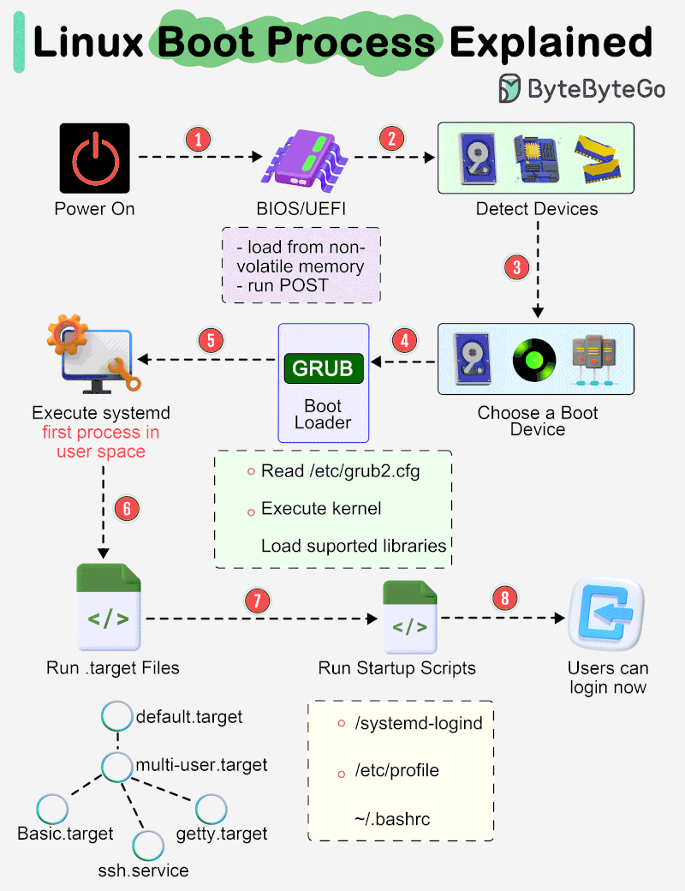

### Linux System Stack Tool Mapping

???+ info "Linux Performance"

    The Linux software and hardware stack, mapping various performance and observability tools (e.g., strace, top, iostat, perf, tcpdump) to the specific layers they monitor, from Applications down to Device Drivers, I/O Controllers, CPUs, and DRAM.

[📊 Vergrößern](images/OperatingSystems_ObservabilityTools_LinuxSystemStackToolMapping.png){ .md-button .md-button--primary }

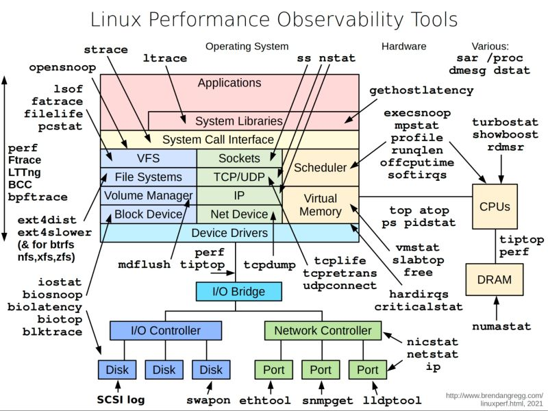

### Microservice Design Patterns and Operations

???+ info "Microservice Best Practices"

    Nine key best practices for building microservices: 1. Separate data store, 2. Keep code at a similar level of maturity, 3. Separate build for each microservice, 4. Single responsibility, 5. Deploy into containers, 6. Treat servers as stateless, 7. Domain-driven design, 8. Micro frontend, and 9. Orchestrating microservices (using Kubernetes).

[📊 Vergrößern](images/SystemDesign_ArchitecturalGuidelines_MicroserviceDesignPatternsAndOperations.png){ .md-button .md-button--primary }

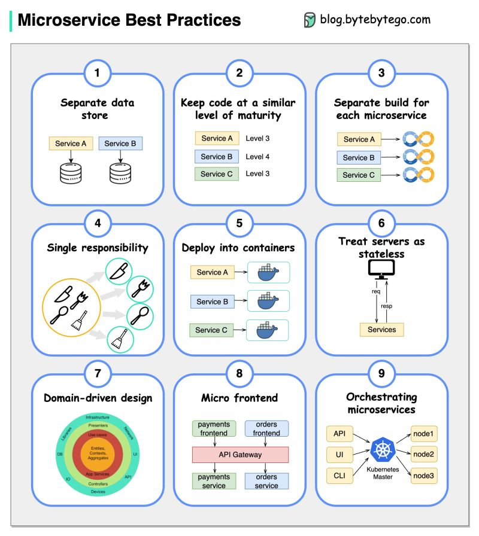

### Microservices Architecture

???+ info "9 Best Practices For Building Microservices"

    Nine key best practices for building microservices, including designing for failure, building small services, using lightweight protocols, service discovery, data ownership, resiliency patterns, security, centralized logging, and containerization.

[📊 Vergrößern](images/SystemDesign_BestPractices_MicroservicesArchitecture.png){ .md-button .md-button--primary }

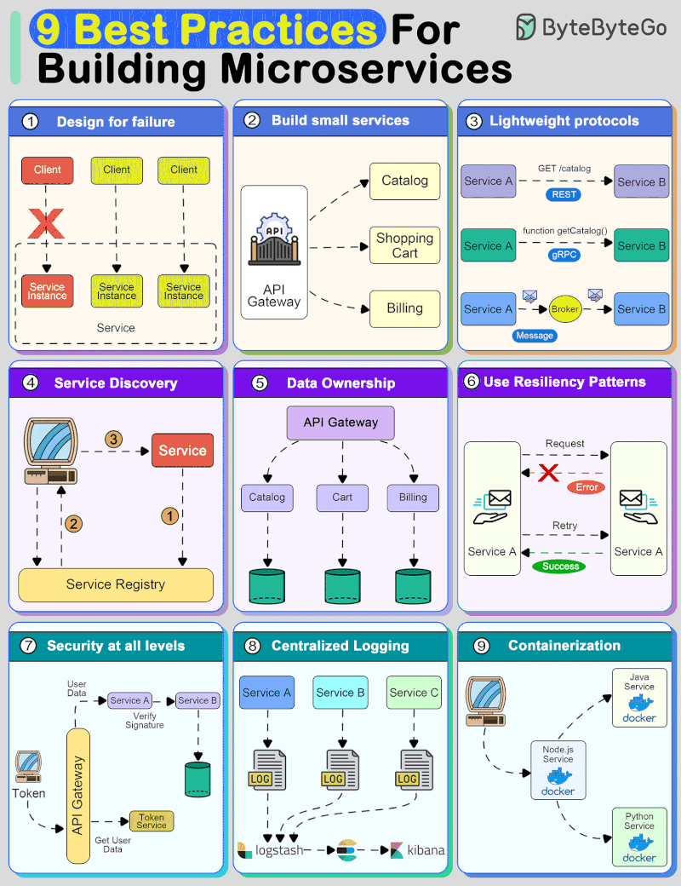

### Octal and String Representation of Permissions

???+ info "Linux"

    Linux file permissions. It includes a table mapping binary and octal values to string representations (r, w, x) and permission types. Below, it breaks down a permission string (rwxrw-r-x) into Owner, Group, and Other segments, showing how the octal values (7, 6, 5) are calculated by summing the values for Read (4), Write (2), and Execute (1).

[📊 Vergrößern](images/OperatingSystems_FilePermissions_OctalAndStringRepresentationOfPermissions.png){ .md-button .md-button--primary }

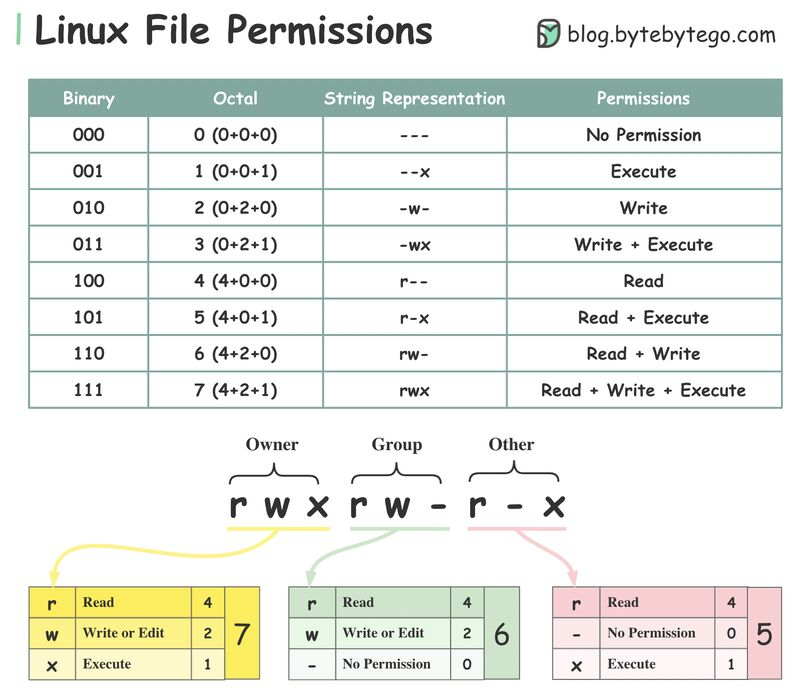

### Payment Processing Infrastructure

???+ info "The Payments Ecosystem"

    The payments ecosystem, categorizing key industry players (ISO/MSP, Payment Gateway, Payment Processor) with company logos on the left, and mapping the transaction flow between merchants, acquiring banks, card networks, and issuing banks on the right.

[📊 Vergrößern](images/SystemDesign_KeyPlayersAndTransactionFlow_PaymentProcessingInfrastructure.png){ .md-button .md-button--primary }

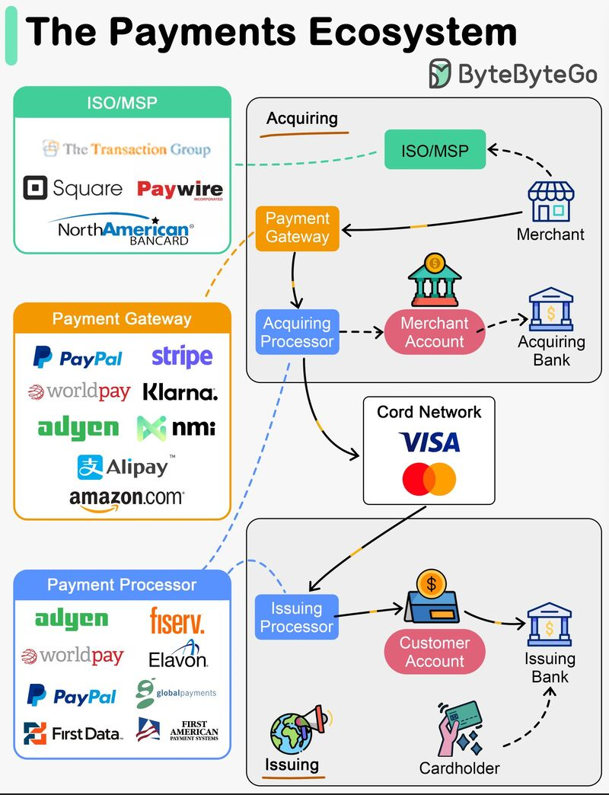

### PostgreSQL Extensions and Integrations

???+ info "Is Postgres eating the Database World?"

    The expanding ecosystem of PostgreSQL. A central pie chart categorizes database functions into Graph, TimeSeries, Machine Learning, OLAP, Derived, Geospatial, Search, and Federated. Surrounding boxes display logos of specific tools, extensions, and databases (like TimescaleDB, PostGIS, Mongo, Redis) that fit into these categories, showing how Postgres integrates with or replaces them.

[📊 Vergrößern](images/Databases_DatabaseCapabilitiesMap_PostgreSQLExtensionsAndIntegrations.png){ .md-button .md-button--primary }

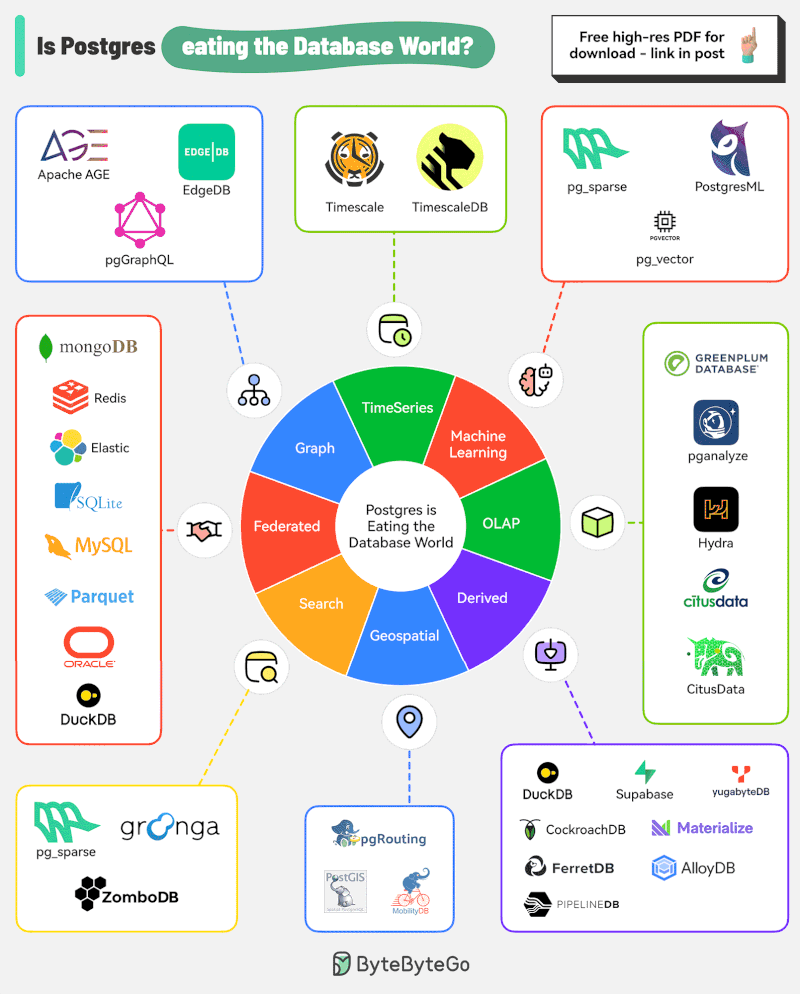

### Standard Linux Directories

???+ info "Linux File Systems"

    The Linux file system hierarchy centered on the root directory '/', branching out to show standard subdirectories like /bin, /etc, /home, /var, and /usr, along with brief descriptions of their specific purposes.

[📊 Vergrößern](images/OperatingSystems_DirectoryHierarchy_StandardLinuxDirectories.png){ .md-button .md-button--primary }

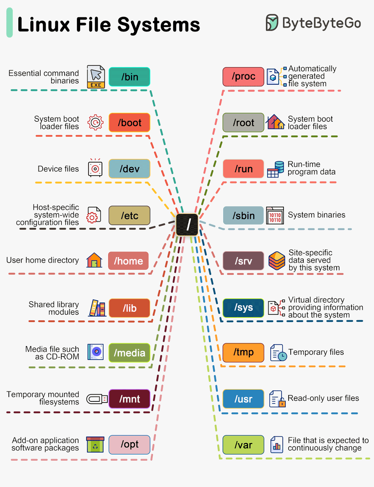

### The 7 Layers of the OSI Model

???+ info "OSI Model"

    Titled 'What is OSI model' illustrating the Open Systems Interconnection model. It shows the seven layers (Physical, Data Link, Network, Transport, Session, Presentation, Application) arranged vertically on both a sending device (Device A) and a receiving device (Device B). The diagram depicts the flow of data, showing encapsulation on the left where headers (MAC, IP, TCP, HTTP) are added as data moves down the layers, transmission as bits, and de-encapsulation on the right where headers are removed as data moves up the layers.

[📊 Vergrößern](images/Networking_DataEncapsulation_TheSevenLayersOfTheOSIModel.png){ .md-button .md-button--primary }

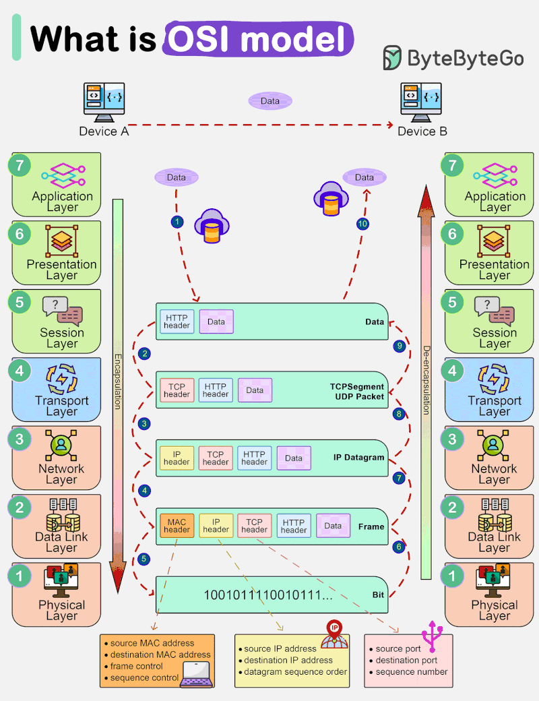

*19 Themen verfügbar*
