# Programming

### C++ Programming Applications and Architecture

???+ info "Top 8 C++ Use Cases"

    Eight major domains where C++ is commonly used. It features diagrams and icons for Embedded Systems (phones, cars), Game Development (game loop architecture), Operating Systems (kernel space, system calls), Databases (query handling, storage), Financial Applications (trading systems, stock exchange), Web Browsers (rendering engine, JS interpreter), Networking (layers, topology), and Scientific Computing (parallel computing, clusters).

[📊 Vergrößern](images/Programming_EmbeddedSystemsGameDevelopment_CProgrammingApplicationsAndArchitecture.png){ .md-button .md-button--primary }

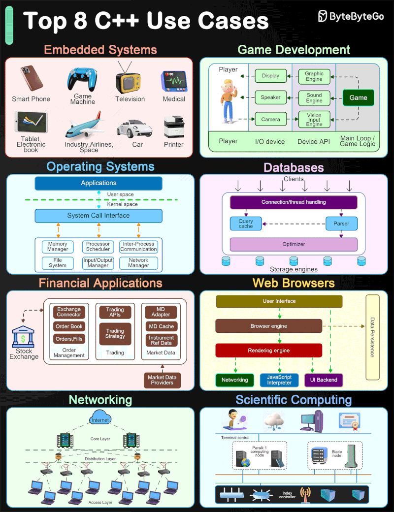

### Commit History Visualization

???+ info "Git Branching Strategies"

    A comparative diagram illustrating the difference between 'git merge' and 'git rebase'. It shows three stages: the original branch structure with a main and feature branch, the result of a merge which creates a new merge commit and preserves non-linear history, and the result of a rebase which rewrites the feature branch commits to create a linear history on top of the main branch.

[📊 Vergrößern](images/Programming_MergevsRebase_CommitHistoryVisualization.png){ .md-button .md-button--primary }

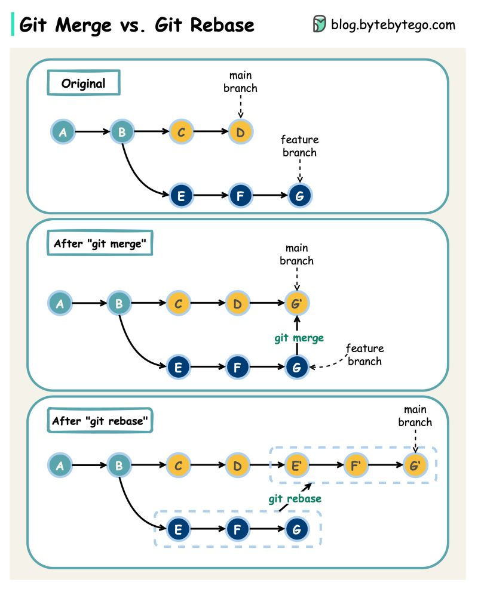

### Comparison of Compiled, Bytecode, and Interpreted Languages

???+ info "How do C++, Java, Python Work?"

    The lifecycle of code execution for three categories of programming languages. The left column shows compiled languages (Go, C++, C) converting source code directly to machine code. The middle column shows languages like Java and C# converting to bytecode which runs on a Virtual Machine (JIT/Interpreter). The right column shows interpreted languages (Python, JS, Ruby) running source code directly via an interpreter.

[📊 Vergrößern](images/Programming_DevelopmentAndRuntimeWorkflow_ComparisonOfCompiledBytecodeAndInterpretedLanguage.png){ .md-button .md-button--primary }

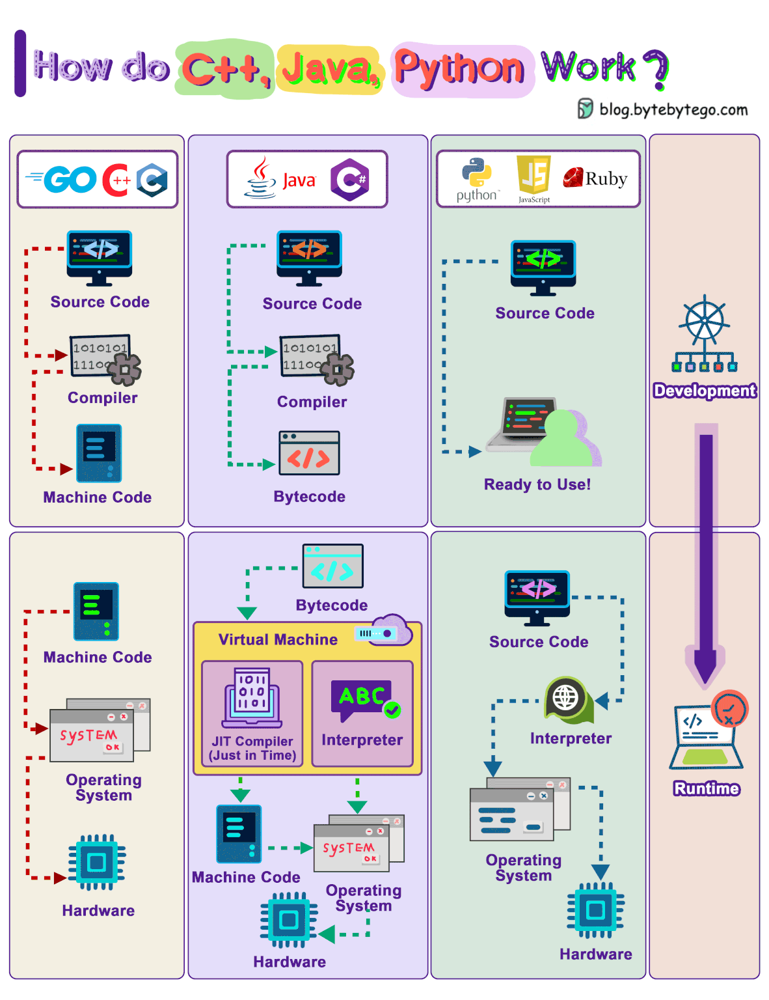

### Git Command Workflow

???+ info "How Git Commands work"

    The Git workflow, showing the four main areas (Working Directory, Staging Area, Local Repo, Remote Repo) and the specific commands (git add, git commit, git push, git pull, git fetch, git merge, git checkout, git clone) used to move data between them, separated into Local and Remote environments.

[📊 Vergrößern](images/Programming_LocalAndRemoteRepositories_GitCommAndWorkflow.png){ .md-button .md-button--primary }

### Git Workflow and Architecture

???+ info "Git Fundamentals"

    The flow of data and changes between the four main Git areas: Working Directory, Staging Area, Local Repository, and Remote Repository. It maps specific Git commands (add, commit, push, fetch, pull, merge, checkout, clone) to the movement between these areas.

[📊 Vergrößern](images/Programming_HowGitCommandswork_GitWorkflowAndArchitecture.png){ .md-button .md-button--primary }

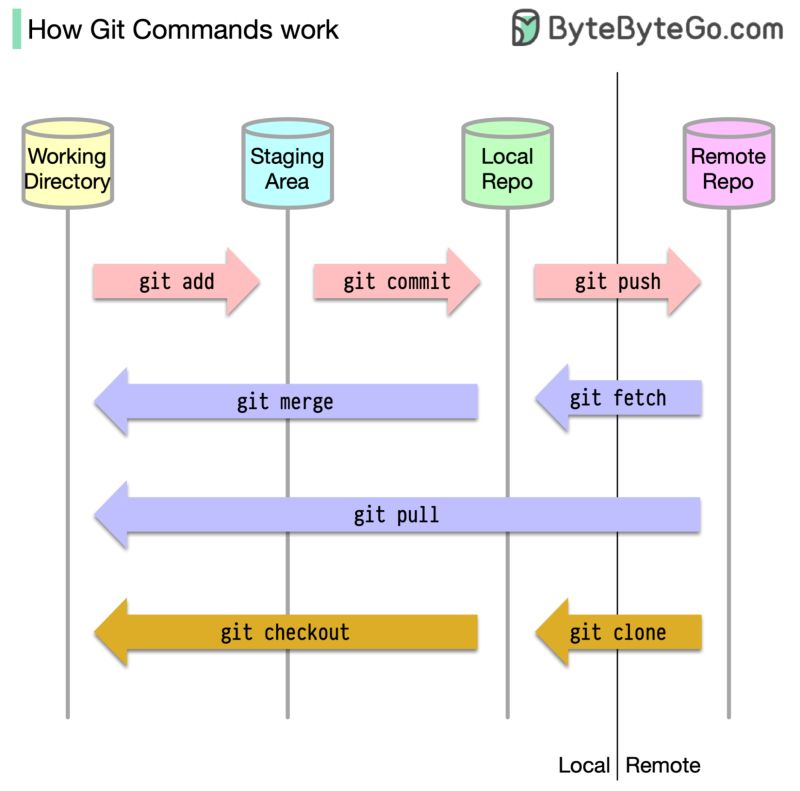

### GitOps CI/CD Pipeline Implementation

???+ info "GitOps Workflow"

    A complete GitOps workflow. It shows the Continuous Integration phase where code pushed to an App Repo triggers GitHub Actions (build, analysis, tests, security scanning) to create a Docker image. It also shows the Continuous Deployment phase where configuration pushed to a Manifest Repo is synced by Argo CD, which pulls the image from the registry and deploys it to Dev, Test, and Prod Kubernetes environments.

[📊 Vergrößern](images/CloudInfrastructure_SimplifiedVisualGuide_GitOpsCICDPipelineImplementation.png){ .md-button .md-button--primary }

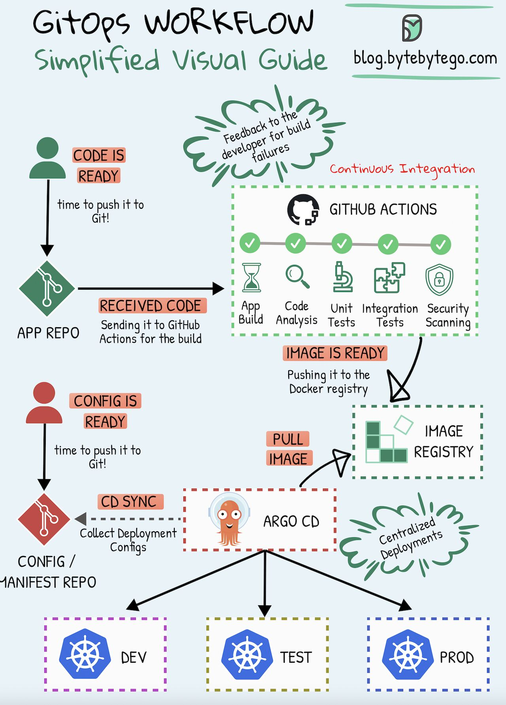

### Imperative, Object-Oriented, Functional, and Generic Programming

???+ info "Top 8 programming paradigms"

    Four major programming paradigms. For each paradigm (Imperative, Object-Oriented, Functional, Generic), it provides a definition, key characteristics (like mutable state, encapsulation, immutability), and examples of programming languages that support them (such as C++, Java, Python, Haskell).

[📊 Vergrößern](images/Programming_Paradigms_ImperativeObjectOriented.png){ .md-button .md-button--primary }

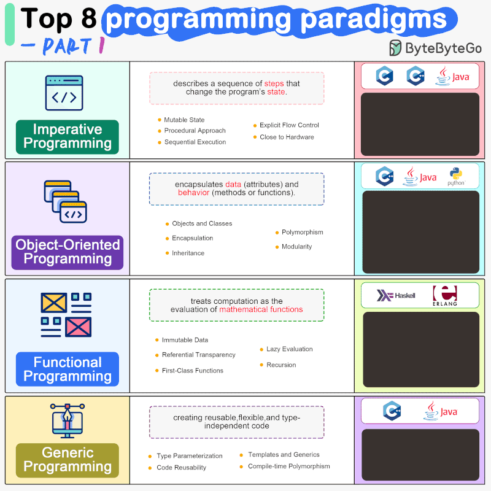

### JavaScript Fundamentals and Ecosystem

???+ info "Javascript {.js} Explained"

    Key JavaScript concepts. It covers language characteristics (interpreted vs compiled, first-class functions, dynamic typing), runtime mechanics (client-side execution, event loop, prototype-based OOP, garbage collection), and the broader ecosystem (comparison with Python/Java, relationship with TypeScript, and popular frameworks like React, Vue, and Angular).

[📊 Vergrößern](images/Programming_General_JavaScriptFundamentalsAndEcosystem.png){ .md-button .md-button--primary }

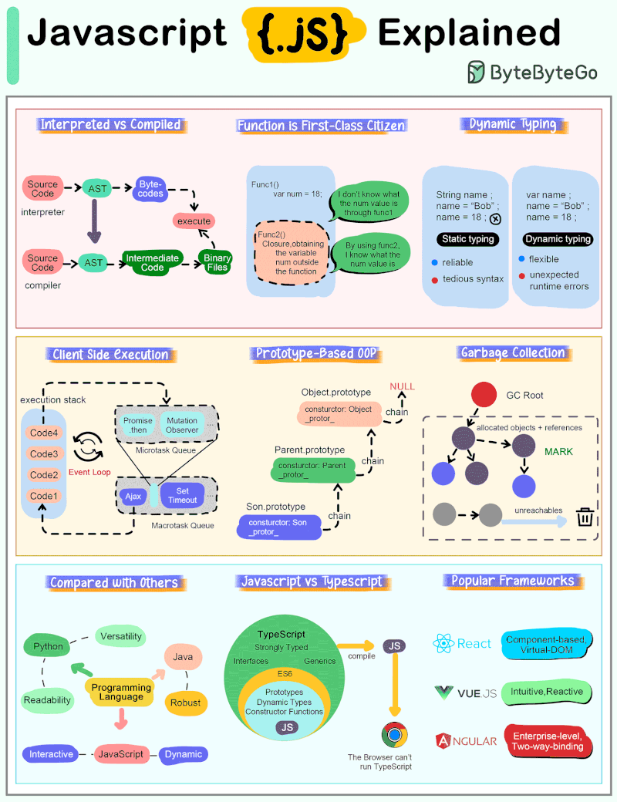

### Recommended Reading List for Software Engineers

???+ info "10 Books Every Software Engineer Should Read"

    Categorizing essential books for software developers into five key areas: General Advice (The Pragmatic Programmer, Code Complete), Coding (Clean Code, Refactoring), Software Architecture (Designing Data-Intensive Applications, System Design Interview), Design Patterns (Design Patterns, Domain-Driven Design), and Data Structures & Algorithms (Introduction to Algorithms, Cracking the Coding Interview).

[📊 Vergrößern](images/CareerLearning_GeneralAdviceCodingSoftwareArc_RecommendedReadingListForSoftwareEngineers.png){ .md-button .md-button--primary }

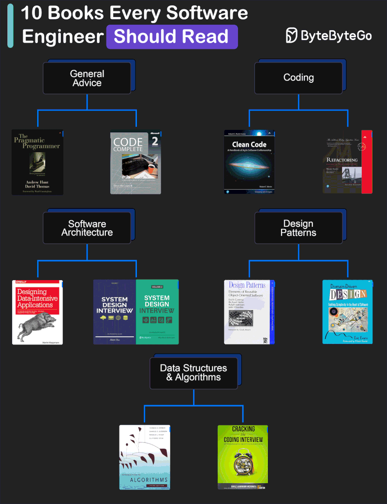

### Software Architecture Styles

???+ info "Software Architecture"

    Various software architecture styles. It features a central categorization wheel dividing styles into groups like Data-Centric, Layered, Component-Based, and Event-Driven. Surrounding the wheel are detailed diagrams and explanations for specific architectures including CQRS, Layered (n-tier), Microkernel, Microservices, Space-Based, Domain-Driven Design (DDD), Event-Driven, MVP, Interpreter, and Orchestration.

[📊 Vergrößern](images/SystemDesign_ArchitectureStyles_SoftwareArchitectureStyles.png){ .md-button .md-button--primary }

### Software Architecture Styles and Patterns

???+ info "Software Architecture"

    A central wheel categorizing various software architecture styles (like Data-Centric, Layered, Service-Oriented) surrounded by detailed diagrams and explanations for specific patterns including CQRS, Layered (n-tier), Microkernel, Microservices, Space-Based, Domain-Driven Design (DDD), Event-Driven, MVP, and Orchestration.

[📊 Vergrößern](images/SystemDesign_ArchitectureStyles_SoftwareArchitectureStylesAndPatterns.png){ .md-button .md-button--primary }

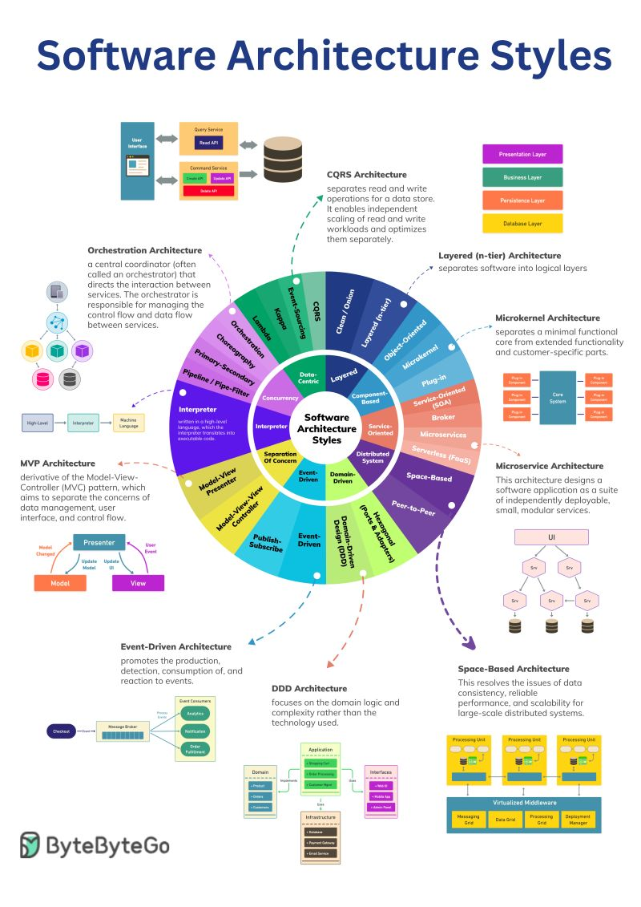

### Testing Methodologies and Tools

???+ info "Software Testing"

    Table outlining six key software testing processes: Unit Testing, Integration Testing, System Testing, Load Testing, Error Testing, and Test Automation. Each row provides a visual illustration of the testing scope (e.g., individual blocks for unit, connected modules for integration) and lists popular tools associated with that testing type (e.g., pytest, Selenium, JMeter, Jenkins).

[📊 Vergrößern](images/Programming_BestWaysToTestSystemFunctional_TestingMethodologiesAndTools.png){ .md-button .md-button--primary }

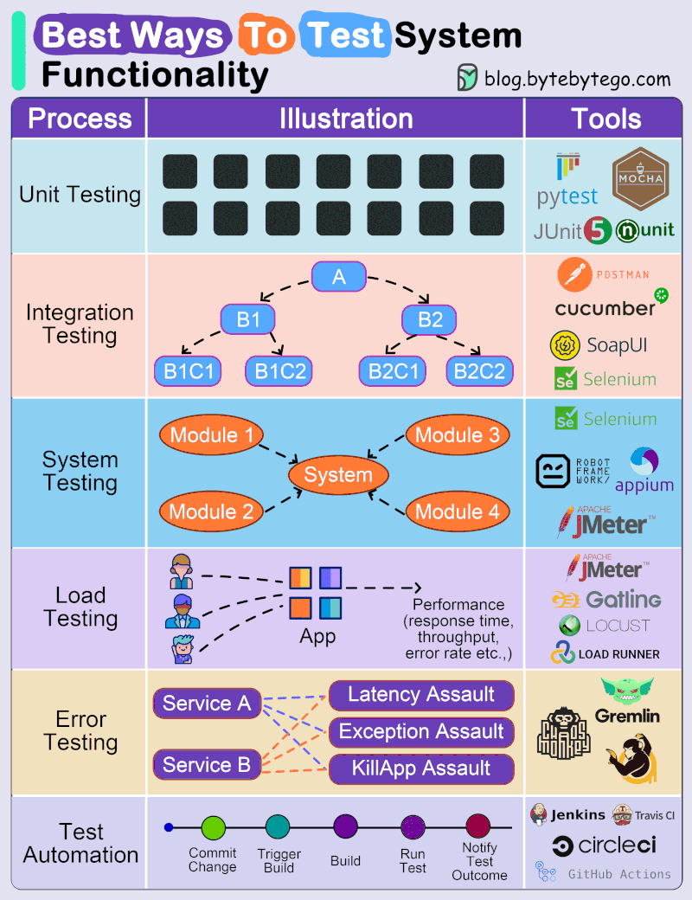

### Timeline of OOP adoption

???+ info "Object-Oriented Programming"

    A winding timeline infographic illustrating the history of Object-Oriented Programming (OOP) through five numbered stages: Early Concepts (Simula, 1960s-70s), Smalltalk (1970s), C++ Emergence (1980s), OOP Mainstream Adoption (Java and C#, 1990s), and OOP in Modern Times (Python, Javascript, Ruby).

[📊 Vergrößern](images/Programming_HistoryAndEvolution_TimelineOfOOPadoption.png){ .md-button .md-button--primary }

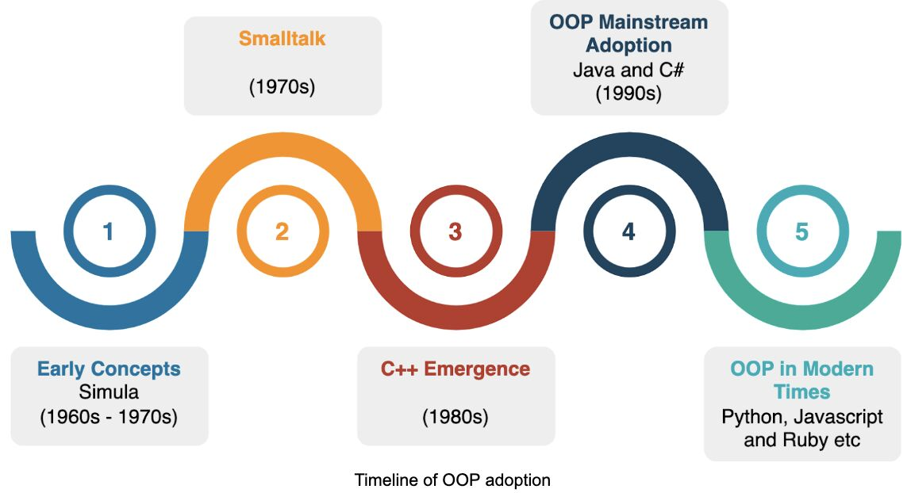

*13 Themen verfügbar*
