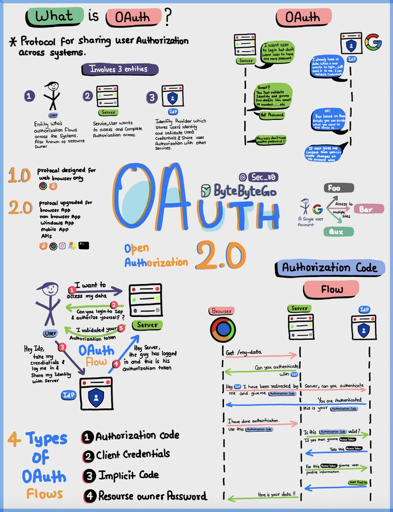
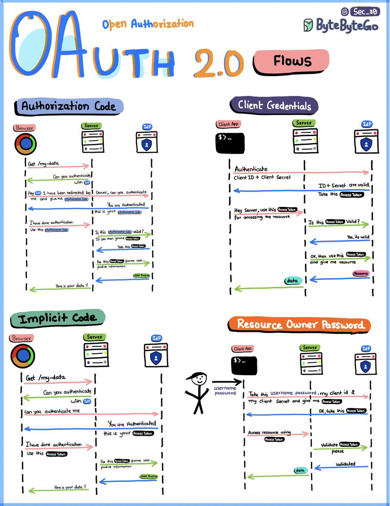
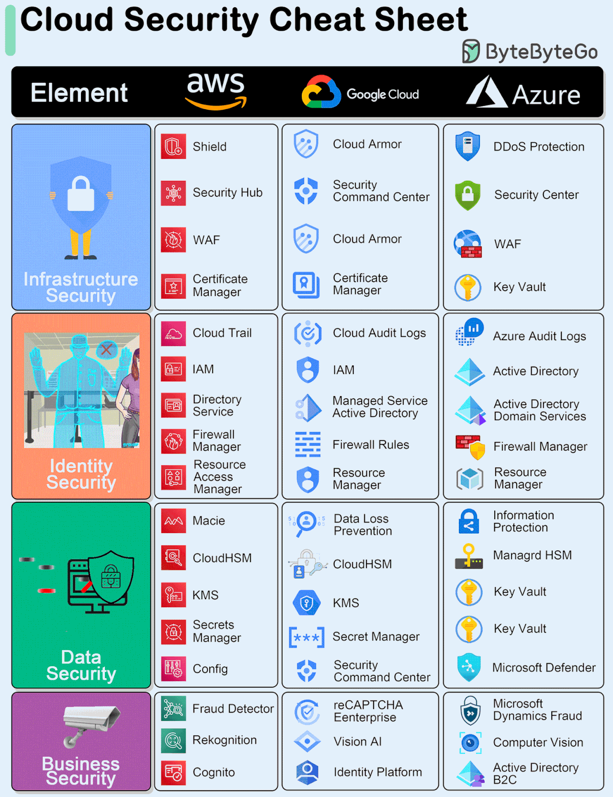
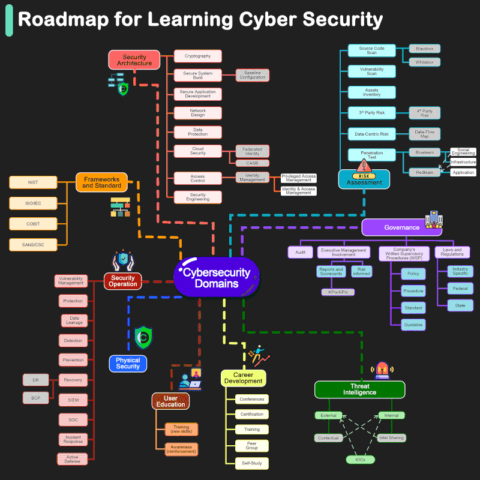
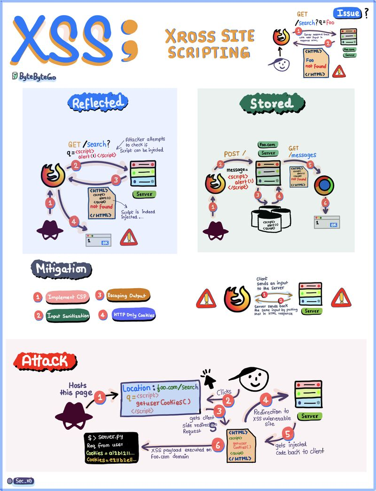
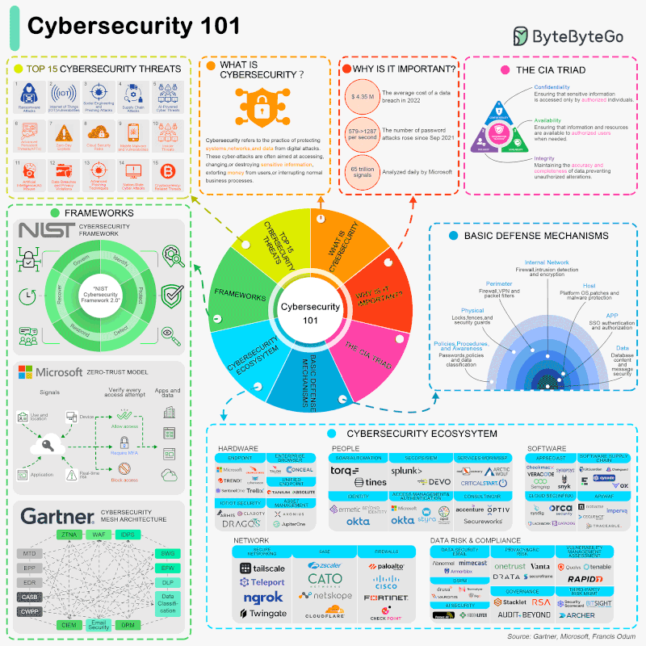
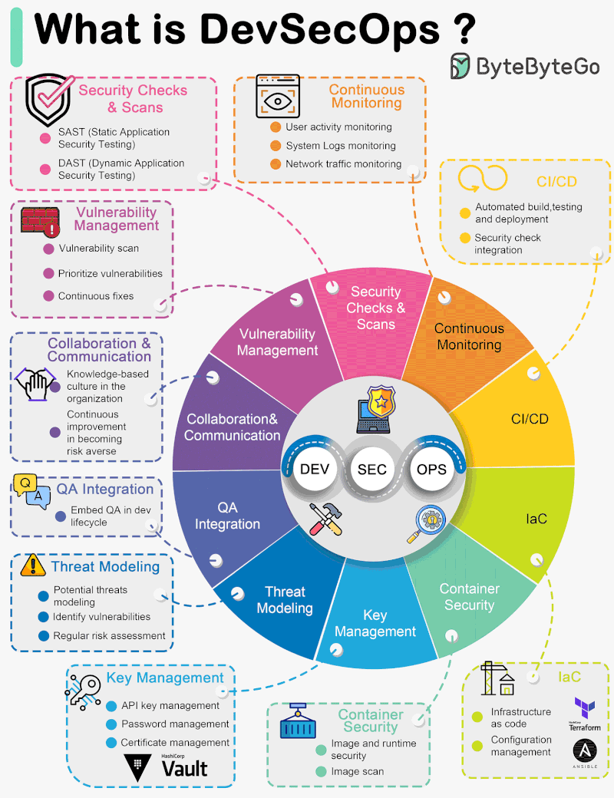
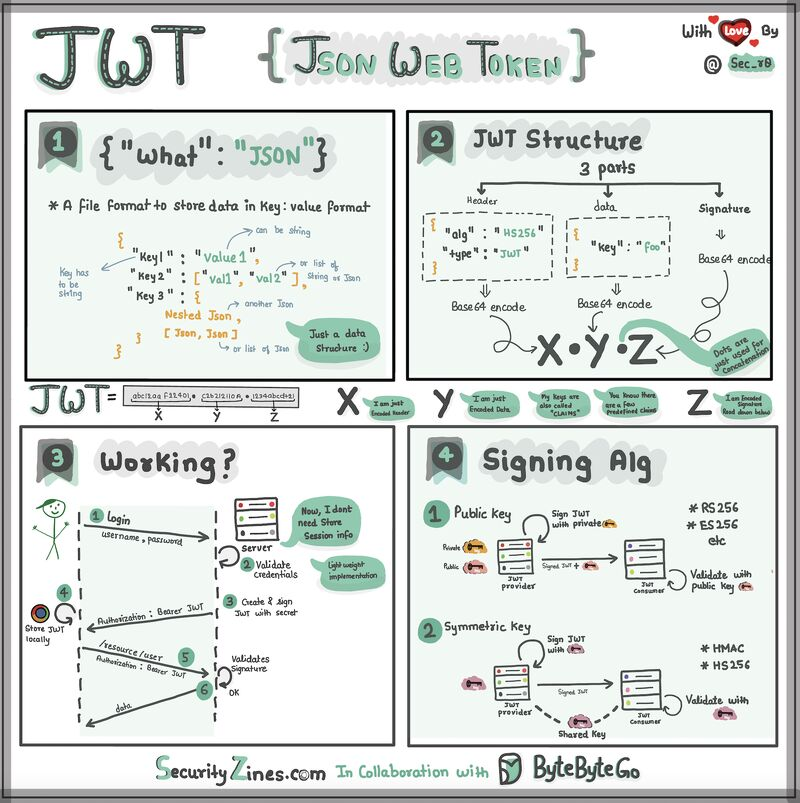
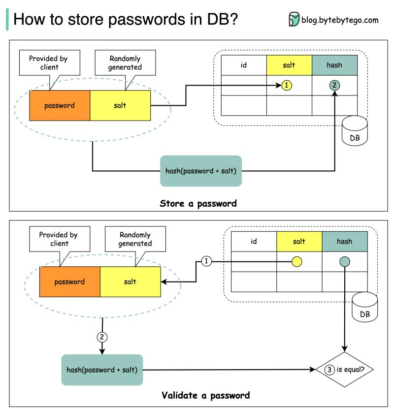

# Security

### Authorization Code Flow

???+ info "OAuth"

    The OAuth 2.0 protocol. It defines OAuth as a protocol for sharing user authorization, identifies the three entities involved (User, Server, IdP), compares versions 1.0 and 2.0, lists the four types of OAuth flows, and provides a detailed sequence diagram illustrating the Authorization Code Flow.

[📊 Vergrößern](images/Security_OAuth_AuthorizationCodeFlow.png){ .md-button .md-button--primary }

### Authorization Code, Client Credentials, Implicit Code, Resource Owner Password

???+ info "Sec_80"

    Four different OAuth 2.0 authorization flows (Authorization Code, Client Credentials, Implicit Code, and Resource Owner Password), detailing the sequence of requests and responses between the Browser/Client App, Server, and Identity Access Provider (IAP).

[📊 Vergrößern](images/Security_OAuthFlows_AuthorizationCodeClientCredentials.png){ .md-button .md-button--primary }

### Cloud Provider Security Services Comparison

???+ info "Cloud Security"

    A cheat sheet comparing security elements and specific tools across AWS, Google Cloud, and Azure, categorized into Infrastructure, Identity, Data, and Business security domains.

[📊 Vergrößern](images/CloudInfrastructure_InfrastructureSecurityIdentity_CloudProviderSecurityServicesComparison.png){ .md-button .md-button--primary }

### Comprehensive breakdown of Cybersecurity Domains including Architecture, Governance, Risk, and Operations

???+ info "Roadmap for Learning Cyber Security"

    A detailed mind map illustrating the key domains of cybersecurity. The central node 'Cybersecurity Domains' branches out into nine major categories: Security Architecture, Frameworks and Standard, Security Operation, Physical Security, User Education, Career Development, Threat Intelligence, Governance, and Risk Assessment. Each category further breaks down into specific sub-topics like Cryptography, NIST, SIEM, Audit, and Penetration Testing.

[📊 Vergrößern](images/Security_CybersecurityDomains_ComprehensivebreakdownOfCybersecurityDomainsinclud.png){ .md-button .md-button--primary }

### Cross-Site Scripting (XSS) Types, Mitigation, and Attack Flow

???+ info "XSS"

    Cross-Site Scripting (XSS) vulnerabilities. It details the mechanisms of Reflected and Stored XSS attacks through diagrams, lists four key mitigation strategies (Implement CSP, Input Sanitization, Escaping Output, HTTP Only Cookies), and depicts a specific attack scenario where an attacker uses a redirect to inject a script and steal user cookies.

[📊 Vergrößern](images/Security_XSS_TypesMitigationAttackFlow.png){ .md-button .md-button--primary }

### Cybersecurity Ecosystem, Threats, and Frameworks

???+ info "Cybersecurity 101"

    Titled 'Cybersecurity 101' by ByteByteGo. It visualizes the core components of cybersecurity including the top 15 threats, definitions, importance statistics, the CIA Triad (Confidentiality, Integrity, Availability), major frameworks like NIST and Microsoft Zero-Trust, basic defense mechanisms (layered security), and a detailed map of the cybersecurity ecosystem featuring hardware, people, software, network, and compliance vendors.

[📊 Vergrößern](images/Security_Fundamentals_CybersecurityEcosystemThreatsAndFrameworks.png){ .md-button .md-button--primary }

### DevSecOps Principles and Practices

???+ info "What is DevSecOps?"

    The core components of DevSecOps. It features a central wheel integrating DEV, SEC, and OPS, surrounded by detailed segments explaining key practices such as Security Checks & Scans, Continuous Monitoring, CI/CD, Infrastructure as Code (IaC), Container Security, Key Management, Threat Modeling, QA Integration, Collaboration & Communication, and Vulnerability Management.

[📊 Vergrößern](images/Security_DevSecOpsLifecycleComponents_DevSecOpsPrinciplesAndPractices.png){ .md-button .md-button--primary }

### JWT Structure, Authentication Workflow, and Signing Algorithms

???+ info "JWT (JSON Web Token)"

    An educational infographic divided into four panels explaining JSON Web Tokens. Panel 1 defines JSON format. Panel 2 details the 3-part JWT structure (Header, Data, Signature) and Base64 encoding. Panel 3 illustrates the authentication workflow (Login, Validation, Token creation). Panel 4 explains signing algorithms, comparing Public Key (Asymmetric) and Symmetric Key methods.

[📊 Vergrößern](images/Security_General_JWTStructureAuthenticationWorkflowAndSigningAlgori.png){ .md-button .md-button--primary }

### Salted Password Hashing

???+ info "How to store passwords in DB?"

    The image illustrates the secure process for handling user passwords in a database. It is divided into two workflows: the top section shows how to 'Store a password' by combining a user-provided password with a randomly generated salt, hashing the result, and saving both the salt and hash to the DB. The bottom section shows how to 'Validate a password' by retrieving the stored salt, hashing the input password with it, and comparing the new hash against the stored hash to check for equality.

[📊 Vergrößern](images/Security_StorageAndValidationWorkflow_SaltedPasswordHashing.png){ .md-button .md-button--primary }

*9 Themen verfügbar*
