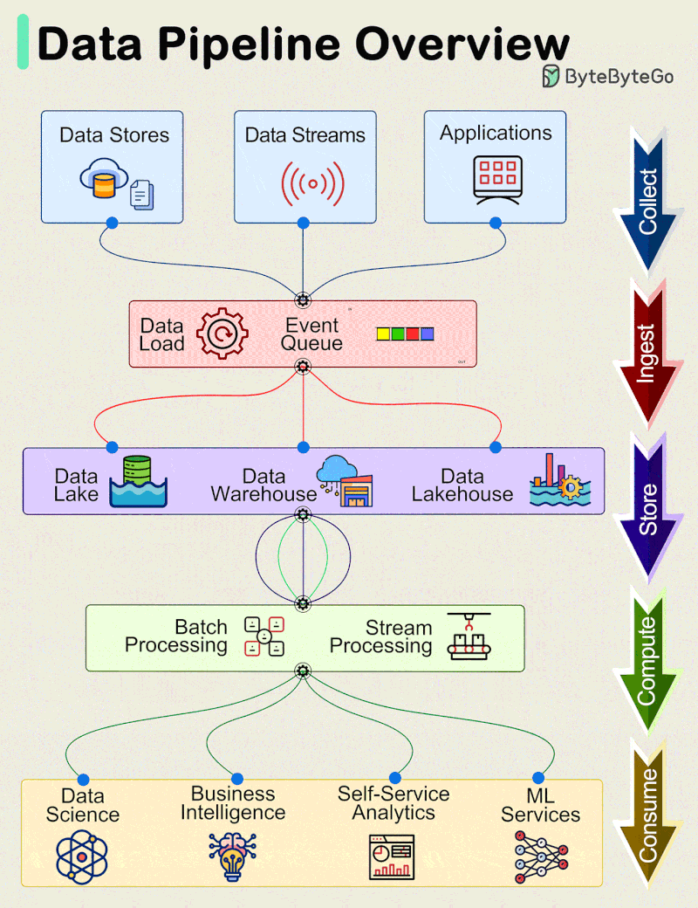
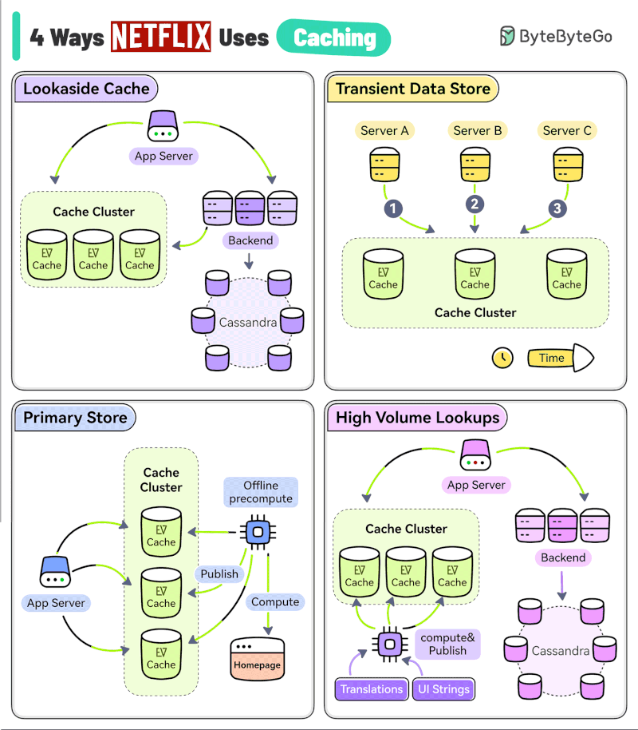
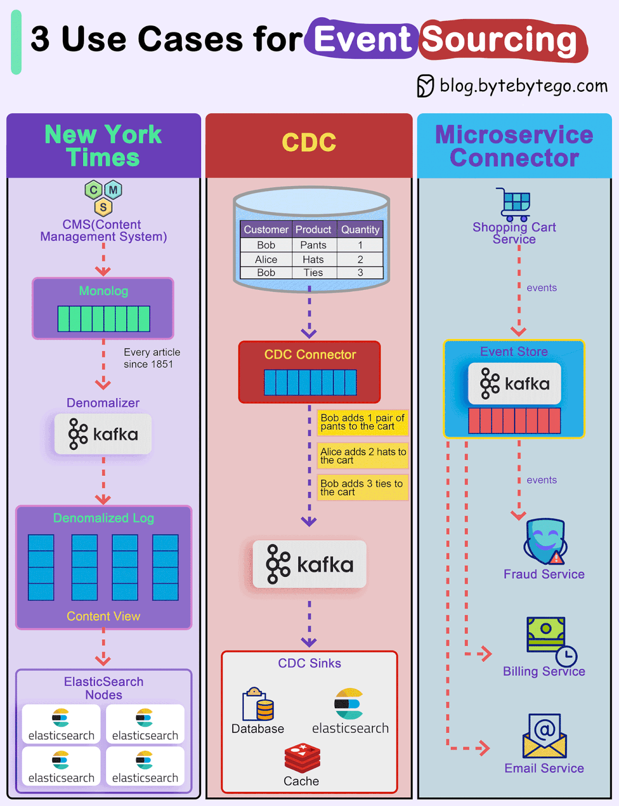
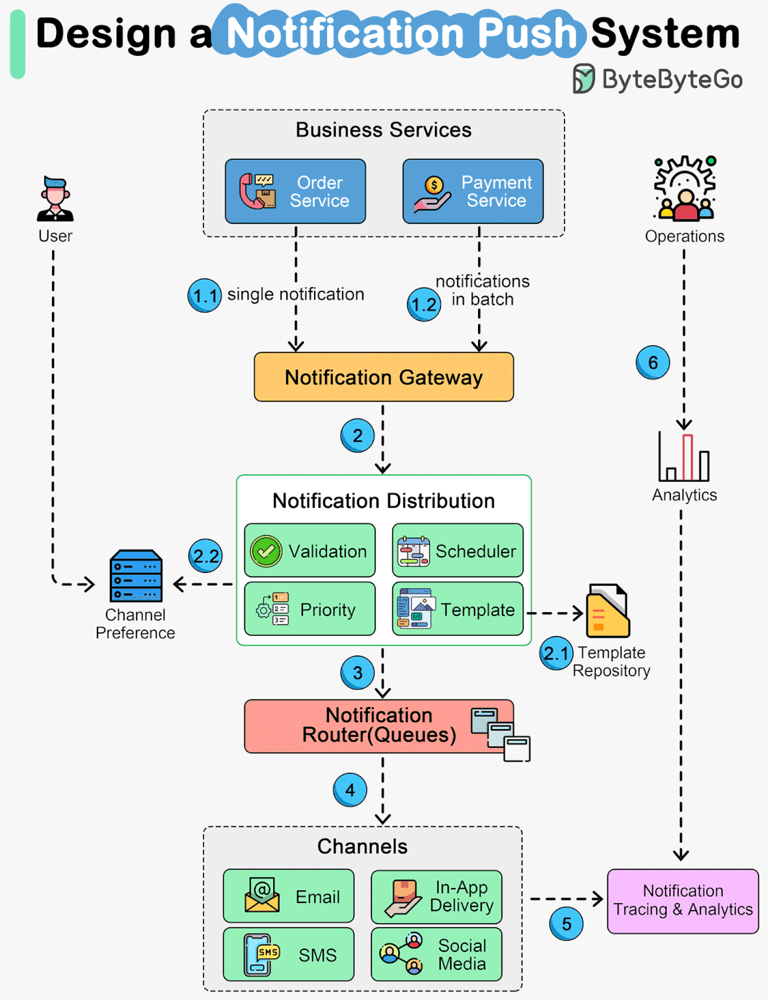
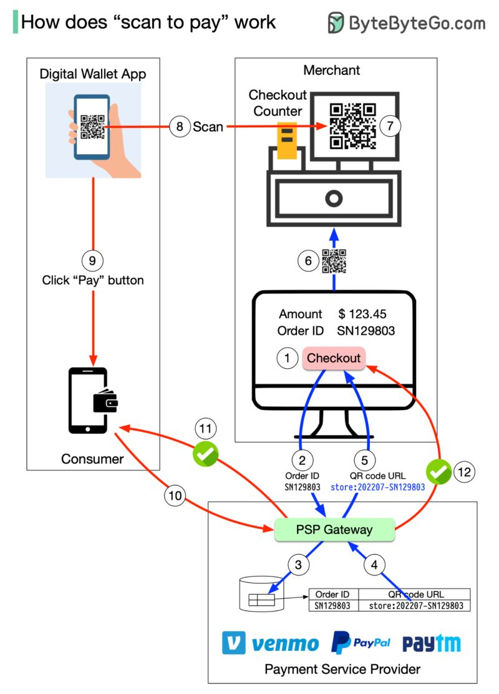
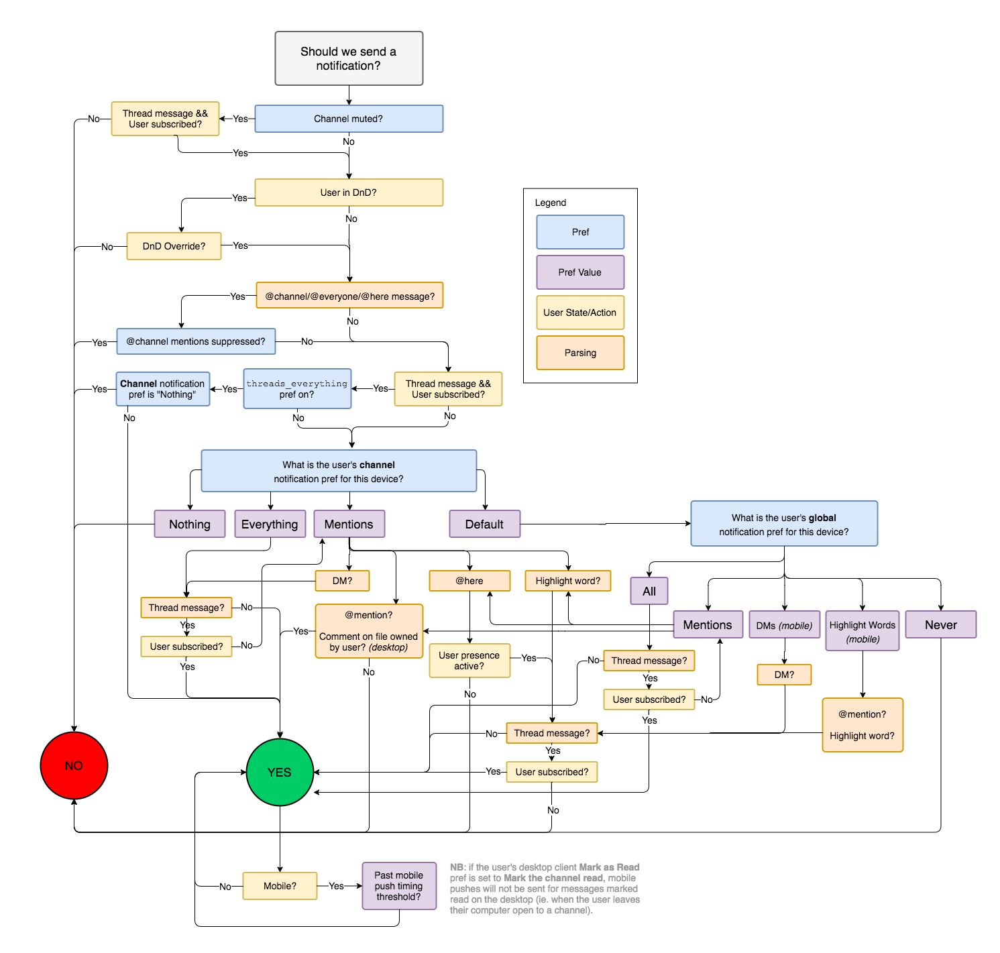
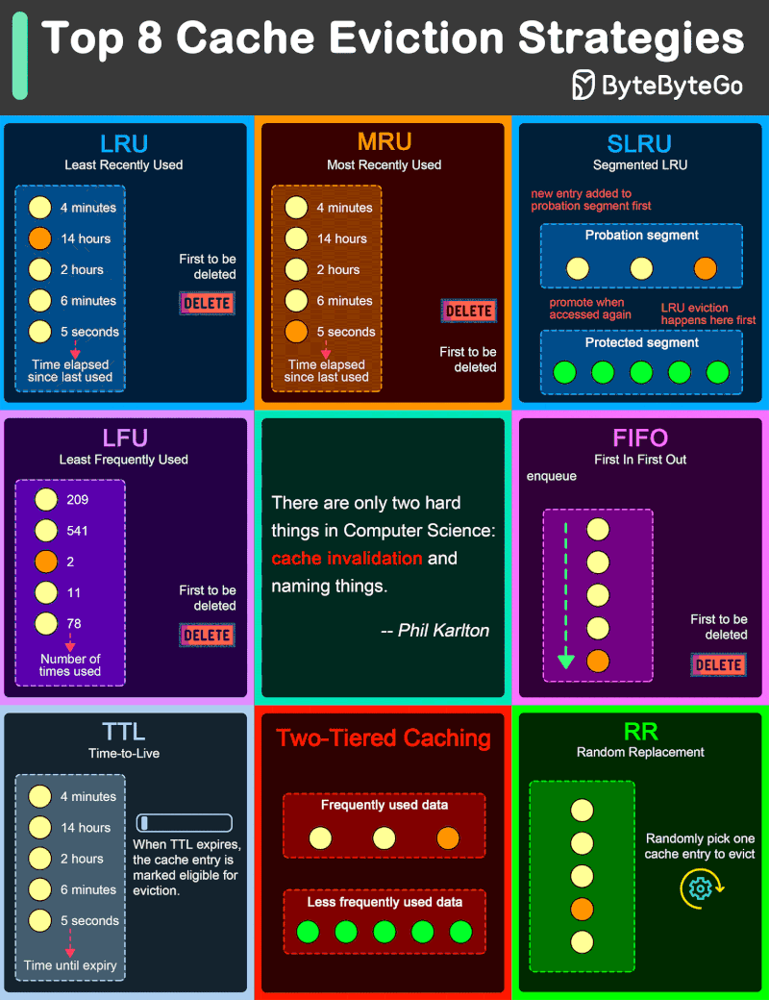
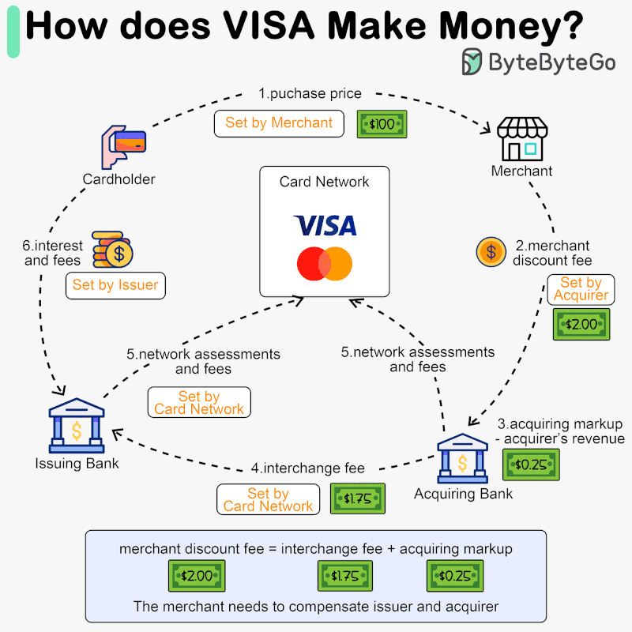

# System Design

### Data Pipeline Architecture and Stages

???+ info "Data Pipeline"

    A vertical flowchart diagram illustrating the end-to-end lifecycle of a data pipeline. It categorizes the process into five main stages indicated by arrows on the right: Collect (Data Stores, Streams, Applications), Ingest (Data Load, Event Queue), Store (Data Lake, Data Warehouse, Data Lakehouse), Compute (Batch Processing, Stream Processing), and Consume (Data Science, Business Intelligence, Self-Service Analytics, ML Services).

[📊 Vergrößern](images/SystemDesign_General_DataPipelineArchitectureAndStages.png){ .md-button .md-button--primary }

### Lookaside Cache, Transient Data Store, Primary Store, High Volume Lookups

???+ info "Caching"

    Four specific caching architectures used by Netflix: Lookaside Cache (checking cache then backend), Transient Data Store (writing directly to cache), Primary Store (using cache as the main database with offline precomputation), and High Volume Lookups (precomputing static data like translations).

[📊 Vergrößern](images/SystemDesign_Netflix_LookasideCacheTransientDataStorePrimaryStoreHighVo.png){ .md-button .md-button--primary }

### New York Times, CDC, Microservice Connector

???+ info "Event Sourcing"

    Learn New York Times, CDC, Microservice Connector - Use Cases. Key concepts and practical implementation.

[📊 Vergrößern](images/SystemDesign_UseCases_NewYorkTimesCDCMicroserviceConnector.png){ .md-button .md-button--primary }

### Notification Delivery Workflow

???+ info "Design a Notification Push System"

    A system architecture diagram illustrating the end-to-end flow of a notification push system. It depicts business services (Order, Payment) sending notifications to a Notification Gateway. The flow continues through a Notification Distribution module (handling validation, scheduling, priority, and templates), interacts with user channel preferences and a template repository, and moves to a Notification Router using queues. Finally, notifications are sent via various channels (Email, In-App, SMS, Social Media), with parallel processes for tracing, analytics, and operations monitoring.

[📊 Vergrößern](images/SystemDesign_SystemArchitecture_NotificationDeliveryWorkflow.png){ .md-button .md-button--primary }

### QR Code Payment Transaction Flow

???+ info "Payment Systems"

    The 12-step process of a 'scan to pay' transaction, showing the interactions between a Consumer (Digital Wallet App), a Merchant (Checkout Counter), and a Payment Service Provider (PSP Gateway).

[📊 Vergrößern](images/SystemDesign_Howdoesscantopaywork_QRCodePaymentTransactionFlow.png){ .md-button .md-button--primary }

### Scan to Pay Transaction Workflow

???+ info "Payment Systems"

    A technical diagram illustrating the 12-step process of a QR code-based payment. It details the interactions between three main entities: the Consumer (using a Digital Wallet App), the Merchant (at a Checkout Counter), and the Payment Service Provider (PSP). The flow covers generating a dynamic QR code, scanning it with a mobile app, authorizing the payment, and confirming the transaction success to both parties.

[📊 Vergrößern](images/SystemDesign_Howdoesscantopaywork_ScantoPayTransactionWorkflow.png){ .md-button .md-button--primary }

### Should we send a notification?

???+ info "Notification System"

    A detailed flowchart illustrating the decision-making algorithm for sending user notifications. It evaluates multiple conditions including channel mute status, Do Not Disturb (DnD) mode, specific mention types (@channel, @here), thread subscriptions, and granular user preferences for both channel and global notification settings.

[📊 Vergrößern](images/SystemDesign_DeliveryLogic_Shouldwesendanotification.png){ .md-button .md-button--primary }

### Top 8 Cache Eviction Strategies

???+ info "Caching"

    Eight common cache eviction algorithms and strategies: Least Recently Used (LRU), Most Recently Used (MRU), Segmented LRU (SLRU), Least Frequently Used (LFU), First In First Out (FIFO), Time-to-Live (TTL), Two-Tiered Caching, and Random Replacement (RR). It also includes a famous quote by Phil Karlton about cache invalidation.

[📊 Vergrößern](images/SystemDesign_EvictionStrategies_CacheEvictionStrategies.png){ .md-button .md-button--primary }

### Visa Revenue Model

???+ info "Payment Systems"

    A flowchart diagram illustrating how Visa makes money through transaction fees. It depicts the flow of funds between a Cardholder, Merchant, Issuing Bank, Acquiring Bank, and the Card Network. The diagram breaks down the 'merchant discount fee' ($2.00) into the 'interchange fee' ($1.75) paid to the issuer and the 'acquiring markup' ($0.25) kept by the acquirer, while also noting network assessments and interest fees.

[📊 Vergrößern](images/SystemDesign_FeeStructure_VisaRevenueModel.png){ .md-button .md-button--primary }

*9 Themen verfügbar*
